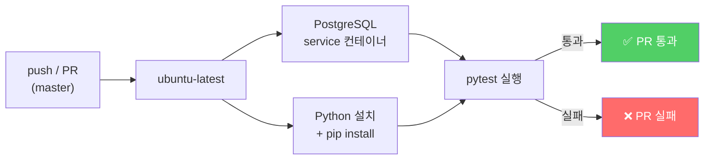

# GitHub Actions로 테스트자동화

[https://github.com/aengu/learn-log/commit/1f98694b87a686b905ddcb3c5f258d8b485e6d66](https://github.com/aengu/learn-log/commit/1f98694b87a686b905ddcb3c5f258d8b485e6d66)

---

| 항목 | 내용 |
| --- | --- |
| 목적 | push/PR 시 테스트를 자동 실행하여 코드 품질 보장 |
| 방식 | GitHub Actions CI + Django TestCase |
| 환경 | Docker(PostgreSQL) 개발환경과 GitHub Actions 환경 동시 지원 |
- master 브랜치에 push하거나 PR을 올리면 테스트가 자동 실행된다
- 테스트 실패 시 PR에 실패 표시가 나타난다
- 로컬 Docker 환경과 GitHub Actions 환경 모두에서 동일한 테스트가 동작해야 한다
- 수동으로도 워크플로우를 실행할 수 있어야 한다

---

## 자동 테스트를 실행하는 방법

|  | Git pre-commit hook | GitHub Actions |
| --- | --- | --- |
| 실행 위치 | 로컬 | GitHub 서버 |
| 실행 시점 | 커밋 직전 | push/PR 후 |
| 강제성 | `--no-verify`로 스킵 가능 | 우회 불가 |
| 팀 공유 | 각자 로컬 설정 필요 | 리포에 포함되어 자동 적용 |
| 결과 확인 | 터미널에서 즉시 | GitHub PR에 통과/실패 표시 |

팀 공유와 강제성 측면에서 GitHub Actions가 더 범용적이므로 먼저 도입했다.

---

## CI 파이프라인 흐름



## 핵심 개념: GitHub Actions 워크플로우 구조

```yaml
name: Test            # 워크플로우 이름 (Actions 탭에 표시)

on:                   # 트리거 조건
  push:
    branches: [master]
  pull_request:
    branches: [master]
  workflow_dispatch:   # GitHub에서 수동 실행 버튼

jobs:                 # 실행할 작업 목록
  test:               # job 이름
    runs-on: ubuntu-latest   # 실행 환경
    services: ...     # 필요한 서비스 컨테이너 (DB 등)
    steps: ...        # 순차 실행할 단계들
```

### `on` — 언제 실행할 것인가

```yaml
on:
  push:
    branches: [master]      # master에 push할 때
  pull_request:
    branches: [master]      # master로 PR 올릴 때
  workflow_dispatch:         # Actions 탭에서 "Run workflow" 버튼으로 수동 실행
```

`workflow_dispatch`를 추가하면 GitHub 리포 → Actions 탭에서 수동으로 워크플로우를 실행할 수 있다.

### `services` — GitHub Actions에서 PostgreSQL 사용

```yaml
services:
  db:
    image: postgres:15-alpine
    env:
      POSTGRES_DB: learnlog
      POSTGRES_USER: learnlog_user
      POSTGRES_PASSWORD: learnlog_password
    ports:
      - 5432:5432
    options: >-
      --health-cmd pg_isready
      --health-interval 10s
      --health-timeout 5s
      --health-retries 5
```

로컬에서는 `docker-compose.yml`의 db 서비스로 PostgreSQL을 띄우지만, GitHub Actions에서는 services로 별도 컨테이너를 띄운다. `health-cmd`로 DB가 완전히 준비될 때까지 기다린 후 테스트를 시작한다.

### `steps` — 실행 단계

```yaml
steps:
  - uses: actions/checkout@v4          # 1. 코드 체크아웃

  - uses: actions/setup-python@v5      # 2. Python 설치
    with:
      python-version: '3.11'

  - name: Install dependencies         # 3. 의존성 설치
    run: pip install -r requirements.txt

  - name: Run tests                    # 4. 테스트 실행
    env:
      DEBUG: 'True'
      DATABASE_HOST: localhost
    run: python manage.py test
```

## Docker ↔ GitHub Actions 환경 차이 해결

로컬 Docker에서는 DB 호스트가 `db` (docker-compose 서비스명)이지만, GitHub Actions에서는 `localhost`다. 환경변수로 분기 처리:

```python
# settings.py
DATABASES = {
    'default': {
        ...
        'HOST': os.getenv('DATABASE_HOST', 'db'),  # 기본값 db (Docker), CI에서는 localhost
    }
}
```

| 환경 | DATABASE_HOST | 결과 |
| --- | --- | --- |
| 로컬 Docker | 미설정 → 기본값 `'db'` | docker-compose의 db 서비스에 연결 |
| GitHub Actions | `localhost` | services로 띄운 PostgreSQL에 연결 |

## 테스트 코드 (tests.py)

```python
from django.test import TestCase, Client
from django.urls import reverse

class MainPageTest(TestCase):
    def setUp(self):
        self.client = Client()

    def test_main_page_returns_200(self):
        response = self.client.get(reverse('search:main'))
        self.assertEqual(response.status_code, 200)

    def test_main_page_uses_correct_template(self):
        response = self.client.get(reverse('search:main'))
        self.assertTemplateUsed(response, 'search/main.html')
```

![[attachments/GitHub Actions로 테스트자동화 - image.png]]

![[attachments/GitHub Actions로 테스트자동화 - image 1.png]]