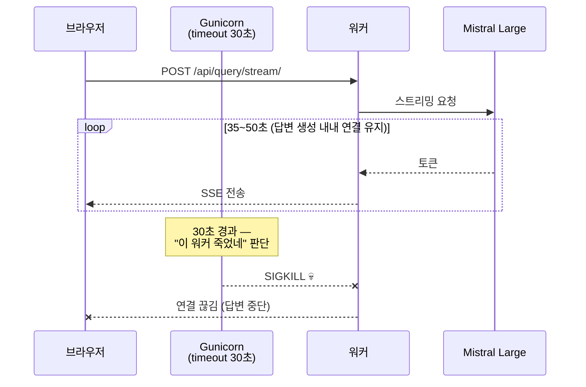

# Gunicorn 워커 타임아웃 트러블슈팅 - 스트리밍 응답 SIGKILL

| 항목 | 내용 |
| --- | --- |
| 목적 | Render 배포 환경에서 답변 생성 중 워커가 죽는 문제 해결 |
| 원인 | Gunicorn 기본 timeout(30초) + 스트리밍 응답이 30초 이상 소요 |
| 해결 | `--timeout 120` 옵션 추가 |

---

## 0. 문제 상황

[[LLM 응답 속도 최적화 - 병렬화, 프롬프트 경량화, 스트리밍]]에서 체감 속도 개선을 위해 Mistral Large 답변을 스트리밍으로 전환했다. 로컬에서는 잘 동작했지만, Render 배포 환경에서 간헐적으로 에러가 발생했다.

---

## 1. 에러 로그

```
[ERROR] Error handling request POST /api/query/stream/
  ...
  File "search/services/learnlog_service.py", line 197, in generate_answer_stream
    for event in stream:
  ...
  File "gunicorn/workers/base.py", line 198, in handle_abort
    sys.exit(1)
SystemExit: 1

[ERROR] Worker (pid:69) was sent SIGKILL! Perhaps out of memory?
```

처음엔 "out of memory?"라는 메시지 때문에 메모리 문제인 줄 알았지만, 스택트레이스를 보면 **스트리밍 도중 Gunicorn이 워커를 강제 종료**한 거다.

---

## 2. 원인 분석

**Gunicorn의 워커 timeout 메커니즘:**
- Gunicorn은 각 워커가 요청을 처리하는 시간을 감시한다
- 기본 timeout은 **30초**
- 30초 안에 응답이 완료되지 않으면 "이 워커가 죽었다"고 판단하고 SIGKILL을 보낸다

**왜 스트리밍 전에는 괜찮았나?**
- 스트리밍 전: LLM 응답을 한 번에 받아서 반환 → 워커가 응답을 보내면 바로 해제
- 스트리밍 후: 워커가 **응답이 끝날 때까지 연결을 유지**해야 함 → Mistral Large 답변 생성이 30~40초 걸리면 timeout 초과

**왜 로컬에서는 안 발생했나?**
- 로컬은 Django 개발 서버(`runserver`)를 사용하고, 이건 timeout 제한이 없다
- Gunicorn은 프로덕션 WSGI 서버로, 워커 관리를 위해 timeout을 강제한다

타이밍을 그림으로 보면:



---

## 3. 해결

`render.yaml`의 startCommand에 `--timeout 120` 추가:

```yaml
# render.yaml
startCommand: gunicorn config.wsgi:application --timeout 120
```

Mistral Large 답변 생성이 보통 35~50초이므로 120초면 충분한 여유가 있다.

---

## 4. 회고

이번 일로 두 가지가 기억에 남았다. 하나는 에러 메시지를 곧이곧대로 믿으면 안 된다는 것. "out of memory?"라는 문구 때문에 한참 메모리만 뒤졌는데, 정작 범인은 timeout이었다. 메시지보다 스택트레이스 흐름(스트리밍 도중에 죽는다)을 따라간 게 실마리였다. 다른 하나는 로컬에서 멀쩡한데 배포에서만 터지면 환경 차이부터 의심해야 한다는 것. `runserver`는 timeout이 없고 Gunicorn은 워커를 강제로 관리하니, 같은 코드라도 배포 환경의 제약을 모르면 재현조차 안 된다.

---

## 5. 참고

- Gunicorn 기본 timeout: 30초 ([Gunicorn 공식 문서](https://docs.gunicorn.org/en/stable/settings.html#timeout))
- Render 무료 플랜 RAM: 512MB (진짜 OOM이 발생할 수도 있으니 모니터링 필요)
- 스트리밍 구현 상세: [[LLM 응답 속도 최적화 - 병렬화, 프롬프트 경량화, 스트리밍#4. 스트리밍 — 체감 속도 개선]]
