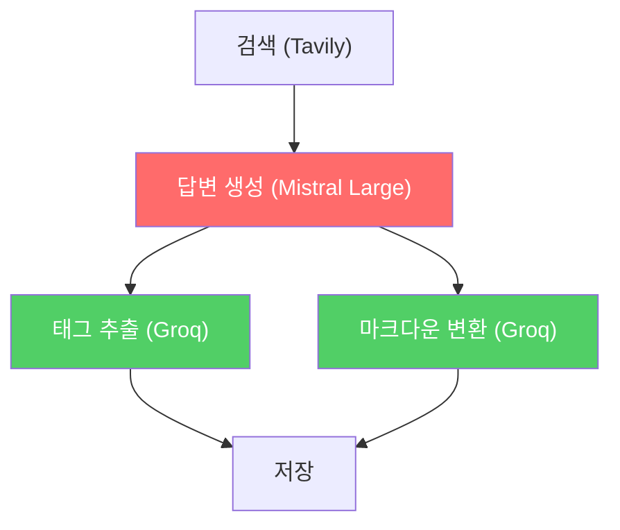
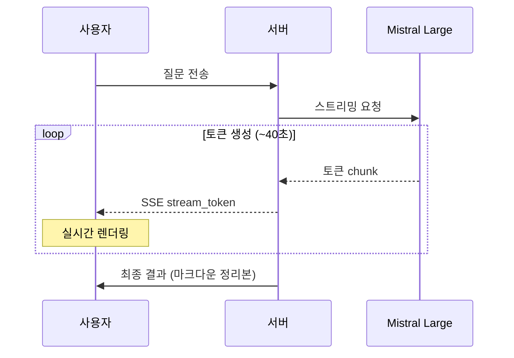

# LLM 응답 속도 최적화 - 병렬화, 프롬프트 경량화, 스트리밍

| 항목 | 내용 |
| --- | --- |
| 목적 | Mistral Large 답변 품질을 유지하면서 체감 속도를 개선하기 |
| 방식 | 무료 LLM 대안 탐색 → 실패 → 코드 레벨 최적화 (병렬화, 프롬프트 경량화, 스트리밍) |
| 범위 | `search/services/learnlog_service.py`, `search/api_views.py`, `search/templates/search/main.html` |

---

## 0. 동기 — Mistral Large가 너무 느리다

[[LLM 공급자 하이브리드 전환 - Groq + Mistral 속도·품질 벤치마크]]에서 답변 생성을 Mistral Large로 전환한 후 품질은 올라갔지만, 질문 하나에 **~40초**가 걸리게 됐다. 태그 추출과 마크다운 변환은 Groq으로 돌려서 빨라졌지만 병목인 답변 생성은 여전히 느리다.

두 가지 방향으로 접근했다:
1. **더 빠르고 성능 좋은 무료 LLM으로 교체** → 대안 없음
2. **현재 구조에서 코드 레벨로 줄이기** → 이 문서의 내용

---

## 1. 무료 LLM 대안 탐색 — 전부 실패

[awesome-free-llm-apis](https://github.com/mnfst/awesome-free-llm-apis) 기준으로 OpenRouter DeepSeek V4 Flash(무료)를 벤치마크했지만, 한국어 품질이 처참하고(깨진 한국어) 53초나 걸렸다. 무료 LLM 중 Mistral Large를 대체할 만한 게 없어서 **코드 레벨에서 줄이기**로 방향 전환.

---

## 2. 병렬화 — 태그 추출 + 마크다운 변환 동시 실행

질문 처리 흐름을 보면 태그 추출과 마크다운 변환은 둘 다 AI 답변이 완성된 후에 실행되고, 서로 의존성이 없다. 순차로 돌릴 이유가 없다.



변경 전에는 태그 추출 → 마크다운 변환이 순차였지만, 둘 다 답변에만 의존하므로 병렬로 바꿨다.

### [벤치마크](https://github.com/aengu/learn-log/blob/master/benchmarks/0515/benchmark_parallel.py)

3라운드 평균:

| 방식 | 소요시간 |
|---|---|
| 순차 | 2.89s |
| 병렬 | 1.01s |
| **절감** | **65%** |

### 구현

`ThreadPoolExecutor`로 두 작업을 동시에 제출하고 결과를 기다린다.

```python
from concurrent.futures import ThreadPoolExecutor

# learnlog_service.py — process_query
with ThreadPoolExecutor(max_workers=2) as executor:
    tags_future = executor.submit(self.extract_tags, user_query, ai_answer)
    md_future = executor.submit(self.convert_to_markdown, user_query, ai_answer, search_results)
    tag_names = tags_future.result()
    markdown = md_future.result()
```

SSE 뷰(`api_views.py`)에도 동일하게 적용. 이에 따라 프로그레스 단계도 5단계 → 4단계로 줄였다.
![[Learn Log - 프레그레스바 수정.gif]]
**Render 배포 환경에서 괜찮은가?** — 괜찮다. `ThreadPoolExecutor`는 프로세스 내부에서 스레드를 만드는 거고, 두 작업 모두 API 응답을 기다리는 I/O 작업이다. Python GIL이 있어도 I/O 대기 중에는 스레드가 해제되므로 실제로 동시에 동작한다.

---

## 3. 프롬프트 경량화 — 입력 토큰 줄이기

LLM API의 응답 시간은 입력 토큰 + 출력 토큰에 비례한다. 프롬프트를 줄이면 입력 처리 시간이 줄어든다.

### 답변 생성 프롬프트

| 항목 | 이전 | 경량 |
|---|---|---|
| 역할 설명 | "당신은 친절하고 정확한 개발 전문가입니다" | 제거 (없어도 잘 답변함) |
| 검색 결과 | 3개 × 400자 | 2개 × 200자 (3번째는 보통 관련도 낮음) |
| 지시사항 | 6줄 상세 | 1줄 압축 |
| 부연 문장 | "위 참고 자료를 바탕으로~" | 제거 |
| **프롬프트 길이** | **1170자** | **616자 (53%)** |

```python
# 이전
prompt = f"""당신은 친절하고 정확한 개발 전문가입니다.
사용자 질문: {query}
참고 자료:
출처: {url}\n내용: {content[:400]}  # × 3개
위 참고 자료를 바탕으로 질문에 대한 명확하고 상세한 답변을 작성해주세요.
요구사항:
- 한국어로 작성 (한자 사용 금지, 한글로만 표기)
- 기술적으로 정확하게
- 개념 설명 → 동작 원리 → 코드 예시 → 주의사항 순서로 구성
...6줄"""

# 경량
prompt = f"""개발 질문에 한국어로 답변하세요.
질문: {query}
참고:
[{url}] {content[:200]}  # × 2개
형식: 개념 → 동작 원리 → 코드 예시 → 주의사항. 코드에 주석 포함."""
```

### [벤치마크 — 답변 생성 (Mistral Large)](https://github.com/aengu/learn-log/blob/master/benchmarks/0515/benchmark_prompt.py)

2라운드 평균:

| 프롬프트 | 입력 토큰 | 소요시간 |
|---|---|---|
| 이전 | 579 | 52.56s |
| 경량 | 314 | 37.32s |
| **절감** | **46%** | **29%** |

답변 품질도 확인했다 — 구조(개념→원리→코드→주의사항)가 잘 잡히고 코드 예시도 포함됨.

### 연습문제 생성/채점 프롬프트

연습문제 쪽은 Mistral Small을 쓰고 있어서 원래 빠르지만 (2~4초), 같은 원칙을 적용했다:
- `ai_response[:1000]` → `[:500]`
- 부연 설명 압축
- path_trace의 `correct_index` 규칙은 유지 (이전에 A/B 테스트해서 넣은 것)

[벤치마크 — 연습문제](https://github.com/aengu/learn-log/blob/master/benchmarks/0515/benchmark_exercise_prompt.py)

| 항목 | 이전 합계 | 경량 합계 | 절감 |
|---|---|---|---|
| 연습문제 4종 | 11.96s | 7.98s | **33%** |

### [max_tokens 조정은 효과 없음](https://github.com/aengu/learn-log/blob/master/benchmarks/0515/benchmark_max_tokens.py)

max_tokens를 줄이면 빨라질까 싶어서 테스트했지만, 효과가 없었다.

| max_tokens | 소요시간 | 상태 |
|---|---|---|
| 2000 | 33.77s | 자연 종료 |
| 1500 | 34.41s (-2%) | 1회 MAX 도달 |
| 1200 | 27.01s (+20%) | 매번 잘림 |

1500은 속도 차이가 거의 없고 (모델이 어차피 1400~1600 정도 생성), 1200은 빠르지만 답변이 잘린다. **2000 유지.**

---

## 4. 스트리밍 — 체감 속도 개선

총 소요시간은 줄이지 못해도, 사용자가 빈 화면에서 40초를 기다리는 대신 답변이 한 글자씩 나오면 체감이 완전히 달라진다.



### 구현 — 백엔드

Mistral API의 `chat.stream()`을 사용해 토큰 단위로 yield하는 메서드를 추가했다.

```python
# learnlog_service.py
def generate_answer_stream(self, query, search_results, custom_instructions=None):
    # ... 프롬프트 구성 (generate_answer와 동일) ...
    stream = self.mistral_client.chat.stream(
        model=self.ANSWER_MODEL,
        messages=[{"role": "user", "content": prompt}],
        temperature=0.7,
        max_tokens=2000
    )
    for event in stream:
        chunk = event.data.choices[0].delta.content
        if chunk:
            yield chunk
```

SSE 뷰에서는 각 토큰을 `stream_token` 이벤트로 전달하면서 전체 답변을 누적한다.

```python
# api_views.py — _process_stream
ai_answer_chunks = []
for chunk in service.generate_answer_stream(query, search_results, custom_instructions):
    ai_answer_chunks.append(chunk)
    yield self._sse_event('stream_token', {'token': chunk})
ai_answer = ''.join(ai_answer_chunks).strip()
```

답변 누적이 끝나면 이후 태그 추출 + 마크다운 변환이 병렬로 실행된다.

### 구현 — 프론트엔드

스트리밍 프리뷰 카드를 추가하고, `stream_token` 이벤트가 올 때마다 `marked.js`로 실시간 마크다운 렌더링한다.

```javascript
if (currentEvent === 'stream_token') {
    streamPreview.classList.remove('hidden');
    streamBuffer += data.token;
    streamContent.innerHTML = marked.parse(streamBuffer);
    if (autoScroll) {
        streamPreview.scrollIntoView({ behavior: 'smooth', block: 'end' });
    }
}
```

스트리밍 중에 보이는 건 Mistral 원본 답변을 브라우저에서 바로 마크다운 파싱한 것이고, 완료 후에는 Groq가 정리한 노션 스타일 마크다운으로 교체된다. 그래서 최종 결과가 스트리밍 때 보던 것과 약간 다를 수 있다 (구조가 더 깔끔해짐).

### 자동 스크롤

답변이 길어지면 자동으로 따라 내려가되, 사용자가 직접 스크롤하면 자동 스크롤이 해제된다.

처음에는 `scroll` 이벤트로 감지했는데, `scrollIntoView({ behavior: 'smooth' })`도 `scroll` 이벤트를 발생시켜서 프로그래밍 스크롤과 사용자 스크롤을 구분할 수 없었다. **`wheel`과 `touchmove` 이벤트**로 바꿔서 해결 — 이 두 이벤트는 실제 사용자 입력에서만 발생한다.

```javascript
let autoScroll = true;
const onUserInteract = () => {
    const atBottom = (window.innerHeight + window.scrollY) >= (document.body.offsetHeight - 100);
    autoScroll = atBottom;
};
window.addEventListener('wheel', onUserInteract);
window.addEventListener('touchmove', onUserInteract);
```

---

## 5. 정리

### 최적화 결과 요약

| 최적화 | 방법 | 효과 |
|---|---|---|
| 병렬화 | ThreadPoolExecutor | 태그+마크다운 65% 절감 (2.89s → 1.01s) |
| 프롬프트 경량화 | 입력 토큰 46% 감소 | 답변 생성 29% 절감 (52.56s → 37.32s) |
| max_tokens 조정 | 테스트 | 효과 없음 — 2000 유지 |
| 스트리밍 | Mistral chat.stream() | 총 시간 동일, 체감 속도 대폭 개선 |

### 기타 변경

- SSE 프로그레스 메시지를 완료형("검색 완료")에서 진행형("검색 중...")으로 변경
- 프로그레스 5단계 → 4단계 (병렬화로 태그+마크다운이 한 단계로 합쳐짐)
- 벤치마크 파일을 `benchmarks/MMDD/` 구조로 정리
