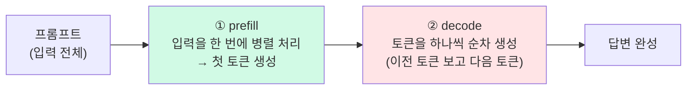

# LLM 추론에서 입력은 싸고 출력이 비싸다

> **한 줄**: LLM 응답 시간은 프롬프트가 얼마나 긴가(입력)보다 답변을 얼마나 길게 쓰는가(출력)가 좌우한다. 입력은 한 번에 병렬로 처리(prefill)되고, 출력은 토큰을 하나씩 순차로 생성(decode)하기 때문이다. 프로젝트에서 같은 오해를 두 번 했고, 두 번 다 측정으로 교정했다.

이건 특정 작업 일지가 아니라, 여러 작업([[LLM 응답 속도 최적화 - 병렬화, 프롬프트 경량화, 스트리밍|5월 속도 최적화]], [[꼬리질문]], [[pgvector 하이브리드 RAG]], [[LangGraph 라우팅 에이전트]])에서 반복해서 부딪힌 개념을 한곳에 모은 노트다.

---

## prefill과 decode — 시간이 어디서 드나

LLM이 답을 만드는 과정은 두 단계로 나뉜다.



- **prefill (입력 처리)** — 프롬프트 전체를 **한 번에 병렬로** 읽어서 첫 토큰을 만든다. GPU가 한 방에 처리. 이 시간이 곧 **TTFT(Time To First Token)**, 첫 글자가 나오기까지의 시간이다.
- **decode (출력 생성)** — 그 다음부터는 토큰을 **하나씩 순차로** 만든다. "이전 토큰 → 다음 토큰" 식이라 출력 길이만큼 시간이 쌓인다. 토큰 하나당 시간이 **TPOT(Time Per Output Token)**.

총 응답 시간은 이렇게 분해된다.

```
총 지연 ≈ TTFT + (TPOT × 출력 토큰 수)
            ↑           ↑
        prefill      decode (출력 길이에 비례해서 쌓임)
```

핵심은 **입력은 병렬(한 방), 출력은 순차(한 톨씩)**라는 비대칭이다. 그래서 같은 토큰 수라도 입력 1000개 읽는 것보다 출력 1000개 만드는 게 훨씬 오래 걸린다. 참고로 H100 기준 1만 토큰 prefill이 0.2~0.4초인데, decode는 초당 30~150토큰 수준이다.

---

## "입력은 싸다"의 정확한 의미

여기서 조심할 게 있다. **입력이 "공짜"인 건 아니다.** 프롬프트가 길어지면 prefill도 길어지고 TTFT도 나빠진다 — 시스템 프롬프트 한 문장, RAG 청크 하나, 대화 기록 한 턴이 다 prefill 시간을 늘린다. 특히 긴 컨텍스트(만 토큰대 이상)에선 TTFT가 선형보다 더 가파르게 증가한다.

정확히는 **"입력 읽기가 출력 생성보다 훨씬 싸다"**이지, "입력은 무료"가 아니다. 내 프로젝트에서 "입력 늘려도 시간 안 변했다"가 성립한 건 컨텍스트가 수백~수천 토큰 규모라 prefill이 워낙 빨라 차이가 측정 안 됐기 때문이다. 만 토큰대로 가면 입력도 무시 못 한다.

---

## 프로젝트에서 두 번 한 오해, 두 번의 교정

이 개념을 머리로 아는 것과 측정으로 아는 건 달랐다. 같은 함정에 두 번 빠졌다.

| 시점 | 한 일 | 처음 해석 | 측정 후 진실 |
| --- | --- | --- | --- |
| 5월 | 프롬프트 경량화 | "입력 줄여서 빨라졌다" | ❌ 입력 읽기는 원래 쌌다. **출력이 짧아져서** 빨라진 것 |
| 6월 ([[꼬리질문]]) | 입력을 4.5배 늘려가며 TTFT 측정 | (검증) | ✅ 입력 늘려도 TTFT 그대로. 시간은 **출력**이 좌우 |
| 6월 ([[LangGraph 라우팅 에이전트]]) | 로그 컨텍스트 500→1500자 | "입력 늘리면 느려지고 잘릴라" | ✅ 안 느려짐. 오히려 500자가 더 잘림 |

5월의 "입력 줄여서 빨라졌다"가 틀린 이유: 프롬프트가 가벼워지니 **모델이 답변을 짧게 생성**했고, 그래서 빨라진 거다. 지운 내용이 뭐였는지는 부차적이고, 핵심은 "재료가 줄면 출력도 준다"였다. 시간을 잡아먹던 건 입력 읽기(prefill)가 아니라 출력 생성(decode)이었다.

---

## 한 발 더 — 출력 길이는 컨텍스트의 "양"이 아니라 "질"

여기서 미묘한 반전이 있다. "재료 많으면 출력 늘어난다"면 1500자로 늘렸을 때 느려져야 하는데 안 그랬다([[LangGraph 라우팅 에이전트]] 벤치마크). 정리하면:

- **장황하고 무관한 재료** → 모델이 빈 곳을 자기 지식으로 메우며 말이 많아짐 → 출력↑ → 느려지고 잘림
- **질문에 직접 답하는 알맞은 재료** → 그걸 기반으로 압축해서 답함 → 출력↓

그래서 500자(어중간)가 오히려 잘리고, 1500자(질문에 맞는 본문)가 더 짧고 안정적으로 끝났다. **출력 길이를 좌우하는 건 컨텍스트의 양이 아니라 질이다.** 다만 이 부분은 내 벤치마크로 관찰한 거고, 딱 떨어지는 논문은 못 찾았다(RLHF의 verbosity/length bias 연구가 그나마 인접하지만 같은 주장은 아님).

---

## 그래서 설계에 어떻게 쓰나

- **컨텍스트는 양보다 질** — 무관한 걸 많이 넣느니 질문에 맞는 걸 정확히. (RAG 검색 품질이 중요한 이유)
- **입력 추가는 생각보다 싸다(이 규모에선)** — RAG로 로그 주입, 꼬리질문 컨텍스트 주입 같은 건 TTFT를 거의 안 늘린다. [[pgvector 하이브리드 RAG]]에서 검색 추가 비용이 0.65초였던 것도 같은 맥락.
- **속도를 줄이려면 출력을 건드려라** — max_tokens, 간결하게 쓰라는 지시, 구조 고정 등. 입력을 깎는 것보다 출력을 줄이는 게 직접적이다.
- **측정은 TTFT를 따로 재라** — 총시간만 보면 출력 길이 변동에 묻힌다. TTFT(입력 비용)와 총시간(출력 포함)을 분리해야 어디서 시간이 드는지 보인다.

---

## 참고

- [Prefill vs Decode: LLM Inference Phases Explained (Redis)](https://redis.io/blog/prefill-vs-decode/) — prefill/decode 개념
- [LLM Inference Metrics: TTFT, TPOT, TPS Explained](https://gradientupdate.substack.com/p/llm-inference-metrics-reference) — TTFT/TPOT 정의
- [Optimizing LLM Inference: Prefill vs Decode, Latency vs Throughput (Medium)](https://medium.com/@maghonei/optimizing-llm-inference-prefill-vs-decode-latency-vs-throughput-80dbf00fc0ba)
- [[LLM 응답 속도 최적화 - 병렬화, 프롬프트 경량화, 스트리밍]] — 5월의 첫 오해
- [[꼬리질문]] — TTFT 측정으로 교정
- [[LangGraph 라우팅 에이전트]] — 1500자 실험, 양 vs 질
- [[pgvector 하이브리드 RAG]] — 입력 추가 비용이 작다는 또 다른 사례
