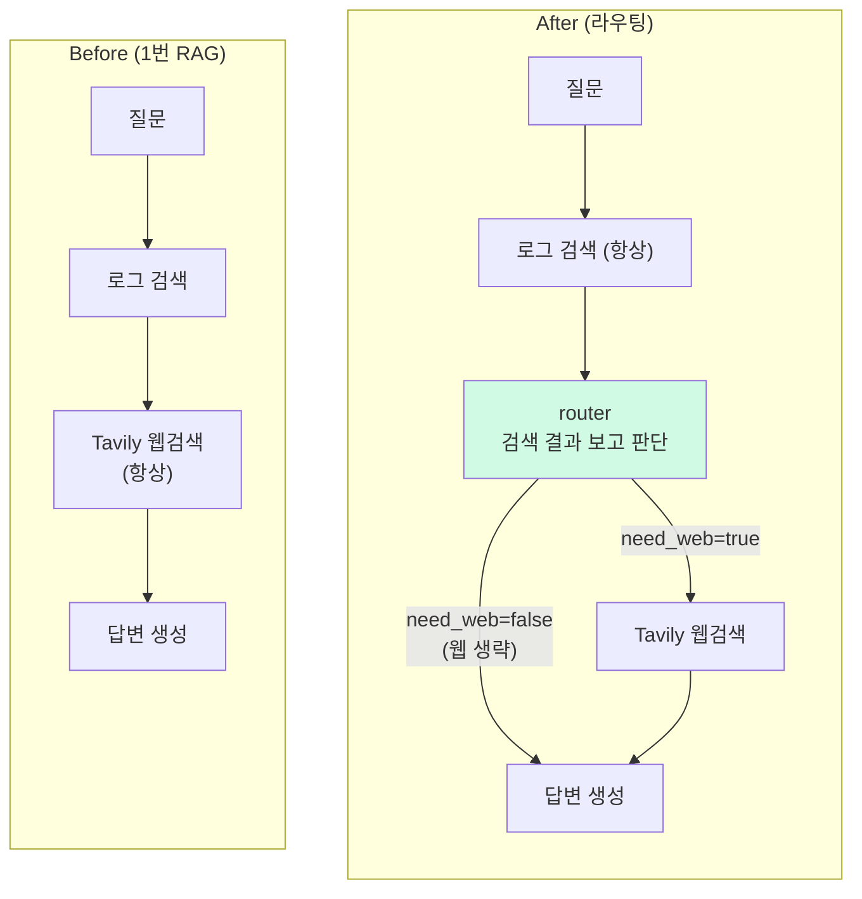
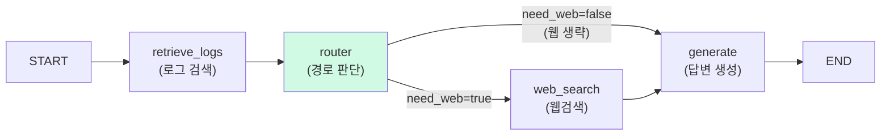
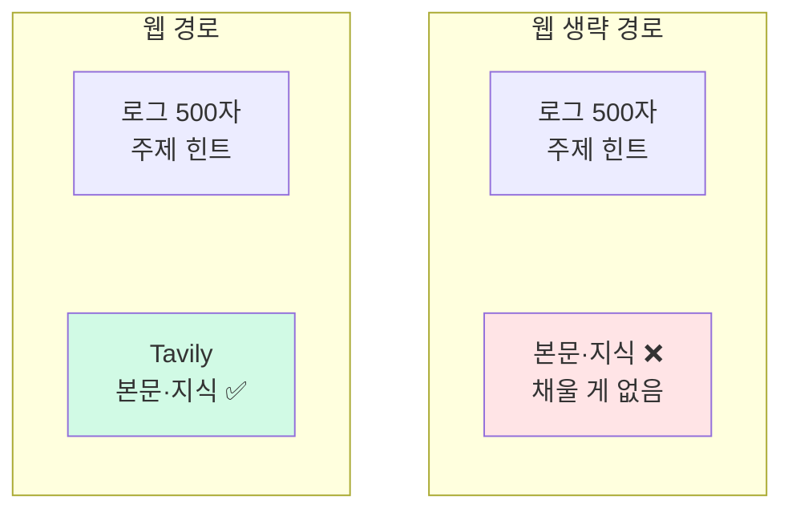

# LangGraph 라우팅 에이전트

> **결과**: 검색 → 웹 → 생성 직선 파이프라인을 LangGraph 조건 분기 그래프로 전환. 라우터 LLM이 검색된 내 학습 로그를 보고 "웹검색 생략"(로그로 충분)과 "로그 주입 차단"(무관한 주제)을 판단한다. 웹 생략 경로의 로그 컨텍스트는 500자 → 1500자로 늘렸는데, 걱정했던 max_tokens 잘림이 오히려 500자 쪽에서 나오는 반전이 있었다.

| 항목 | 내용 |
| --- | --- |
| 목적 | 모든 질문이 같은 경로를 타던 파이프라인에 질문별 분기 추가 |
| 방식 | LangGraph StateGraph + 기존 서비스 메서드를 노드로 재사용, 라우터는 Groq |
| 범위 | search_agent.py(그래프), 라우팅 LLM 호출, SSE 6단계, 절삭 길이 벤치마크 |

---

## 만들게 된 계기

[[pgvector 하이브리드 RAG]]를 만들고 나니 약점이 하나 남았다. 관련 로그가 아예 없는 새 주제를 물어도 top-3을 억지로 뽑아서 무관한 로그가 프롬프트에 들어간다. 그리고 이미 내 로그에 답이 다 있는 질문도 매번 웹검색(3.3초)부터 돈다.

둘 다 같은 원인이다. 파이프라인이 직선이라 모든 질문이 같은 경로를 탄다. "이 질문엔 웹이 필요한가, 내 로그가 쓸만한가"를 질문마다 판단하는 분기가 필요해졌고, 분기와 상태 관리가 생기는 시점이 LangGraph를 도입할 명분이 생기는 시점이다.

---

## 설계: 검색부터 하고, 라우터가 결과를 보고 분기

라우터가 질문만 봐서는 내 로그에 뭐가 있는지 알 수 없다. "N+1 해결법"이라는 질문을 받아도, 그 주제를 내가 정리해뒀는지는 질문에 안 적혀 있으니까. 그래서 라우터한테 질문이 아니라 "검색해보니 이런 로그들이 나왔다"를 보여주고 판단시킨다.

순서가 그래서 ①연관 로그 검색 → ②라우터 판단이다. 하이브리드 검색이 0.65초로 싸니까 일단 항상 검색부터 하고, 그 결과를 라우터가 보고 "이 로그가 쓸만한지 / 웹이 더 필요한지"를 정한다.



라우터의 판단은 2축(`use_logs`, `need_web`)이다. 이 둘이 [[pgvector 하이브리드 RAG|1번]]에서 못 풀고 남겼던 약점 두 개를 하나씩 막는다 — ①무관한 로그를 억지로 주입하던 것, ②답이 이미 있어도 매번 웹검색하던 것.

| 축 | 묻는 것 | false면 |
| --- | --- | --- |
| use_logs | 검색된 로그가 질문과 같은 주제인가 | 무관한 로그 주입 차단 (억지 top-3 해결) |
| need_web | 로그만으로 부족한가 | 웹검색 생략 (3.3초 + Tavily 호출 절약) |

나머지 노드(retrieve_logs, web_search, generate)는 [[pgvector 하이브리드 RAG|1번]]에서 만든 메서드를 그대로 감싼 거라, 라우터 구현에 새로 추가한 건 `decide_route` 하나다. 매 질문마다 도는 부가 호출이라 빠르고 싼 Groq 경량 모델에 temperature 0으로 맡겼다(판단 0.6초).

```python
def decide_route(self, query, retrieved_logs):
    # 검색된 로그를 "질문: 내용 앞부분"으로 추려서 라우터에 보여준다
    logs = "\n".join(f"- {l.query}: {l.ai_response[:200]}" for l in retrieved_logs)
    prompt = f"""질문: {query}
    과거 학습 로그:
    {logs}
    JSON으로만 답해: {{"use_logs": true/false, "need_web": true/false}}"""
    result = self._call_groq_json(prompt)   # 아래 헬퍼
    return {"use_logs": result["use_logs"], "need_web": result["need_web"]}

# 공용 헬퍼 — response_format으로 valid JSON을 모델 레벨에서 강제 (코드펜스·잡설 방지)
def _call_groq_json(self, prompt, max_tokens=300):
    response = self.groq_client.chat.completions.create(
        model=self.LIGHT_MODEL,
        messages=[{"role": "user", "content": prompt}],
        temperature=0.0,
        response_format={"type": "json_object"},   # ← JSON 강제 (프롬프트에 'JSON' 단어 필수)
        max_tokens=max_tokens,
    )
    return json.loads(response.choices[0].message.content)   # 바로 파싱, 펜스 벗길 필요 없음
```

스트리밍도 살아 있다. generate 노드가 LangGraph의 `get_stream_writer`로 토큰을 흘려보내면 SSE 뷰가 받아서 기존 실시간 표시가 그대로 작동한다.

---

## 처음 써본 LangGraph 동작 정리

LangGraph는 LLM 워크플로를 "상태를 공유하는 노드들의 그래프"로 짜는 프레임워크다. LangChain 팀이 만들었지만 LangChain 없이 단독으로 쓸 수 있어서, LLM 호출은 기존처럼 Groq/Mistral SDK 직접 호출을 유지했다.

이번에 짠 그래프는 이렇게 생겼다. 아래 코드의 노드 이름이 이 그림 그대로다.



핵심 개념은 셋이다.

① **State** — 파이프라인 전체가 공유하는 데이터 묶음. TypedDict로 선언하면 끝이고, 노드들이 여기에 결과를 쌓아간다.

```python
class SearchState(TypedDict, total=False):
    query: str
    retrieved_logs: list   # retrieve_logs 노드가 채움
    need_web: bool         # router 노드가 채움
    search_results: dict   # web_search 노드가 채움
    answer: str            # generate 노드가 채움
```

② **Node** — state를 받아서 **바뀐 부분만** dict로 반환하는 평범한 파이썬 함수. 전체 state를 돌려주는 게 아니라 변경분(delta)만 반환하면 LangGraph가 알아서 병합한다.

```python
def router(state):
    decision = service.decide_route(state['query'], state['retrieved_logs'])
    return {'use_logs': decision['use_logs'], 'need_web': decision['need_web']}
```

③ **Edge** — 노드를 잇는 선. `add_edge`는 무조건 이동, `add_conditional_edges`는 판단 함수가 반환한 이름의 노드로 이동한다. "라우팅"이라는 게 결국 이 함수 하나다.

```python
def after_router(state):
    return 'web_search' if state.get('need_web', True) else 'generate'

graph.add_edge(START, 'retrieve_logs')
graph.add_edge('retrieve_logs', 'router') # 일반 엣지: 검색 -> 라우터
graph.add_conditional_edges('router', after_router, # 조건부 엣지: -> 웹검색or답변생성
                            {'web_search': 'web_search', 'generate': 'generate'})
graph.add_edge('web_search', 'generate')
graph.add_edge('generate', END)
agent = graph.compile()   # 그래프 완성 → 실행 가능한 agent
```

두 종류의 엣지가 핵심이다.
- **`add_edge(A, B)`** — A 끝나면 **무조건** B로. (화살표 하나)
- **`add_conditional_edges(A, 판단함수, 매핑)`** — A 끝나면 판단함수가 갈 곳을 정한다. (화살표 여러 개 = 분기)

조건부 엣지는 세 부분으로 읽으면 된다.

```python
graph.add_conditional_edges(
    'router',          # 어느 노드 다음에?  (router가 끝나면)
    after_router,      # 어디로 갈지 정하는 판단 함수
    {'web_search': 'web_search', 'generate': 'generate'},  # 판단 결과 → 실제 노드 매핑
)
```

동작은 ①router가 끝나면 ②`after_router(state)`가 `need_web`을 보고 `'web_search'`나 `'generate'` 문자열을 반환하고 ③그 값을 매핑에서 찾아 해당 노드로 점프한다. 매핑 딕셔너리는 `{판단함수가 뱉는 라벨: 실제 노드 이름}`인데, 여기선 우연히 둘이 같아서 똑같아 보일 뿐이다. 다이어그램에서 router만 두 갈래로 갈라지던 그 지점이 이 한 줄이고, 나머지 화살표는 전부 무조건 엣지(`add_edge`)다.

실행은 두 방식이다. `agent.invoke(초기상태)`는 끝까지 돌고 최종 state를 반환(결과값만 받으니까 주로 테스트에서 사용), `agent.stream()`은 도는 동안 이벤트를 흘려준다. 스트림 모드를 리스트로 주면 여러 종류를 동시에 받는데, 여기선 둘을 합쳐서 진행바와 토큰을 한 루프로 처리했다.

```python
for mode, chunk in agent.stream(state, stream_mode=['updates', 'custom']):
    # updates: 노드 하나가 끝날 때마다 {노드이름: 변경분} → SSE 진행바 갱신
    # custom:  generate 노드 안에서 get_stream_writer()로 쏜 것 → 답변 토큰 중계
```

솔직히 지금 그래프 규모(노드 4개, 분기 1개)면 if문으로도 짤 수 있다. 그런데도 가져가는 게 있다. 흐름 정의가 한 곳에 모여서 파이프라인 구조가 코드만 봐도 그려지고, 노드 완료 이벤트가 공짜로 나와서 SSE 진행바 연동이 매핑 몇 줄로 끝났고, 분기가 더 생겼을 때(다음 작업인 환각 방어 등) 노드와 엣지 추가로 확장된다. 반대로 LLM 호출 자체는 프레임워크에 안 맡겼다. 노드 안은 전부 기존 서비스 메서드라, LangGraph를 걷어내도 서비스 레이어는 그대로 남는 구조다.

---

## 웹 생략 경로의 구멍: 충분하다며 잘라서 준다

웹 생략은 라우터가 "관련 로그만으로 답변 생성이 가능하다"고 판단한 경우다. 그래서 로그만으로 컨텍스트를 채우게 설계했는데, 여기서 문제가 하나 생긴다. 기존엔 Tavily 웹검색이 컨텍스트의 "본문"을 채웠는데, 웹을 생략하면 그게 빠진다. 그러면 [[꼬리질문]] 때 정한 **로그 앞 500자만** 들어가는 규칙으로는 본문을 채울 게 없어진다 (기존에 로그를 500자로 제한했던 의도는, 로그는 주제 힌트이고 본문은 Tavily가 채운다는 전제였으니까).



빠진 본문 자리를 뭘로 채울지, 후보는 둘이었다. 글자수 완화로 결정했다.

| 후보 | 방법 | 판단 |
| --- | --- | --- |
| 로그의 reference 재사용 | 저장해둔 Tavily 발췌를 다시 넣기 | 웹페이지 앞부분을 그대로 자른 텍스트 + 과거 질문 기준으로 수집된 것 → 같은 분량에 정보가 적다 |
| **글자수 완화 (채택)** | 로그 500자 → 1500자 | 내 질문에 맞춰 이미 정리된 글이라 같은 토큰으로 정보가 가장 많다 |

단, 전역이 아니라 **웹 생략 경로만** 늘렸다. 웹 경로는 Tavily가 본문을 채우니 로그는 500자로 충분하고, 웹 생략 경로만 로그가 본문까지 감당하니 1500자로 늘렸다.

실제 컨텍스트 구성은 이렇다 (로그 top-3, Tavily 상위 2건 × 200자 ≈ 400자).

| 경로 | 로그 | Tavily | 컨텍스트 합계 |
| --- | --- | --- | --- |
| 웹 경로 | 500자 × 3 = 1,500자 | ~400자 | **~1,900자** |
| 웹 생략 (그냥 두면) | 500자 × 3 = 1,500자 | 없음 | ~1,500자 (본문 부족) |
| **웹 생략 (1500자로 늘림)** | 1,500자 × 3 = 4,500자 | 없음 | **~4,500자** |

총량이 같아지는 건 아니다. Tavily(~400자) 빠진 자리에 로그를 +3,000자 채운 거라, 웹 생략 경로가 오히려 더 길다(측정상 입력 토큰 970 → 1,849, 약 2배). 

---

## 1500자로 늘리면 느려질까? — 오히려 500자가 잘렸다

로그를 1500자로 늘리면 답변 품질은 좋아지겠지만, 걱정은 **비용**이었다. 꼬리질문 실험의 교훈이 "컨텍스트를 늘리면 모델이 말이 많아져서 답변이 max_tokens에 잘린다"였으니까. 1500자가 오히려 답변을 잘리게 만들면 늘린 의미가 없다. 그래서 500자 vs 1500자로 답변을 생성해 출력 길이·시간·잘림을 쟀다.

| 조건 | 평균 출력 | 평균 시간 | max_tokens 잘림 |
| --- | --- | --- | --- |
| 500자 | 1,463tok | 26.8s | **1/4** ⚠️ |
| 1500자 | 1,212tok | 23.7s | 0/4 |

결과는 반전이었다. 걱정한 1500자가 아니라 **500자 쪽이 잘렸다.** 출력도 500자가 더 길고(1,463 > 1,212), 시간도 더 걸렸다. 컨텍스트가 어중간하면 모델이 빈 부분을 자기 지식으로 길게 메우면서 말이 많아지고, 질문에 딱 맞는 컨텍스트를 받으면 그걸 기반으로 압축해서 답하기 때문이다. 꼬리질문 때 "재료 많으면 말이 많아진다"던 건 장황한 재료(부모 답변 전문) 얘기였고, 출력 길이를 결정하는 건 컨텍스트의 양이 아니라 질이었다. (왜 입력보다 출력이 시간을 좌우하는지 → [[LLM 추론에서 입력은 싸고 출력이 비싸다]])

표본이 작아서(질문 2개 × 2회) 일반화는 조심스럽지만, 의사결정엔 충분했다. 품질도 비용도 1500자가 유리하니 확정.

---

## 회고

파이프라인을 처음 설계할 때도 다들 흔히 쓰는 LangChain을 도입해야 하나 고민했었다. 그땐 검색 → 웹 → 생성으로 흐름이 직선이라, 직접 sdk호출로 충분한데 굳이 새로운 프레임워크를? 싶어서 안 썼다. 그런데 이번에 "질문마다 경로를 다르게" 하는 분기가 필요해지면서, 처음으로 LangGraph를 써봤다. 흐름이 한곳에 정의돼서 구조가 한눈에 보이고, 노드 완료 이벤트가 공짜로 나와 SSE 진행바 연동도 쉬웠다.

벤치마크의 반전도 남는다. 같은 "컨텍스트를 늘리면?"이라는 질문에 6월 10일엔 "출력이 부풀어 잘린다"가 답이었고 6월 11일엔 "오히려 출력이 줄고 잘림이 사라진다"가 답이었다. 모순이 아니라 조건이 달랐던 거다(장황한 재료 vs 정답을 담은 재료). 측정 없이 지난번 교훈을 그대로 적용했다면 1500자 확장을 "잘림 위험" 때문에 포기했을 텐데, 그 교훈이 어디까지 유효한지도 재봐야 아는 거였다.

남은 건 환각 방어다. 웹 생략 경로는 공식문서 grounding 없이 과거 LLM 출력만으로 답을 만드는 구조라, 오염된 로그가 정화 기회 없이 재사용될 수 있다. 라우터 기준 강화(사실 민감 질문은 웹 강제), grounding 지시, 저장 후 비동기 검증 + 출처·검증 배지를 다음 작업으로 잡아뒀다. 검증을 답변 응답에 동기로 끼우지 않고 "저장 후 검사해서 표시"로 가는 이유는, 이 앱에서 환각의 진짜 피해가 읽는 순간이 아니라 저장돼서 복습으로 암기되는 것이라서다. 검증이 지켜야 할 건 응답 속도가 아니라 저장된 로그다.

---

## 참고

- `search/services/search_agent.py`: StateGraph 정의 (`build_search_agent`)
- `search/services/learnlog_service.py`: `decide_route`
- `benchmarks/0611/benchmark_rag_context_limit.py`: 절삭 길이 벤치마크 (원시 JSONL 저장)
- `search/tests/test_search_agent.py`: 그래프 분기 테스트 (모킹)
- [[pgvector 하이브리드 RAG]]: 이 에이전트의 retrieve_logs 노드가 된 작업
- [[꼬리질문]]: 500자 규칙의 출처 + 픽스처 누설 교훈
- [[검색 중 프로그레스바 + 진행로그를 위한 SSE 구현]]: 노드 이벤트를 받아주는 스트리밍 기반

---

## 이후 개선

- 회고에 적은 "웹 생략 경로의 오염된 로그 재사용" 우려를 예방·검출·표시 3단으로 다룸 → [[환각 방어]]
