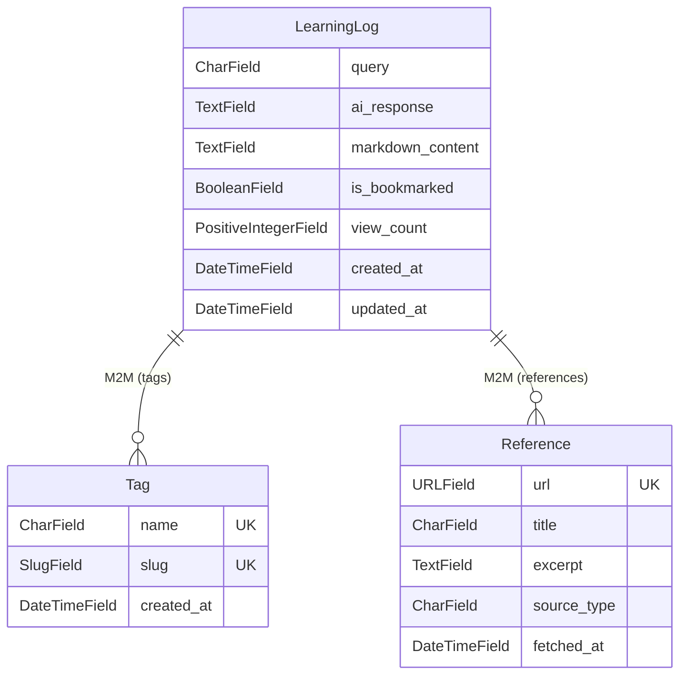

# LearningLog 모델 필드 설계

[https://github.com/aengu/learn-log/commit/dd1d50e38328ffd06ce50a542c0794285f02b8f0](https://github.com/aengu/learn-log/commit/dd1d50e38328ffd06ce50a542c0794285f02b8f0)

AI 기반 기술 질문과 답변을 저장하는 모델 설계 및 구현

| 항목 | 내용 |
| --- | --- |
| 목적 | 학습 로그 데이터 모델 정규화 |
| 방식 | Django ORM ManyToMany 관계 |

---

## 요구사항

- 질문에 따른 답변을 저장한다.
- 답변은 공식 레퍼런스(해당 스택의 공식 문서나 github 도메인인 경우)의 url과 그에 기반한 답변 + 기술 스택 태그로 이루어진다.
- 답변은 노션에 저장할 목적으로 마크다운 형식으로 반환해야 한다.
- 레퍼런스와 태그에 대한 통계와 필터 기능을 지원해야 한다.
- 답변에 조회수와 북마크 기능을 지원해야 한다.

---

## 모델 관계도



---

## 구현

모델은 3개다. 중심에 **LearningLog**(질문+답변)가 있고, 거기에 **Tag**(기술 스택 태그)와 **Reference**(출처 URL)가 M2M으로 붙는 구조. 태그와 레퍼런스를 별도 모델로 분리한 이유는 "같은 태그/레퍼런스가 여러 로그에 걸쳐 재사용"되기 때문이다 — `docker` 태그가 10개 로그에 달릴 수 있고, 같은 공식 문서 URL이 여러 답변에서 인용될 수 있다.

### Tag

태그별 검색 및 통계를 위해 별도 모델로 분리.

```python
class Tag(models.Model):
    name = models.CharField(max_length=50, unique=True, verbose_name="태그명")
    slug = models.SlugField(max_length=50, unique=True, verbose_name="슬러그")
    created_at = models.DateTimeField(auto_now_add=True, verbose_name="생성일")

    class Meta:
        ordering = ['name']

```

- `slug`: URL에서 사용할 수 있도록 SlugField 추가 (예: `docker-network`)

### Reference

검색 결과로 얻은 공식 문서/블로그 등의 출처를 체계적으로 관리.

```python
class Reference(models.Model):
    url = models.URLField(max_length=500, unique=True, verbose_name="URL")
    title = models.CharField(max_length=300, verbose_name="문서 제목")
    excerpt = models.TextField(verbose_name="핵심 내용 발췌")
    source_type = models.CharField(
        max_length=50,
        choices=[
            ('official', '공식 문서'),
            ('blog', '기술 블로그'),
            ('stackoverflow', 'Stack Overflow'),
            ('github', 'GitHub'),
            ('other', '기타'),
        ],
        default='official',
    )
    fetched_at = models.DateTimeField(auto_now_add=True)

```

### LearningLog

질문과 답변을 저장하는 중심 모델. Tag, Reference와 ManyToMany로 연결.

```python
class LearningLog(models.Model):
    query = models.CharField(max_length=500, db_index=True, verbose_name="질문")
    ai_response = models.TextField(verbose_name="AI 답변")
    markdown_content = models.TextField(verbose_name="마크다운 내용")

    references = models.ManyToManyField(Reference, related_name='learning_logs', blank=True)
    tags = models.ManyToManyField(Tag, related_name='learning_logs', blank=True)

    is_bookmarked = models.BooleanField(default=False)
    view_count = models.PositiveIntegerField(default=0)
    created_at = models.DateTimeField(auto_now_add=True)
    updated_at = models.DateTimeField(auto_now=True)

    class Meta:
        ordering = ['-created_at']
        indexes = [
            models.Index(fields=['created_at']),
            models.Index(fields=['query']),
            models.Index(fields=['is_bookmarked']),
        ]

```

**ManyToMany를 선택한 이유:**

| 방식 | 장점 | 단점 |
| --- | --- | --- |
| ArrayField | 단순, 별도 테이블 불필요 | PostgreSQL 전용, 태그 통계 어려움 |
| **ManyToMany** | **태그별 조회/통계 가능, DB 무관** | **중간 테이블 생성** |

**인덱스 설계:**

- created_at: 최신순 정렬 (리스트 페이지)
- query: 질문 검색 최적화
- is_bookmarked: 북마크 필터링

---

같은 모델의 초기 설계와 마이그레이션 과정은 → [[Django 모델 설계 및 마이그레이션 초기화]]