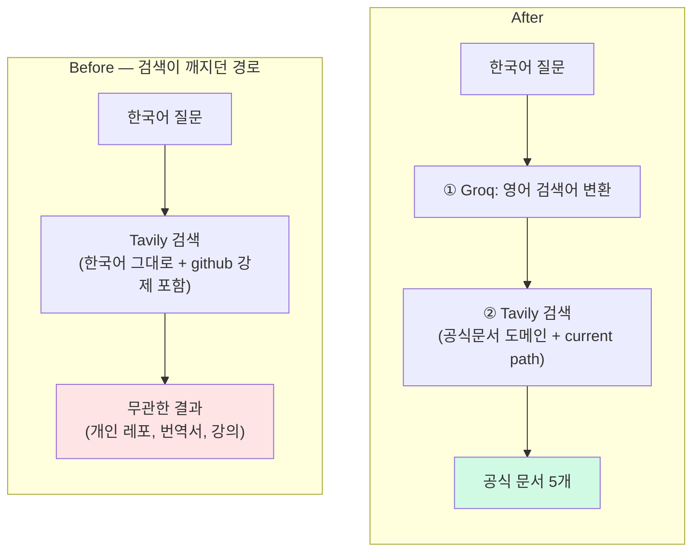

# RAG 검색 파이프라인 개선 — 한국어 질문이 엉뚱한 결과를 부르던 문제

> **결과**: 한국어 질문 → 영어 검색어 변환 + github 노이즈 제거 + `include_domains` path 정밀화로 검색 품질 복원. 구체적 스펙 질문에서 **환각이 실제로 교정**됨(`to_tsvector('korean')` → `'simple'`). RAG는 검색 품질이 보장될 때만 환각을 줄인다는 가설을 실측으로 확인.

| 항목 | 내용 |
| --- | --- |
| 목적 | "공식 문서로 grounding해 환각을 줄인다"는 LearnLog의 원래 의도가 검색 품질 때문에 무력화된 문제 복구 |
| 방식 | Groq로 한국어 질문 → 영어 검색어 변환 + 도메인 매칭 실패 시 github 강제 포함 제거 + 공식문서 path를 current/stable로 정밀화해 옛 버전 차단 |
| 범위 | `search_official_docs`(검색어 변환), `domains.py`(github 제거 + 7개 도메인 path 정밀화). 모델/스키마 변경 0건 |

---

## 만들게 된 계기

> 내가 쓴 제품 평가서가, 내가 만든 코드의 버그를 잡았다.

한 LLM 제품 평가 과제를 진행하면서 LearnLog의 검색 파이프라인을 실측했는데, **한국어 기술 질문에 Tavily가 무관한 결과만 반환**하는 걸 발견했다. 한국어 FTS 질문에 돌아온 검색 결과 5개가 전부 팔콘 프레임워크 번역, 주식 자동매매 강의 같은 무관한 내용이었다.

LearnLog가 "Tavily로 공식 문서를 먼저 검색하고 그걸 근거로 답변 생성"하는 구조를 택한 이유가 바로 **구체적 사실에 대한 환각을 줄이기 위해서**였다. 그런데 검색 품질이 낮으니 grounding 자체가 작동하지 않았던 것. 의도와 정반대 상태였다.

---

## 진단 — 무관 결과의 두 원인

순수 한국어 질문으로 재현하니 원인이 명확했다.

```
질문: "데이터베이스에서 한글 텍스트를 형태소 단위로 검색하는 법"
→ 매칭 도메인: ['github.com']
→ 결과: github.com/dongjinleekr/spark-ko-nlp, gist, 누군가의 bookmarks, 부트캠프 이슈 …
```

**원인 1 — 한국어 쿼리를 그대로 Tavily에 던짐**
Tavily는 영어권 웹 기반이라, 한국어 기술 쿼리로는 영어 공식 문서(`postgresql.org/docs`)를 거의 못 찾는다. grounding 대상이 영어 문서인데 검색어가 한국어라 미스매치.

**원인 2 — 도메인 매칭 실패 시 `github.com`만 검색**
`get_domains_for_query`는 매칭되는 기술이 없으면 `github.com`을 무조건 포함했다. 그 상태로 **한국어** 쿼리를 던지면 한국어 README를 가진 임의 개인 레포가 매칭된다. 평가서의 무관 결과가 바로 이거였다.

→ 둘이 겹치면: `postgresql` 같은 영문 키워드가 없는 한국어 질문은 **github.com에서 한국어로 검색** → 노이즈만 반환.

---

## 개선



**① 한국어 → 영어 검색어 변환** (`search_official_docs`)
Groq(llama-3.3)로 질문을 영어 키워드로 변환해 Tavily에 던진다. 도메인 매칭은 원본(한국어 키워드)+변환 쿼리 둘 다에서 추출.

```python
def _to_search_query(self, query):
    # "데이터베이스에서 한글 텍스트를..." → "Korean morpheme search database"
    prompt = "Convert this developer question into a concise English web search query..."
    # Groq 호출, max_tokens=40, temperature=0, 실패 시 원본 반환
```

**② `github.com` 강제 포함 제거** (`domains.py`)
매칭되는 기술이 없으면 `None`을 반환해 도메인 제한 없이 전체 웹을 검색하게 했다. (github 강제 포함이 한국어 질문을 개인 레포로 오염시키던 직접 원인)

> 트레이드오프: LLM 호출이 3회 → 4회로 늘었다. 다만 추가된 변환은 `max_tokens=40`로 가볍고 Groq가 빨라 "공식 문서 검색 중…" 단계에 흡수된다. 줄이려면 한글이 없는 질문은 변환 스킵하는 가드를 둘 수 있다.

---

## 검증 1 — 검색 품질 (before/after)

| 질문 | Before | After |
| --- | --- | --- |
| 파이썬 GIL | github discussion + python docs 혼재 | **docs.python.org 5개 전부** |
| 리액트 전역 상태 | toss 토론 + 부트캠프 이슈 | **react.dev 5개 전부** (useState, useContext) |
| 한글 형태소 검색 | github 개인레포/gist 5개 (노이즈) | NLP 학술논문 + elastic 블로그 |
| 동기/비동기 차이 | github TIL/면접질문 5개 (노이즈) | 기술블로그(geeksforgeeks, builtin) |

검색어 변환 품질도 좋았다: "Python GIL", "React global state management", "asynchronous vs synchronous processing".
**유일한 약점**: "형태소"처럼 학술 용어와 겹치면 논문으로 쏠린다.

---

## 검증 2 — 환각 감소 (핵심)

검색 개선이 답변 환각을 실제로 줄이는지, 평가서가 잡았던 **구체적 스펙 질문**으로 확인했다.

| 질문 | Before | After |
| --- | --- | --- |
| **PostgreSQL korean FTS 기본 제공?** | 컨텍스트 **0개** → `to_tsvector('korean', …)` 코드 제시 = **환각** (korean 설정은 존재하지 않음) | postgresql.org 확보 → `to_tsvector('simple', …)`로 **교정** + "외부 형태소 분석기 필요" 정확 |
| **PostgreSQL 격리수준 개수?** | github TIL → "**4가지 모두 지원**" (부정확) | postgresql.org → "**Read Uncommitted 미지원**" 명시 (정확, 실구현 3개) |
| **Django atomic read_only 옵션?** | 컨텍스트 0개 → "옵션 없음" 정확 | djangoproject.com → "옵션 없음" 정확 |

**korean FTS가 결정적 증거**다. Before는 검색 결과가 비어(`ctx=[]`) grounding이 없으니 자체 지식의 환각이 그대로 나왔고, After는 공식 문서가 잡혀 **실제 존재하는 설정으로 교정**됐다.

흥미로운 부수 발견: **보편 개념 질문(GIL, 동기/비동기)은 before/after 둘 다 정확**했다. LLM이 이미 잘 아는 주제라 컨텍스트가 환각을 만들지도 줄이지도 않는다. 환각은 평가서 관찰대로 *구체적 수치·API·스펙*에서만 났고, 검색 grounding은 거기서만 효과가 있었다.

---

## 이후 — path 정밀화로 옛 버전 차단

After에서도 한 가지가 남았다. 검색이 공식 문서를 찾되 `postgresql.org/docs/**7.2**/...` 같은 **옛 버전**이나 release notes가 결과에 섞이는 경향.

### 막다른 길 — URL 버전 치환

옛 버전 URL의 버전 부분을 `current`로 갈아끼우는 사후 patch 방식. 실측해보니:

| 원본 | current 치환 | 결과 |
| --- | --- | --- |
| `7.2/xact-read-committed.html` | `current/xact-read-committed.html` | **404** (경로가 transaction-iso로 바뀜) |
| `11/release-11-1.html` | `current/release-11-1.html` | 200 ❌ (치환해도 옛 내용 그대로) |

절반이 404(경로 변경), release notes는 200이어도 무의미. 추가 HTTP 요청도 듦. 폐기.

받은 결과를 URL 패턴으로 재정렬하는 **리랭킹**도 고려했지만, *"Tavily가 애초에 current 페이지를 결과에 포함했을 때"만* 효과가 있다. 더 근본적인 답이 필요했다.

### 발견 — `include_domains`는 path까지 prefix로 본다

Tavily SDK를 다시 보다 발견했다. `include_domains`는 도메인뿐 아니라 **path도 prefix 필터로 적용**한다. 즉 path를 더 깊이 적으면 그 안만 검색한다.

```python
include_domains=['postgresql.org/docs']           # → 7.1, 7.2, current 다 섞임
include_domains=['postgresql.org/docs/current']   # → current 5개만!
```

**리랭킹(받은 결과 재정렬)보다 강한 사전 차단**. API 레벨에서 옛 버전·release notes가 원천 차단되니, 받은 결과를 후처리할 필요 자체가 사라진다.

### 도메인별 적용 (7개)

```python
'postgresql':  ['postgresql.org/docs/current']
'python':      ['docs.python.org/3']
'django':      ['docs.djangoproject.com/en']         # ← stable이 redirect라 fallback
'flask':       ['flask.palletsprojects.com/en/stable']
'celery':      ['docs.celeryq.dev/en/stable']
'apache':      ['httpd.apache.org/docs/current']
'nodejs':      ['nodejs.org/docs/latest/api']
```

### 함정 — redirect 처리는 호스트마다 다름

Django `/en/stable`로 시도하니 결과 **0개**. 원인 분리 테스트로 잡았다:

| `include_domains` | 결과 |
| --- | --- |
| `docs.djangoproject.com` (path 없음) | 5개 ✅ |
| `docs.djangoproject.com/en/stable` | **0개** ❌ |

curl로 확인하니 답이 나왔다:
```
GET /en/stable/topics/db/queries/ → 302 → /en/6.0/topics/db/queries/
```

`/en/stable`은 *실제 페이지가 아니라 redirect 표지판*이라 Tavily 인덱스에 그 URL이 없다. Flask·Celery·PostgreSQL은 stable/current URL을 직접 서빙(200)이라 OK. **호스트마다 처리가 다르므로 path 추가 시 `curl -I`로 200/302 확인이 필수.**

Django는 `/en/stable` 대신 한 단계 위(`/en`)로 두니 영문만 필터되고 버전은 검색엔진의 일반 신호(inbound link·트래픽·갱신 빈도)가 자연스럽게 최신을 상위에 올린다. "Tavily가 명시적으로 최신을 우선하는 기능을 가졌다"고 단정할 수는 없지만, 결과적으로 그렇게 동작한다.

### 운영 부담

- `current`/`stable` 별칭(postgresql·flask·celery·apache): **자동 갱신** — 호스트가 알아서 최신을 가리킴
- 메이저 path(python `/3`, django `/en/6.0` 등): 메이저 버전 변경 시만 손봄. Python·Django 등 2~3년 단위라 부담 적음
- 단일 path 사이트(react.dev, htmx.org 등): 무관

대부분 자동, 메이저 갱신만 가끔.

### 부수 발견 — substring 매칭 버그 (별개 후속)

`get_domains_for_query`가 `tech in query_lower` 단순 substring 매칭이라, "**Djan**go"에서 `go`(2글자)가 잡혀 `go.dev/doc`이 도메인 목록에 끼어든다. 결과엔 영향 없었지만(Tavily가 go.dev에서 Django 결과를 못 줌) 별개 후속 과제로 남김.

→ **해결됨 (2026-06-10)**: ASCII 키는 영숫자 경계 정규식(`\b` 대신 — 한글이 붙는 "go언어" 표기를 살리기 위해), 한글 키는 더 긴 등록 키("자바스크립트") 제거 후 검사 방식으로 교체. "javascript의 java", "자바스크립트의 자바" 오매칭도 같이 잡혔다. 상세: [[꼬리질문 - self-FK 질문 트리 구현#실제로 던져보기|꼬리질문]]

---

## 회고

핵심 교훈은 평가서에서 세운 가설을 코드로 확인한 것이다 — **RAG는 검색 품질이 보장될 때만 환각을 줄인다.** Before(검색 실패)는 환각, After(공식 문서 grounding)는 교정. grounding을 "의도"하는 것과 "작동"하는 것은 다르고, 그 사이를 메우는 게 검색 품질이었다.

또 하나, **자기 제품을 사용자 관점에서 평가하는 일(dogfooding)이 코드 리뷰보다 빨리 버그를 잡았다.** 검색 결과가 무관하다는 건 단위 테스트로는 안 잡힌다. 실제 한국어 질문을 던져보고 결과를 눈으로 봐야 드러나는 문제였다.

마지막으로 path 정밀화에서 얻은 교훈 — **사후 정렬보다 사전 차단이 더 강하다.** 리랭킹은 받은 5개 안에서만 순서를 바꾸지만, `include_domains`의 path를 좁히면 노이즈가 *애초에 결과에 안 들어온다*. 처음엔 patch·리랭킹 같은 후처리만 고민했는데, API 파라미터를 다시 들여다본 게 더 근본적인 해결책이었다. 라이브러리/API의 가용 옵션을 한 번 더 정독하는 습관이 후처리 코드를 줄여준다.

---

## 참고

- LLM 제품 평가 과제 — 이 작업의 출발점 (검색 파이프라인을 실측하다 버그 발견)
- [[기술 스택별 검색 도메인 자동 매핑 및 출처 판단 개선]] — `domains.py` 최초 설계
- [[학습 로그 서비스 계층 설계 및 구현]] — `LearnlogService` 구조
