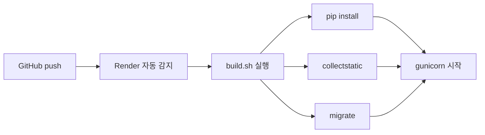
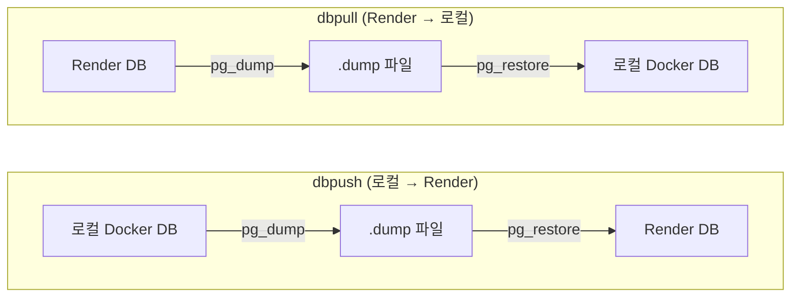

# Render 무료 배포 + DB 동기화 + 자동 백업 구현

[https://github.com/aengu/learn-log/commit/d6a1348c57026dce02beb64ba8bb66db1470caf8](https://github.com/aengu/learn-log/commit/d6a1348c57026dce02beb64ba8bb66db1470caf8)

| 항목 | 내용 |
| --- | --- |
| 목적 | Django 프로젝트를 무료로 배포하고, 로컬-프로덕션 DB 동기화 및 자동 백업 체계 구축 |
| 플랫폼 | Render (무료 플랜) — Heroku 무료 종료 이후 대안. Web Service + Managed PostgreSQL 제공 |
| DB 동기화 | Django management command (dbpush / dbpull) |
| 자동 백업 | GitHub Actions + Artifacts (주 1회) |

---

## 왜 Render인가?

1. **무료 플랜에 PostgreSQL DB 포함** — 별도 DB 호스팅 비용 없음
2. **GitHub 연동 자동 배포** — push만 하면 빌드/배포 자동 실행
3. **Django/Python 네이티브 지원** — 별도 Docker 설정 없이 바로 배포 가능
4. **render.yaml 기반 IaC** — 인프라 설정을 코드로 관리

---

## 배포 구조



### render.yaml

```yaml
databases:
  - name: learnlog-db
    plan: free
    databaseName: learnlog
    user: learnlog_user

services:
  - type: web
    name: learn-log
    runtime: python
    plan: free
    buildCommand: ./build.sh
    startCommand: gunicorn config.wsgi:application
    envVars:
      - key: DATABASE_URL
        fromDatabase:
          name: learnlog-db
          property: connectionString
      - key: SECRET_KEY
        generateValue: true
```

- `fromDatabase`: DB 연결 문자열을 환경변수로 자동 주입
- `generateValue`: SECRET_KEY를 Render가 자동 생성

### DB 설정 분기 (settings.py)

```python
DATABASE_URL = os.getenv('DATABASE_URL')
if DATABASE_URL:
    # Render 프로덕션: DATABASE_URL 환경변수로 연결
    DATABASES = {'default': dj_database_url.parse(DATABASE_URL)}
else:
    # 로컬 Docker: 직접 설정
    DATABASES = {'default': {
        'ENGINE': 'django.db.backends.postgresql',
        'NAME': 'learnlog', 'USER': 'learnlog_user',
        'PASSWORD': 'learnlog_password',
        'HOST': os.getenv('DATABASE_HOST', 'db'), 'PORT': '5432',
    }}
```

Render에서는 `DATABASE_URL`이 자동 주입되고, 로컬에서는 없으므로 Docker 컨테이너(`db`) 직접 연결. `dj_database_url`은 URL 문자열을 Django DATABASES 딕셔너리로 변환해주는 라이브러리.

---

## DB 동기화 — dbpush / dbpull

Render는 컨테이너 안에 DB가 포함된 게 아니라 **독립된 Managed DB**를 사용한다. 로컬 Docker DB와 Render DB는 완전히 별개이므로 수동 동기화가 필요.

"로컬 Django에서 Render DB에 직접 연결하면 안 되나?" → 가능하지만 비효율적 (PostgreSQL 버전 불일치 문제는 → [[PostgreSQL 버전 불일치 트러블슈팅 - dbpull 실패]]):
- 모든 쿼리가 외부 DB로 나가서 네트워크 레이턴시 발생
- 개발 중 실수로 프로덕션 데이터 오염 위험
- 오프라인 개발 불가



### dbpush 핵심 코드

```python
# search/management/commands/dbpush.py
class Command(BaseCommand):
    help = "로컬 Docker DB를 Render 프로덕션 DB로 밀어넣습니다"

    def handle(self, *args, **options):
        remote_url = os.getenv("REMOTE_DATABASE_URL")
        local = self._parse_local_db()

        with tempfile.NamedTemporaryFile(suffix=".dump", delete=False) as f:
            dump_path = f.name

        try:
            self._dump_local(local, dump_path)      # pg_dump → .dump
            self._restore_remote(remote_url, dump_path)  # .dump → pg_restore
        finally:
            if os.path.exists(dump_path):
                os.unlink(dump_path)
```

- `pg_dump --format=custom`: 압축 + 선택적 복원 지원하는 커스텀 포맷으로 덤프
- `pg_restore --clean --if-exists`: 기존 테이블 삭제 후 새로 생성
- `--no-owner`, `--no-privileges`: 로컬↔Render 유저가 다르므로 소유자/권한 정보 제외
- dbpull도 방향만 반대일 뿐 동일한 구조

### 사용법

```bash
docker compose exec web python manage.py dbpush   # 로컬 → Render
docker compose exec web python manage.py dbpull   # Render → 로컬
```

```bash
❯ docker compose exec web python manage.py dbpush
⚠ Render 프로덕션 DB의 모든 데이터가 로컬 데이터로 교체됩니다!
  이 작업은 되돌릴 수 없습니다.
정말 계속하시겠습니까? (yes를 입력): yes
로컬 DB 덤프 중...
  덤프 완료
Render DB 복원 중...
  복원 완료
✓ dbpush 완료! 로컬 → Render 동기화 성공
```

---

## 자동 백업 (GitHub Actions)

Render Free 플랜의 **DB 수명은 90일**. 만료되면 데이터가 삭제된다. 주 1회 자동 백업으로 대비.

```yaml
# .github/workflows/backup.yml
name: DB Backup

on:
  schedule:
    - cron: '0 15 * * 0'   # 매주 일요일 15:00 UTC (KST 월요일 00:00)
  workflow_dispatch:         # 수동 실행 가능

jobs:
  backup:
    runs-on: ubuntu-latest
    steps:
      - name: Install PostgreSQL 18 client
        run: |
          # Render DB가 18버전이므로 클라이언트도 18로 맞춤
          sudo apt-get update && sudo apt-get install -y gnupg
          echo "deb http://apt.postgresql.org/pub/repos/apt $(lsb_release -cs)-pgdg main" | sudo tee /etc/apt/sources.list.d/pgdg.list
          wget --quiet -O - https://www.postgresql.org/media/keys/ACCC4CF8.asc | sudo apt-key add -
          sudo apt-get update && sudo apt-get install -y postgresql-client-18

      - name: Dump database
        env:
          DATABASE_URL: ${{ secrets.DATABASE_URL }}
        run: |
          /usr/lib/postgresql/18/bin/pg_dump --no-owner --no-privileges --format=custom \
            --file=learnlog_backup.dump "$DATABASE_URL"

      - name: Upload backup artifact
        uses: actions/upload-artifact@v4
        with:
          name: db-backup-${{ github.run_id }}
          path: learnlog_backup.dump
          retention-days: 90
```

아티팩트가 `run_id`별로 쌓이지만, `retention-days: 90`으로 자동 삭제되므로 최대 ~13개 공존. GitHub Free 아티팩트 한도 500MB는 주의.

### 트러블슈팅

배포 과정에서 두 가지 문제를 만났다:

| 문제 | 원인 | 해결 |
| --- | --- | --- |
| `pg_dump: connection to socket failed` | GitHub Secrets에 `DATABASE_URL` 미등록 → 빈 문자열로 로컬 소켓 연결 시도 | GitHub Settings에서 Render External Database URL로 등록 |
| `pg_dump: aborting because of server version mismatch` (서버 18 vs 클라이언트 16) | Ubuntu 기본 postgresql-client가 16버전 | PostgreSQL 공식 APT에서 `postgresql-client-18` 명시 설치 |

![[attachments/Render 무료 배포 + DB 동기화 + 자동 백업 구현 - image.png]]

![[attachments/Render 무료 배포 + DB 동기화 + 자동 백업 구현 - image 1.png]]

---

## 파일 구조

```
├── render.yaml                              # Render IaC 설정
├── build.sh                                 # render용 빌드 스크립트
├── config/settings.py                       # DB 분기, Render 호스트 설정
├── docker-compose.yml                       # 로컬 개발환경
├── search/management/commands/
│   ├── dbpush.py                            # 로컬 → Render 동기화
│   └── dbpull.py                            # Render → 로컬 동기화
└── .github/workflows/backup.yml             # 주간 자동 백업
```

---

## 개선할 점

- Render 무료 플랜은 15분간 요청이 없으면 컨테이너가 슬립되어 재활성에 약 30초 소요. 10분마다 자동 GET 요청을 보내는 keep-alive 스레드로 해결. → 개선완료 [[render 배포웹 슬립 방지]]
