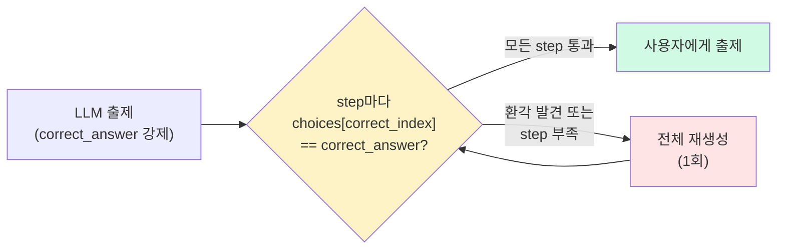

# correct_index 런타임 가드 — 정답 인덱스 정합성 검증 (불일치 0/91)

> **결과**: 4월에 만든 offline 평가가 V2 프롬프트로 정답 인덱스 오류를 10% → 5%로 줄였지만 "완전 차단"은 못 했다. 6월 평가서 작성 중 그 빈 자리를 다시 인식하고, `correct_answer` 중복 출력 + 코드 정합성 검증 + 재생성으로, 정답 인덱스 불일치가 사용자에게 도달한 사례를 **0/91 step(실측, N=20)** 으로 끌어내렸다. 평균 LLM 호출은 1.0회/시도. 비용 추가 거의 없음.

| 항목  | 내용                                                                                                               |
| --- | ---------------------------------------------------------------------------------------------------------------- |
| 목적  | [[프롬프트 변경 효과 측정 - correct_index 오류율 비교 테스트\|4월 작업]]에서 "추가 개선 방향 (미착수)"로 적어둔 "생성 후 자동 검증 + 재생성"을 실현               |
| 방식  | LLM 출력에 `correct_answer` 기준값 필드 강제 → `choices[correct_index] == correct_answer` 코드 정합성 검증 → 불일치 발생 시 재생성 |
| 범위  | `_gen_path_trace` 출제 단계만. 모델/스키마 변경 0건                                                                           |

---

## 만들게 된 계기

4월에 LLM 출제 결과에서 correct_index 정합성 오류를 발견하고 프롬프트를 V2까지 다듬어 [[프롬프트 변경 효과 측정 - correct_index 오류율 비교 테스트\|오류율을 10% → 5%로 줄였다]]. 그런데 **5%는 0%가 아니다**: 서비스에 배포되면 사용자가 여전히 100번 중 5번은 잘못된 출제를 받게 된다는 뜻이다.

당시 만든 측정 도구는 "배포 전에 이 프롬프트가 더 나은지"를 판단하는 테스트였지, **매 요청마다 출력을 검사해서 잘못된 답을 막아주는 장치는 아니었다.**  5% 그 이상 줄이려면 코드 레벨에서 결정적으로 검증하는 다른 방법이 필요했다.

가장 자연스러운 후보는 `explanation` 텍스트에서 정답을 추출해 `choices[correct_index]`와 맞춰보는 것이다. 4월 작업에서 이미 시도한 휴리스틱(정규식 기반 추출) 방식. 그런데 막상 돌려보면 어느 쪽이든 깨진다.

예를 들어 explanation이 이렇게 적혀있다고 하자:

> "처음엔 참조 횟수가 1이고, sys.getrefcount를 부르면 임시 참조가 +1이 되어서, 결국 3이 됩니다."

여기서 정답은 "1"일까 "3"일까? 정규식이 첫 번째 매칭을 잡게 짜면 "1"이 잡힌다. 그런데 실제 정답은 "3", 즉 `choices[correct_index] = "3"` 인 출제를 휴리스틱이 "choices[ci]가 1이 아니네, 오류!"라고 잘못 보고해버린다. 그렇다고 마지막 매칭을 잡게 바꾸면 또 다른 패턴("3이었다가 1이 됩니다" 같은 경우)에서 깨진다. **어느 규칙으로 짜도 LLM이 만드는 자연어 표현 다양성을 못 따라간다.** 4월 실측에서 휴리스틱이 오류라고 보고한 8건 중 6건이 가짜 오류(75%)였던 이유다.

게다가 explanation이 "카운트가 증가합니다" 처럼 구체적 숫자를 아예 안 쓰면 정규식은 잡을 게 없다. 4월 측정에서 step의 60~70%가 그렇게 검증 자체가 안 됨으로 스킵됐다. 즉 대부분의 출제를 검사도 못 하는 상태.

결국 대안은 LLM Judge였다: 문제를 출제하는 llm보다 더 성능이 높은 llm으로 검증하여 스킵률은 거의 0으로 떨어졌지만, 어찌됐든 이것도 llm이다보니 판정 자체가 다시 확률적이다.

→ 정리하면, 자연어로 적힌 explanation에서 정답을 추출하는 어떤 방식도 원리적으로 결정적이 될 수 없다. 정규식은 표현 다양성을 못 따라가고, LLM Judge는 또 다른 LLM이라 확률적이다. **판정을 결정적으로 만들려면 길은 하나뿐이다: 자연어가 아니라, LLM이 코드가 비교할 수 있는 구조화된 형식으로 정답을 중복 출력하게 만들고, 코드가 두 값의 정합성을 비교한다.** (단, 이 기준값도 같은 LLM이 만든 것이므로 이 검증이 보장하는 건 '정답이 사실로 맞다'가 아니라 '자기 출력끼리 어긋나지 않는다'까지다 — 아래 한계 절 참고.)

---

## 설계 — `correct_answer` 중복 출력 강제

explanation 추가: **LLM에게 정답을 두 번 쓰게 한다.**

```json
{
  "question": "참조 횟수는?",
  "choices": ["1", "2", "3", "4"],
  "correct_index": 1,
  "correct_answer": "2",      // ← 신규. choices[correct_index]와 정확히 같아야 함
  "explanation": "..."
}
```

검증 한 줄로 끝:

```python
def is_valid(step):
    ci, ca, cs = step.get('correct_index'), step.get('correct_answer'), step.get('choices', [])
    return isinstance(ci, int) and 0 <= ci < len(cs) and cs[ci] == ca
```

이게 결정적인 이유:
- `choices[correct_index]`와 `correct_answer`는 둘 다 구조화된 string. 코드 비교 한 번.
- 자연어 파싱 없음 → 가짜 오류 가능성 0
- 비용 0 (출력 토큰 약간 증가뿐)

**LLM에게 답을 두 번 쓰게 만들면, 자리(index)와 값(value)을 헷갈리는 그 순간 두 출력이 어긋난다.** 4월 노트 7절의 V2 프롬프트가 "correct_index를 정한 뒤 choices[correct_index]를 꺼내서 정답 값과 같은지 다시 확인하세요"라고 self-check를 지시했지만, 그건 LLM이 알아서 따라줘야 작동했다. `correct_answer`를 출력 형식에 강제하면 self-check가 더 이상 LLM 의지에 안 달려있다. 두 값을 쓰게 만들면 **코드가 자동으로 비교해버리니까**.

### 흐름



```python
def _gen_path_trace(self, log):
    prompt = "..."  # v2 프롬프트 + correct_answer 출력 규칙
    content, raw_count = self._gen_and_validate(prompt)

    # 환각 1개라도 발생(통과 < raw) 또는 통과 step 부족이면 1회 재생성
    all_ok = (len(content.get('steps', [])) == raw_count
              and raw_count >= self.PATH_TRACE_MIN_STEPS)
    if not all_ok:
        retry, _ = self._gen_and_validate(prompt)
        if len(retry.get('steps', [])) > len(content.get('steps', [])):
            content = retry
    if not content.get('steps'):
        raise ValueError("path_trace 출제 실패: 유효한 step이 없습니다")
    return content
```

### 정책 결정 — 환각 1개라도 발생하면 즉시 재생성

환각이 1개라도 통과한 응답은 **LLM의 자기일관성이 그 순간 깨졌다는 신호**다. 다른 step도 신뢰하기 어려우니, 환각 step만 걸러내고 나머지를 그대로 쓰는 것보다 전체 응답을 다시 받는 게 안전하다.

비용 우려는 사실상 없다. 아래의 테스트 결과 평균 LLM 호출을 1.0회/시도했고, 환각 자체가 거의 발생 안 해서 재생성 트리거도 거의 안 걸린다.

---

## +) JSON 파싱 실패 트러블슈팅

작업 중간에 PARSE ERROR `Unterminated string starting at: line 5 column 19` 가 가끔(실측 30%, 3/10회) 발생.

**원인**: LLM이 응답을 ` ```json...``` ` 코드 펜스로 감싸서 주는데, 그 안의 `question` 값에도 코드 예시용 ` ```python ... ``` ` 펜스가 들어있는 케이스. `_parse_json_response`가 `split('\`\`\`')`로 외곽 펜스를 떼려다가 question 값 안의 펜스까지 같이 잘라, JSON 내용물이 중간에서 끊겼다.

**해결**: `response_format={"type": "json_object"}` 적용으로 모델이 처음부터 코드 펜스 없이 순수 JSON으로 응답 → PARSE ERROR 0/22로 해결. 이후 split 로직 자체가 불필요해져 `_parse_json_response` 메서드를 제거하고 `json.loads()` 직접 호출로 단순화했다.


---

## 검증 — 단계적 실측

### N=20 측정

환각이 잘 나오는 스트레스 케이스(파이썬 참조 카운팅, 숫자형 선택지)로 20회 출제. 한 회당 3~5 step이 생성돼 총 91 step이 나왔고, **정답 인덱스 불일치 0/91(0.00%), 성공률 100%, 평균 LLM 호출 1.0회**였다.

[[프롬프트 변경 효과 측정 - correct_index 오류율 비교 테스트\|4월 측정]]에서 V2 프롬프트만 있을 때 오류율이 5%였던 것과 비교하면, 이 차이는 두 가지 조합으로 설명된다:

1. **`correct_answer` 도입 + 결정적 코드 검증**: LLM이 정답을 두 번 쓰게 만들었고, 코드가 `choices[ci] == ca`로 자동 비교한다. V2 프롬프트의 self-check 지시가 "LLM이 따라줘야 작동하는 부탁"에서 "코드가 강제하는 검증"으로 옮겨간 셈이다. 환각이 발생해도 사용자에게 도달하기 전에 차단된다.
2. **`response_format` 적용**: LLM 응답 형식을 JSON으로 강제해 parse error 방지.

프롬프트 개선으로 5%까지 줄였고, 런타임 가드 도입 후에는 실측 범위(91 step)에서 정답 인덱스 불일치가 사용자에게 노출된 사례가 0건이다.

---

## 한계 — 빠져나갈 수 있는 환각 패턴

`correct_answer`가 잡는 건 자리(index)와 값(answer)을 **다르게** 틀린 경우다. 만약 LLM이 **둘 다 같은 방향으로 틀리면** 통과해버린다.

예: choices=["1","2","3","4"], 진짜 정답이 "2"인데 LLM이
- `correct_index=2` (자리 환각)
- `correct_answer="3"` (값도 같이 잘못)

→ `choices[2] == "3" == correct_answer` → **통과되어버림 (가짜 정답)**

다행히 [[프롬프트 변경 효과 측정 - correct_index 오류율 비교 테스트\|4월 작업]]에서 실제로 관찰된 환각 패턴은 전부 "자리(index)는 잘못, 값은 explanation과 맞음" 형태였고, 이번 실측에서도 이런 케이스는 0/91 step으로 한 건도 나오지 않았다. 

더 근본적인 해결 방향 (필요시 예정):
1. **삼각 검증**: explanation의 논리적 정답까지 LLM Judge로 교차. 비용 ↑
2. **숫자형 선택지를 서술형으로 강제**: `"2"` 대신 `"참조 횟수는 2이다"`. 선택지가 숫자가 아니니 자리/값 혼동 자체가 안 생긴다. 채점 로직도 같이 손봐야 함.

실측 0%인 지금은 굳이 추가할 필요가 없다. 이 패턴의 환각이 실제로 발생하면 그때 보완 예정!

---

## 회고

### offline 평가만으로는 부족하다

프롬프트를 다듬어 오류율을 5%로 낮추는 것과, 실제 프로덕션에서 오류가 사용자에게 도달하지 못하도록 막는 것은 다른 일이다. LLM 답변에는 언제든 변수가 존재하기 때문에, 배포 전 품질을 확인하는 offline 평가만으로는 충분하지 않다. 프로덕션 레벨에서 최종적으로 오류를 방지하는 장치가 별도로 필요하다는 걸 이번 작업을 통해 체감했다.

---

## 참고

- [[프롬프트 변경 효과 측정 - correct_index 오류율 비교 테스트]]: 4월 작업. 이 노트가 12절 "추가 개선 방향" 두 번째를 실현
- [[RAG 검색 파이프라인 개선 — 한국어 질문이 엉뚱한 결과를 부르던 문제]]: 같은 LLM 제품 평가서가 시작점이 된 첫 번째 사이클
- [[간격 반복 연습문제 - 자동 출제·채점|학습 로그 기반 간격 반복 연습문제 시스템 구현]]: `_gen_path_trace`가 속한 연습문제 시스템 최초 설계
