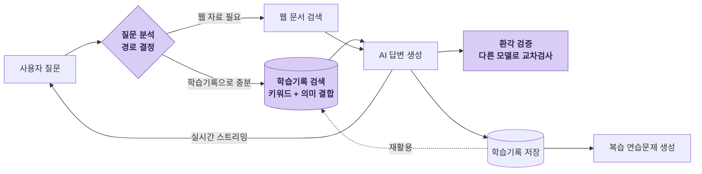

# 📚 LearnLog - 개발자를 위한 AI 검색 아카이브 시스템

[https://github.com/aengu/learn-log](https://github.com/aengu/learn-log)

[Learn Log - AI 개발 지식 베이스](https://learn-log.onrender.com/)

## 🎯 프로젝트 개요

개발 중 기술적 질문을 검색하면, AI가 공식 레퍼런스와 함께 답을 마크다운으로 정리해주고, 저장된 학습 로그를 다시 검색(RAG)해 새 답변에 활용하며, 간격 반복 연습문제로 복습까지 이어지는 학습 아카이브 시스템입니다.

**핵심 가치**: 검색 → 정리 → 복습 → 재활용(RAG)의 학습 루프를 하나의 시스템 안에서 완결

> 제가 개발하면서 매일 직접 쓰는 개인 학습 도구입니다. 토이 프로젝트로 끝내지 않고 실제 사용 중 느낀 불편을 기능 개선으로 이어가며, 개선은 벤치마크로 측정해 수치로 확인한 뒤 반영했습니다.

  
<b>5개월</b>지속 개발 (2026.1–6)

  
<b>28편</b>개발 일지

  
<b>16개</b>벤치마크·검증 스크립트

  
<b>0/91</b>가드 적용 후 최종 출력 불일치

  
<b>68→37s</b>응답 단축

  
<b>73개</b>테스트 · CI 자동화

---

## 🏗 아키텍처

라우터가 질문마다 경로를 정하고(웹 생략 / 무관한 기록 차단), 과거 학습기록을 검색해 답변 컨텍스트를 채우며, 생성과 다른 모델로 환각을 비동기 검증합니다.

*구현: 라우팅 LangGraph · 하이브리드 검색 pgvector+FTS · 답변 Mistral · 검증·경량작업 Groq · 웹검색 Tavily*

---

## 주요 기술적 도전

<table class="ll-table">
<thead><tr><th>도전</th><th>문제 → 접근</th><th>결과</th></tr></thead>
<tbody>
<tr>
<td>📚 <b>학습기록 재활용 (RAG)</b><small>FTS + 벡터 하이브리드 검색</small></td>
<td>쌓인 학습기록이 답변 생성에 쓰이지 않았고, 키워드 검색(FTS)은 "N+1 문제"를 "ORM 쿼리 반복 호출"이라는 질문으로 못 찾는다. pgvector 의미 검색을 FTS와 RRF로 결합해 top-3을 프롬프트에 주입 — 전용 벡터 DB 없이 PostgreSQL 확장 하나로.</td>
<td>추가 지연 0.65s · 2%<a href="../LearnLog/pgvector-하이브리드-RAG---FTS+벡터-RRF-결합">상세 →</a></td>
</tr>
<tr>
<td>🛡 <b>환각 방어</b><small>예방 · 검출 · 표시 3단</small></td>
<td>답변이 저장돼 연습문제로 암기되는 구조라 환각이 치명적인데, 무료 티어 모델의 환각 자체는 막을 수 없다. 예방(grounding)·검출(생성과 <b>다른 모델</b>로 저장 후 비동기 모순 검사)·표시(출처·검증 배지) 3단으로 다루고, 그 Judge까지 Claude로 66건 교차검증.</td>
<td>응답 안 막는 검증<a href="../LearnLog/환각-방어---예방·검출·표시-3단">상세 →</a></td>
</tr>
<tr>
<td>🧪 <b>LLM 검증 체계</b><small>채점 스크립트의 오판 발견 · 교체</small></td>
<td>프롬프트 개선 효과를 측정하니 오히려 악화로 나왔다 — 원시 응답을 전수 확인해 보니 "오류"의 75%가 채점 스크립트의 오판. 채점기를 먼저 고치고, 스킵률 90%인 정규식 채점을 다른 모델의 LLM 교차 채점으로 교체해 전수 판정.</td>
<td>확정 오류율 10%→5%<a href="../LearnLog/프롬프트-검증-재설계---pytest를-버리고-실험-스크립트로">상세 →</a></td>
</tr>
<tr>
<td>🔒 <b>런타임 가드</b><small>출력 자가검증 + 실패 시 재생성</small></td>
<td>프롬프트 개선(10%→5%)은 모델 출력을 고쳤지만 5%는 0이 아니다. LLM에게 정답을 번호와 값으로 두 번 쓰게 강제 — 헷갈리는 순간 두 값이 어긋나고, 코드가 내부 일관성을 검사해 어긋나면 재생성. 서비스 계층에서 오류 노출을 통제하고, 못 잡는 유형까지 한계로 문서화.</td>
<td>최종 출력 불일치 0/91<a href="../LearnLog/correct_index-런타임-가드-—-정답-인덱스-정합성-검증">상세 →</a></td>
</tr>
<tr>
<td>⚡ <b>속도 vs 품질</b><small>모델 분리 + 병렬화 + 스트리밍</small></td>
<td>품질을 위해 답변 모델을 Mistral Large로 올리자 응답이 68초. 작업별 벤치마크로 병목(답변 생성 65%)을 확인하고 모델 하이브리드 분리 → 후처리 병렬화 → 프롬프트 경량화 → SSE 스트리밍. 효과 없던 실험과 틀렸던 결론의 정정까지 기록.</td>
<td>68s→37s<a href="../LearnLog/LLM-응답-속도-최적화---병렬화,-프롬프트-경량화,-스트리밍">상세 →</a></td>
</tr>
</tbody>
</table>

---

## ✨ 주요 기능

### AI 답변 + 공식 레퍼런스 정리
질문하면 Tavily로 공식 문서를 찾고, Mistral이 답변을, Groq가 노션 스타일 마크다운 변환을 맡아 레퍼런스가 포함된 한 문서로 정리합니다. *(위 실행 화면)*

### 과거 학습기록 재활용 (RAG)
저장·태그 분류된 학습기록을 키워드 + 의미(pgvector)로 검색해 답변 컨텍스트에 주입합니다. "N+1 문제"로 저장한 기록을 "ORM이 반복 호출돼 느린 문제" 질문으로 찾아옵니다 — 키워드가 안 겹쳐도.

### 질문별 경로 라우팅
라우터가 질문을 보고 **웹검색 생략**(기록으로 충분) · **무관 기록 차단**을 판단합니다. 직선 파이프라인을 조건 분기 그래프(LangGraph)로 전환했습니다.

### 환각 방어
생성과 다른 모델로 모순을 **비동기** 검증하고 출처 배지를 표시합니다. 검증이 답변 속도를 막지 않게 분리했습니다.

### 간격 반복 연습문제
저장한 기록을 정말 이해했는지 두 유형으로 출제하고, 1·3·7·14·30일 간격으로 복습을 관리합니다.

### 통계 대시보드 + Streak
학습량 · 정답률 · 연속 학습일수(Streak)를 잔디 스타일로 시각화합니다.

## 🛠 기술 스택

- **Backend**: Django 5 · DRF · **PostgreSQL 18** — FTS + pgvector 하이브리드 검색을 별도 벡터 DB 없이 DB 안에서 해결
- **AI 파이프라인**: LangGraph — 질문별 조건 분기 라우팅 (검색→생성 파이프라인 제어)
- **Frontend**: Django Template + **HTMX** — SPA 없이 SSE 스트리밍·무한스크롤·부분 갱신 · Tailwind CSS
- **Testing & CI**: pytest · factory_boy (테스트 73개) · GitHub Actions push/PR 자동 실행
- **Deployment**: Docker Compose · Render (Web Service + Managed PostgreSQL)

---

## 🤖 LLM·검색 API

작업 성격에 맞춰 3개 API를 분리해서 씁니다.

- **Tavily** — 공식 문서 웹 검색·발췌 (RAG의 웹 소스)
- **Mistral Large** — 답변 생성 (개념 깊이·한국어 품질 우수)
- **Groq (Llama 3.3)** — 태그 추출·마크다운 변환·라우팅 판단 등 경량·고속 작업

> 초기 Groq 단독 → 품질 위해 Mistral 도입, 작업별 하이브리드로 분리. → [[LLM 공급자 하이브리드 전환 - Groq + Mistral 속도·품질 벤치마크|벤치마크]]

---

## 개발 후기

**왜 만들었나** — 검색해서 저장만 하고 다시 안 보는 문제가 있었습니다. 그 순간엔 이해한 것 같은데 며칠 뒤 같은 걸 또 검색하고 있었어요. "검색 → 정리 → 복습"이 한 곳에서 도는 시스템이 필요했습니다.

**실제로 쓰나** — 남을 위한 서비스가 아니라 매일 직접 씁니다. 연습문제 정답률 40% — 저장만 하고 제대로 이해 못 한 걸 숫자로 확인하게 된 것이 가장 큰 수확이었습니다.

**아쉬운 점** — 무료 LLM 티어의 속도 한계(약 30초)는 병렬 호출·경량화·스트리밍으로 체감을 줄였지만 근본 한계는 남아 있습니다.

---

## 개발 타임라인

2026년 1~6월, 약 5개월간 28편 — 검색 아카이브에서 RAG·환각 방어까지 꾸준히 발전시켰습니다. 태그를 누르면 영역별로 필터됩니다.

성공만 기록하지 않았습니다 —

<a href="../LearnLog/LLM-응답-속도-최적화---병렬화,-프롬프트-경량화,-스트리밍">🧪 효과 없던 실험도 기록 (max_tokens)</a>
<a href="../LearnLog/LLM-응답-속도-최적화---병렬화,-프롬프트-경량화,-스트리밍">✏️ 틀린 결론을 두 달 뒤 실험으로 정정</a>
<a href="../LearnLog/correct_index-런타임-가드-—-정답-인덱스-정합성-검증">⚠️ 시스템이 못 잡는 유형까지 문서화</a>

<input type="radio" name="llf" id="f-all" checked>
<input type="radio" name="llf" id="f-design">
<input type="radio" name="llf" id="f-feature">
<input type="radio" name="llf" id="f-rag">
<input type="radio" name="llf" id="f-verify">
<input type="radio" name="llf" id="f-perf">
<input type="radio" name="llf" id="f-test">
<input type="radio" name="llf" id="f-ops">
<input type="radio" name="llf" id="f-cs">

<label for="f-all">전체</label><label for="f-design">설계</label><label for="f-feature">기능구현</label><label for="f-rag">AI/RAG</label><label for="f-verify">AI/검증</label><label for="f-perf">성능</label><label for="f-test">테스트</label><label for="f-ops">배포·운영</label><label for="f-cs">CS</label>

2026.06

06-18<a href="../LearnLog/LLM-추론에서-입력은-싸고-출력이-비싸다">LLM 추론 — 입력은 싸고 출력이 비싸다</a>CS

06-16<a href="../LearnLog/환각-방어---예방·검출·표시-3단">환각 방어 — 예방·검출·표시 3단</a>AI/검증

06-11<a href="../LearnLog/pgvector-하이브리드-RAG---FTS+벡터-RRF-결합">pgvector 하이브리드 RAG — FTS+벡터 RRF</a>AI/RAG

06-11<a href="../LearnLog/LangGraph-라우팅-에이전트---질문별-조건-분기">LangGraph 라우팅 — 질문별 조건 분기</a>AI/RAG

06-10<a href="../LearnLog/꼬리질문---self-FK-질문-트리-구현">꼬리질문 — self-FK 질문 트리</a>기능구현

06-04<a href="../LearnLog/correct_index-런타임-가드-—-정답-인덱스-정합성-검증">런타임 가드 — 최종 출력 불일치 0/91</a>AI/검증

2026.05

05-30<a href="../LearnLog/RAG-검색-파이프라인-개선-—-한국어-질문이-엉뚱한-결과를-부르던-문제">RAG 검색 개선 — 한국어 질문 정확도 복원</a>AI/RAG

05-21<a href="../LearnLog/메타인지-학습-UX-재설계---안-쓰는-기능을-다시-만들기">메타인지 UX 재설계 — 안 쓰는 기능 다시 만들기</a>기능구현

05-17<a href="../LearnLog/Gunicorn-워커-타임아웃-트러블슈팅---스트리밍-응답-SIGKILL">Gunicorn 워커 SIGKILL 디버깅</a>배포·운영

05-06<a href="../LearnLog/PostgreSQL-버전-불일치-트러블슈팅---dbpull-실패">PostgreSQL 18 버전 불일치 트러블슈팅</a>배포·운영

2026.04

04-28<a href="../LearnLog/통계-대시보드-+-Streak(불꽃)-시스템-구현">통계 대시보드 + Streak 시스템</a>기능구현

04-28<a href="../LearnLog/싱글턴-패턴---Streak-모델-적용">싱글턴 패턴 — Streak 모델 적용</a>CS

04-25<a href="../LearnLog/LLM-공급자-하이브리드-전환---Groq-+-Mistral-속도·품질-벤치마크">LLM 하이브리드 전환 — Groq + Mistral</a>성능

04-25<a href="../LearnLog/LLM-응답-속도-최적화---병렬화,-프롬프트-경량화,-스트리밍">응답 속도 최적화 — 68s→37s</a>성능

04-20<a href="../LearnLog/프롬프트-변경-효과-측정---correct_index-오류율-비교-테스트">프롬프트 변경 효과 측정 — 오류율 비교</a>AI/검증

04-20<a href="../LearnLog/프롬프트-검증-재설계---pytest를-버리고-실험-스크립트로">검증 재설계 — pytest→실험 스크립트</a>AI/검증

2026.03

03-26<a href="../LearnLog/간격-반복-연습문제---자동-출제·채점">간격 반복 연습문제 — 자동 출제·채점</a>기능구현

03-13<a href="../LearnLog/GitHub-Actions로-테스트자동화">GitHub Actions CI — 자동 테스트·백업</a>테스트

03-13<a href="../LearnLog/render-배포웹-슬립-방지">배포 웹 슬립 방지 — 콜드스타트 제거</a>배포·운영

2026.02

02-27<a href="../LearnLog/Render-무료-배포-+-DB-동기화-+-자동-백업-구현">Render 배포 + DB 동기화 + 자동 백업</a>배포·운영

02-12<a href="../LearnLog/학습로그-검색-기능---Full-Text-Search-구현">Full-Text Search — 한국어 키워드 검색</a>기능구현

02-09<a href="../LearnLog/log-list-API-테스트-작성">log list API 테스트 작성</a>테스트

02-05<a href="../LearnLog/SSE-진행-스트리밍---프로그레스바·진행로그">SSE 진행 스트리밍 — 프로그레스바·진행로그</a>기능구현

02-02<a href="../LearnLog/검색-도메인-자동-매핑---출처-판단-개선">검색 도메인 자동 매핑 — 출처 판단</a>AI/RAG

2026.01

01-30<a href="../LearnLog/Django-모델-설계-및-마이그레이션-초기화">Django 모델 설계 + 마이그레이션</a>설계

01-30<a href="../LearnLog/LearningLog-모델-필드-설계">LearningLog 모델 필드 설계</a>설계

01-30<a href="../LearnLog/학습-로그-서비스-계층-설계-및-구현">서비스 계층 설계 — API→가공→저장</a>설계

01-23<a href="../LearnLog/vscode에서-Docker-컨테이너-디버깅하기">Docker 컨테이너 원격 디버깅</a>배포·운영

