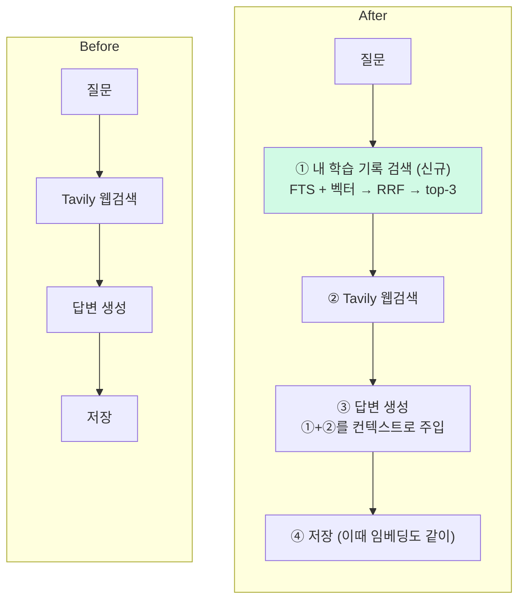

# pgvector 하이브리드 RAG

> **결과**: 질문이 들어오면 내 과거 학습 로그를 먼저 검색해서(FTS + 벡터, RRF 결합) 답변 생성 프롬프트에 넣어주는 RAG 파이프라인. "N+1 문제"라고 저장해둔 로그를 "ORM 쿼리가 반복 호출돼서 느려지는 문제"라는 질문으로 찾아온다. 키워드가 하나도 안 겹치는데. 추가 비용은 0.65초로 전체 파이프라인(35초+)의 2% 수준.

| 항목 | 내용 |
| --- | --- |
| 목적 | 모아둔 학습 로그가 새 답변 생성에 활용되게 (검색 → 생성 연결) |
| 방식 | pgvector 임베딩 검색 + 기존 FTS를 RRF로 결합, top-3을 프롬프트에 주입 |
| 범위 | DB 이미지 교체, embedding 필드, 하이브리드 검색, 답변 프롬프트, SSE 5단계, 백필 커맨드 |

---

## 만들게 된 계기

질문을 하면 답변이 만들어지고 로그로 쌓인다. 몇 달치가 쌓였는데, 어제 물어본 질문과 비슷한 걸 물어봐도 똑같이 같은 파이프라인을 타고 웹검색부터 시작한다. 
전부터 답변 품질을 높일(환각을 줄일) 방법을 고민했었는데, 혹시 이 쌓인 로그들도 답변 품질에 기여할 수 있지 않을까.

기존 파이프라인에도 검색(Retrieval)과 생성(Generation)은 있었다. Tavily로 웹 문서를 찾아 상위 2건을 200자씩 잘라 답변 생성 컨텍스트로 넣는 식이다. 다만 이 검색이 보는 건 '웹'뿐이라, 내가 쌓아둔 로그는 어디에도 안 들어갔다. 그래서 이번엔 웹검색에만 의존하지 않기로 했다. 웹검색에 앞서, 기존 로그 중 질문과 연관된 게 있으면 그 내용을 먼저 컨텍스트로 넣는다. 요약하자면 **내 과거 로그를 검색해 답변 생성에 연결해보기!**



원래 흐름(Before)엔 로그를 보는 단계가 없다. After에서 ①이 그 자리에 새로 들어가 생성에 연결된다.

---

## 연관된 로그를 어떻게 찾나 — 임베딩과 벡터 검색

문제는 "연관된 로그"를 어떻게 찾느냐다. 처음 떠오른 건 [[학습로그 검색 기능 - Full-Text Search 구현|기존 검색에 쓰던 FTS]]인데, FTS는 키워드가 글자 그대로 겹쳐야 찾는다. "N+1 문제"로 저장한 로그를 "ORM 쿼리가 반복 호출돼서 느려지는 문제"로 물으면, 같은 내용인데 겹치는 단어가 없어서 0건이 나온다. 키워드 매칭으로는 "의미가 비슷한" 로그를 못 찾는 것.

그래서 임베딩(embedding)이 필요했다. 임베딩은 텍스트를 의미를 담은 숫자 배열(벡터)로 바꾸는 것이다. 핵심은 의미가 비슷한 글은 벡터도 서로 가깝게 배치된다는 점이다. "N+1 문제"와 "ORM 쿼리 반복 호출"은 단어는 다르지만 뜻이 같으니, 벡터 공간에서 가까이 놓인다.

그러면 검색은 이렇게 된다.

1. 모든 로그를 미리 임베딩해서 벡터로 저장해둔다.
2. 새 질문이 들어오면 질문도 임베딩해서 벡터로 바꾼다.
3. 질문 벡터와 가장 가까운(코사인 거리가 작은) 로그 벡터들을 꺼낸다.

단어가 아니라 의미로 찾으니, FTS가 0건을 내던 질문도 찾아낸다. 이걸 벡터 검색(또는 의미 검색)이라 부른다.

다만 FTS를 아예 버리진 않는다! `select_related` 같은 정확한 용어는 오히려 FTS가 더 잘 찾는다. 그래서 둘을 함께 쓰기로 했다(그래서 "하이브리드 RAG"다. 둘을 어떻게 합치는지는 뒤의 RRF에서). 남은 건 "이 벡터들을 어디에 저장하고 어떻게 계산하나"인데, 여기서 도구 선택이 나온다.

---

## 왜 pgvector인가

벡터 검색 하면 Pinecone, Chroma 같은 전용 벡터DB부터 떠오르는데, 안 썼다.

| | 전용 벡터DB | pgvector |
| --- | --- | --- |
| 인프라 | 서비스/컨테이너 추가 | 이미 운영 중인 PostgreSQL에 확장 하나 |
| 데이터 일관성 | 로그 DB와 벡터 저장소 동기화 필요 | 같은 테이블의 컬럼이라 트랜잭션 공짜 |
| 지금 규모(90건) | 명백한 오버스펙 | 풀스캔 코사인 계산이 밀리초 |

임베딩 모델은 mistral-embed(1024차원)를 골랐다([공식 문서](https://docs.mistral.ai/capabilities/embeddings/)). 답변 생성에 이미 [[LLM 공급자 하이브리드 전환 - Groq + Mistral 속도·품질 벤치마크|Mistral을 쓰고 있어서]], 새로 다른 회사에 가입하거나 API 키를 발급받을 필요 없이 쓰던 클라이언트를 그대로 재사용하면 됐다.

```python
self.mistral_client.embeddings.create(model="mistral-embed", inputs=[text])
#    ↑ 답변 생성에 쓰던 그 클라이언트, 새로 안 만들고 재사용
```

모델에는 임베딩을 담을 필드를 추가했다.

```python
# models.py
from pgvector.django import VectorField

class LearningLog(models.Model):
    embedding = VectorField(dimensions=1024, null=True, blank=True)
    
#`null=True`인 이유: 임베딩 API가 죽어도 로그 저장은 돼야함.
```


---

## 점수가 다른 두 검색을 합치기 - RRF

벡터 검색만 쓰지 않고 FTS와 같이 돌린다. 의미 검색은 단어가 달라도 찾는 게 강점이지만, "select_related" 같은 정확한 용어 매칭은 FTS가 더 확실해서다. 그런데 둘을 합치려니 문제가 있다.

① FTS는 SearchRank 점수를 준다 (scale 0~1, **높을수록** 관련 높음)
② 벡터 검색은 코사인 거리를 준다 (scale 0~2, **낮을수록**(0=동일) 관련 높음)
③ 단위도 방향도 다르다. FTS는 클수록 좋고 거리는 작을수록 좋으니, FTS 0.8과 거리 0.12 중 뭐가 더 좋은 결과인지 직접 비교할 방법이 없다

RRF(Reciprocal Rank Fusion)는 이걸 점수를 버리는 걸로 해결한다. 각 검색에서 몇 등 했는지만 보고 `1/(60+등수)`를 합산한다.

```
질문: "ORM 쿼리 중복 호출"

FTS 순위:        벡터 순위:
1등 로그A         1등 로그B (N+1 문제)
2등 로그B         2등 로그C
3등 로그D         3등 로그A

로그B = 1/(60+2) + 1/(60+1)   ← 양쪽 다 상위권, 최종 1등
로그A = 1/(60+1) + 1/(60+3)
로그D = 1/(60+3)              ← 한쪽에만 나옴, 점수도 한 번만

(+ 여기서 60은 그냥 관례값. 1/등수로만하면 점수차가 너무 커지니까 등수차이를 좀 완만하게 하려고 넣는 파라미터라고 함)
```

"양쪽 검색이 모두 좋다고 한 로그"가 위로 올라오는 구조다. 구현도 딕셔너리에 점수 누적하고 정렬하는 게 끝이다.

```python
def _rrf_merge(rankings, k=60):
    # rankings = [FTS가 매긴 pk 순서, 벡터가 매긴 pk 순서]
    scores = {}
    for ranking in rankings:
        for rank, pk in enumerate(ranking, start=1):   # rank = 1등, 2등, ...
            scores[pk] = scores.get(pk, 0.0) + 1.0 / (k + rank)  # 같은 pk면 누적
    return sorted(scores, key=scores.get, reverse=True)  # 점수 높은 순
```

처음엔 "이게 된다고?" 싶었는데, Elasticsearch가 하이브리드 검색에 아예 내장 기능으로 넣어둘 만큼 표준 방법이었다.

---

## 생성에 연결

검색해온 top-3을 답변 프롬프트에 넣는다. [[꼬리질문 - self-FK 질문 트리 구현|꼬리질문]] 때 만든 구조에 블록 하나가 추가됐다.

```
프롬프트 = ① 과거에 학습한 관련 기록 (신규, top-3 × 각 500자) <- NEW!!
         + ② 이전 대화 (꼬리질문일 때, 부모 Q + A 500자)
         + ③ Tavily 검색 결과
         + ④ 사용자 질문

내가 예전에 이 주제로 정리해둔 게 이거고(①), 직전에 이런 얘기 했고(②), 방금 웹에서 찾은 게 이거고(③), 물어보려고 하는 질문은 이거야(④)
```

여기서 ①로그와 ③웹검색은 둘 중 하나를 고르는 게 아니라, 역할이 달라서 **둘 다** 넣는다. 로그는 "내가 이미 이해하고 정리해둔 내용"(내 맥락에 맞고, 내가 한 번 검증한 것)이고, 웹은 "내 기록엔 없는 최신·외부 정보"다. 그래서 있으면 같이 주는 게 답변 품질에 제일 좋다. (이 "로그 + 웹" 보완 관계가, 다음 [[LangGraph 라우팅 에이전트]]에서 "로그로 충분하면 웹은 생략"이라는 분기의 전제가 된다.)

로그당 500자로 자르기: 전문을 넣으면 모델이 말이 많아져서 답변이 max_tokens에 잘리고 소요시간도 길어진다. ①의 역할은 "내가 이 주제를 어디까지 정리했는지" 알려주는 것까지고, 답변 구조가 "개념 → 원리 → 코드 → 주의사항" 고정이라 앞 500자에 개념 정의가 통째로 들어오니까 이정도면 적절하다.

꼬리질문일 때는 부모 로그가 ②로 이미 들어가니까 ①의 검색 대상에서 부모는 제외했다. 같은 내용이 두 번 들어가는 걸 막기 위해서.

UI는 SSE 프로그레스에 첫 단계로 "내 학습 기록 검색 중..."이 추가돼서 4단계가 5단계가 됐다. 기존 로그 90건은 `embed_logs` 백필 커맨드로 일괄 임베딩했다. 새 필드를 추가하면 과거 데이터에는 그 값이 없으니까 한 바퀴 돌면서 채워주는 것, [[일일 학습일지|backfill_journals]] 때랑 같은 패턴이다.

---

## 구현하다 만난 것들


**postgres 이미지에 pgvector가 없다.** `postgres:18-alpine`에는 확장이 안 들어있어서 `pgvector/pgvector:pg18`로 교체했다. 다행히 데이터 볼륨은 그대로라 로그 90건 무사. 마이그레이션에는 `VectorExtension()`을 넣어서 Render와 테스트 DB에서도 `CREATE EXTENSION`이 자동으로 돈다.

**textwrap.dedent의 함정.** 답변 프롬프트가 `textwrap.dedent(f"...")` 패턴이었는데, f-string 치환이 dedent보다 먼저 일어난다. 주입한 블록(개행 포함, 들여쓰기 없음)이 끼는 순간 공통 들여쓰기가 사라져서 dedent가 아무것도 안 하는 함수가 된다.

```python
# 문제: dedent는 "모든 줄의 공통 들여쓰기"를 떼는 함수
prompt = textwrap.dedent(f"""
    질문: {query}
    참고: {context}        # context가 여러 줄이고 들여쓰기 0칸이면...
""")
# f-string 치환이 먼저 → 이런 문자열이 됨:
#     질문: ...
#     참고: 줄1
# 줄2                      ← 들여쓰기 0칸
# → 공통 들여쓰기가 0칸으로 계산돼서 dedent가 아무것도 안 뗌 → 나머지 줄은 4칸 그대로

# 해결: dedent 버리고 직접 이어붙이기
prompt = (
    f"질문: {query}\n"
    f"참고:\n{context}"
)
```

이 함정은 값에 개행이 든 여러 줄 블록일 때만 터진다. 한 줄짜리 `{query}` 는 개행이 없어서 멀쩡하다. 그래서 여러 줄 "이전 대화"를 처음 넣은 꼬리질문 때 드러났고, 여러 줄 로그 블록을 매번 주입하는 RAG에서 상시화됐다. 답변 생성 프롬프트만 직접 조립로 바꿨다(다른 프롬프트는 dedent 유지 — 무효화돼도 들여쓰기가 지저분할 뿐 답변엔 영향이 없어서).

---

## 잘 되나, 얼마나 느려졌나

쌓인 로그를 답변 품질에 보태려고 하이브리드 RAG를 붙였으니, 구현 전후로 두 가지를 간단히 테스트했다. **검색 품질**(연관된 로그를 제대로 찾나)과 **속도**(새 단계가 붙어 얼마나 느려졌나).

기대한 결과는 이렇다. 검색 품질은 설계대로라면 제목·질문에 겹치는 단어가 하나도 없어도 내용(의미)만으로 연관된 로그가 검색돼야 한다. 속도는 검색 단계가 하나 늘었으니 조금은 느려지겠지만, 그 비용이 작아야 쓸 만하다.

먼저 검색 품질. 실데이터 90건으로, 의미는 같은데 키워드가 다른 질문을 골랐다.

```
Q: "ORM 쿼리가 반복 호출돼서 느려지는 문제"
→ 1순위: "Django ORM에서 N+1 문제는 무엇이고 어떻게 해결하나요?"
→ 2순위: "APM, slow query log, django silk 차이점"
→ 3순위: "django select_related와 prefetch_related 차이"
```

만들게 된 계기에 쓴 바로 그 시나리오다. FTS로는 0건이 나오는 질문인데 셋 다 정확하다.

속도는 [[꼬리질문 - self-FK 질문 트리 구현|꼬리질문]] 때처럼 TTFT를 따로 쟀다.

| 항목 | RAG 없음 (before) | RAG 있음 (after) |
| --- | --- | --- |
| 내 기록 검색 (신규 단계) | — | +0.65s |
| Tavily 웹검색 (기존, 양쪽 공통) | 3.32s | 3.32s |
| 생성 TTFT (첫 토큰까지) | 0.99s | 0.72s |
| 생성 총 시간 | 28.9s | 29.6s |
| 답변 길이 | 4,463자 | 4,282자 |

생성 시간은 전후 차이가 노이즈 범위다. 프롬프트에 1,500자가 더 들어갔지만 입력 읽기는 싸다는 걸([[LLM 추론에서 입력은 싸고 출력이 비싸다|prefill은 병렬이라]]) 어제 실험에서 이미 확인했고, 이번에도 같았다. 0.65초의 정체도 DB가 아니라 질문을 임베딩하는 API 호출 1회다. 그래서 로그가 1만 건이 돼도 이 시간은 거의 안 변한다.

---

## 회고

제대로된 rag를 처음 구현해봤는데, 좀 아쉬운 점이 있다. 관련 기록이 아예 없는 새 주제를 물어봐도, 지금은 top-3을 억지로 뽑아서 무관한 로그가 그대로 프롬프트에 들어간다. "이 질문에 내 로그가 쓸모 있나?"를 판단하는 단계가 없어서다. 그걸 라우터한테 시키는 게 다음 작업인데, 직선 파이프라인에 드디어 분기가 필요해진 거다. 다음 문서에 계속!

---

## 참고

- `search/services/learnlog_service.py`: `_embed`, `retrieve_similar_logs`, `_rrf_merge`, `_build_retrieved_context`
- `search/management/commands/embed_logs.py`: 임베딩 백필 커맨드
- `search/tests/test_rag.py`: RRF·벡터 정렬·폴백 테스트 9개
- [[꼬리질문 - self-FK 질문 트리 구현|꼬리질문]]: 500자 규칙과 TTFT 측정법의 출처
- [[학습로그 검색 기능 - Full-Text Search 구현]]: 하이브리드의 한쪽 축이 된 FTS
- [[RAG 검색 파이프라인 개선 — 한국어 질문이 엉뚱한 결과를 부르던 문제]]: 웹검색 쪽 retrieval 개선
- [[LLM 공급자 하이브리드 전환 - Groq + Mistral 속도·품질 벤치마크]]: mistral-embed를 고른 배경

---

## 이후 개선

- 다음 날, 회고에 적은 "top-3 억지 주입" 약점을 라우팅으로 해결 → [[LangGraph 라우팅 에이전트]]
