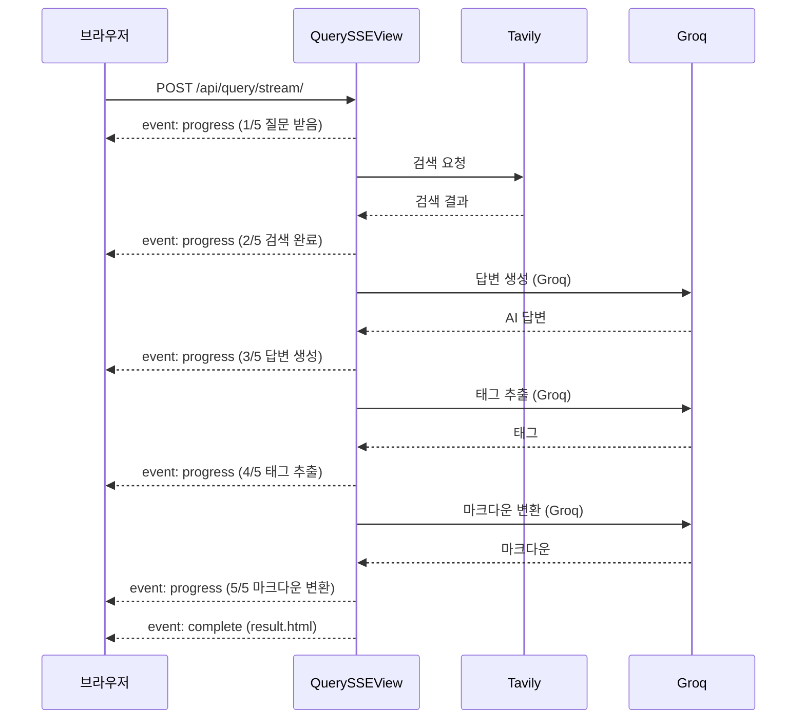

# 검색 중 프로그레스바 + 진행로그를 위한 SSE 구현

[https://github.com/aengu/learn-log/commit/09bca5169f4d38256e33e6e36c993e54d6589363](https://github.com/aengu/learn-log/commit/09bca5169f4d38256e33e6e36c993e54d6589363)

| 항목 | 내용 |
| --- | --- |
| 목적 | AI 질문 처리 시 사용자에게 실시간 진행 상황을 보여주기 (프로그레스 바 + 단계별 메시지) |
| 방식 | Server-Sent Events (단방향 스트리밍) |
| 범위 | `QuerySSEView`, `main.html` SSE fetch 처리 |
| LLM | Groq (Llama) — 답변 생성·태그 추출·마크다운 변환 모두 Groq |

---

![[Learn Log -프로그레스바.gif]]## 왜 SSE인가

실시간 진행 상황을 보여주는 방법은 세 가지가 있다.

| 방식 | 특징 | 안 고른 이유 |
| --- | --- | --- |
| Polling | 클라이언트가 주기적으로 상태를 물어봄 | 불필요한 요청이 계속 발생, 실시간성 떨어짐 |
| WebSocket | 양방향 통신 | 서버→클라이언트 단방향이면 충분한데 오버스펙 |
| **SSE** | **서버→클라이언트 단방향 스트리밍** | **- 채택** |

프로그레스 바는 서버가 "여기까지 했어"를 일방적으로 알려주기만 하면 된다. 클라이언트가 서버에 중간에 뭔가를 보낼 필요가 없으니 SSE가 딱 맞았다. HTTP 위에서 동작하라 별도 프로토콜 설정도 필요 없고, Django의 `StreamingHttpResponse`만으로 구현 가능.

---

## 전체 흐름



---

## SSE 이벤트 포맷

서버가 보내는 이벤트는 3종류다. 각 이벤트는 SSE 표준 포맷(`event:` + `data:`)을 따른다.

```
event: progress
data: {"step": 2, "total": 5, "message": "검색 완료"}

event: complete
data: {"html": "<div class='card'>...</div>"}

event: error
data: {"html": "<div class='alert alert-error'>...</div>"}
```

---

## 백엔드 — Django StreamingHttpResponse

```python
@method_decorator(csrf_exempt, name='dispatch')
class QuerySSEView(View):
    def post(self, request):
        query = request.POST.get('query', '').strip()
        return StreamingHttpResponse(
            self._process_stream(query),
            content_type='text/event-stream'
        )

    def _process_stream(self, query):
        """제너레이터 — yield마다 클라이언트에 즉시 전송"""
        service = LearnlogService()

        yield self._sse_event('progress', {'step': 1, 'total': 5, 'message': '질문 받음'})

        search_results = service.search_official_docs(query)
        yield self._sse_event('progress', {'step': 2, 'total': 5, 'message': '검색 완료'})

        ai_answer = service.generate_answer(query, search_results)
        yield self._sse_event('progress', {'step': 3, 'total': 5, 'message': 'AI 답변 생성'})

        # ... 태그 추출 → 마크다운 변환 → 저장 (순차) ...

        result_html = render_to_string('search/partials/result.html', {'log': log})
        yield self._sse_event('complete', {'html': result_html})

    def _sse_event(self, event_type, data):
        return f"event: {event_type}\ndata: {json.dumps(data, ensure_ascii=False)}\n\n"
```

핵심 포인트:
- `StreamingHttpResponse` + 제너레이터: 응답을 한 번에 보내지 않고, `yield`마다 클라이언트에 즉시 전송
- 서비스 메서드를 개별 호출하는 이유: `process_query()` 하나로 묶으면 중간에 `yield`를 끼울 수 없음

---

## 프론트엔드 — Fetch Streaming API

```javascript
fetch('/api/query/stream/', {
    method: 'POST',
    body: formData,
}).then(response => {
    const reader = response.body.getReader();  // ReadableStream
    const decoder = new TextDecoder();
    let buffer = '';

    function processStream() {
        reader.read().then(({ done, value }) => {
            if (done) return;

            buffer += decoder.decode(value, { stream: true });
            const lines = buffer.split('\n');
            buffer = lines.pop();  // 불완전한 마지막 라인은 버퍼에 유지

            let currentEvent = '';
            for (const line of lines) {
                if (line.startsWith('event:')) {
                    currentEvent = line.slice(7).trim();
                } else if (line.startsWith('data:')) {
                    const data = JSON.parse(line.slice(5).trim());

                    if (data.step !== undefined) {
                        progressBar.value = data.step;
                        progressMessage.textContent = data.message;
                    } else if (data.html !== undefined) {
                        resultContainer.innerHTML = data.html;
                    }
                }
            }
            processStream();  // 재귀 호출로 다음 청크 읽기
        });
    }
    processStream();
});
```

### HTMX 대신 fetch를 쓴 이유

이 프로젝트는 HTMX를 쓰고 있지만, SSE 처리만큼은 fetch로 직접 구현했다.

| 요구사항 | HTMX SSE (`hx-ext="sse"`) | fetch + ReadableStream |
| --- | --- | --- |
| 이벤트 타입별 다른 동작 (progress → 프로그레스 바, complete → 결과 삽입) | 기본이 하나의 타겟에 교체라 복잡 | `if/else`로 자유롭게 분기 |
| JSON 파싱 후 여러 요소 업데이트 | 받은 데이터를 그대로 HTML swap하는 게 기본 | 파싱 후 원하는 요소에 개별 업데이트 |
| 청크 도착 시 즉시 처리 | 이벤트 단위로만 받음 | `reader.read()`로 저수준 스트림 제어 가능 |

`ReadableStream`은 데이터가 도착하는 대로 바로바로 처리할 수 있는 Web API다. 일반 `fetch`는 응답이 전부 끝나야 사용할 수 있지만, `response.body.getReader()`로 ReadableStream을 열면 서버가 보내는 SSE 이벤트를 **도착할 때마다** 읽어서 프로그레스 바를 실시간으로 업데이트할 수 있다.

---

## 파일 구조

```
search/
├── views.py          # QuerySSEView
├── urls.py           # /api/query/stream/ 라우트
└── services.py       # save_learning_log() 분리

templates/search/
└── main.html         # SSE fetch + 프로그레스 바 UI
```

---

## 이후 개선

5단계 순차 처리의 속도 문제는 이후 병렬화 + streaming으로 개선했다 → [[LLM 응답 속도 최적화 - 병렬 처리와 Streaming]]
