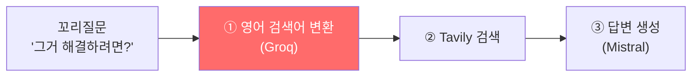
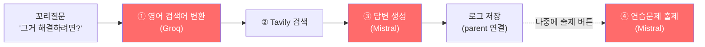

# 꼬리질문

> **결과**: `LearningLog.parent` self-FK로 "그러면 이 경우엔?" 식 꼬리질문 구현. 구현 전에 벤치마크 2개를 먼저 돌렸는데 결과가 재밌었다. 걱정했던 속도 비용(이전 대화를 프롬프트에 넣으면 느려질까)은 사실상 0이었고, 정작 컨텍스트가 없으면 죽는 곳은 전혀 걱정 안 하던 검색어 변환 단계였다 (부모 없이 0/12, 있으면 12/12).

| 항목 | 내용 |
| --- | --- |
| 목적 | 질문-답변 1쌍 구조에 꼬리질문 추가 |
| 방식 | 벤치마크로 컨텍스트 정책부터 결정 → parent FK + 단계별 컨텍스트 주입 |
| 범위 | 모델(parent FK), 검색어 변환·답변 생성·연습문제 출제 프롬프트, UI 진입점 2곳 |

---

## 만들게 된 계기

LearnLog는 질문 하나에 답변 하나로 끝난다. 근데 답변을 읽다 보면 "그러면 그 경우에는?"이 자연스럽게 떠오르고, 지금은 그걸 새 질문으로 처음부터 다시 풀어 써야 한다.

이전 대화를 프롬프트에 넣으면 된다는 건 알고 있었다. 걱정은 속도였다. 이전 답변이 1500토큰쯤 되는데, [[LLM 응답 속도 최적화 - 병렬화, 프롬프트 경량화, 스트리밍|5월에]] 입력 토큰을 줄여서 빨라진 경험이 있으니 입력을 다시 늘리면 그만큼 도로 느려질 것 같았다.

추측으로 정하지 말고 재보기로 했다.

---

## 실험 1: 이전 대화를 넣으면 얼마나 느려지나?

부모 대화를 5가지 크기로 넣어가며 20번 호출했다. 핵심은 TTFT(첫 토큰이 나올 때까지 시간)를 따로 잰 것. 입력을 읽는 비용은 TTFT에 그대로 나타나고, 총 시간만 재면 답변 길이가 들쭉날쭉한 것에 묻혀버린다. 5월에 출력 토큰을 기록 안 해서 아쉬웠던 것도 있어서 이번엔 전부 기록했다.

| 조건 | 컨텍스트 | TTFT | 총시간 | 입력tok | 출력tok | 잘림 |
| --- | --- | --- | --- | --- | --- | --- |
| baseline | 없음 | ~0.6s | 20.2s | 252 | 1038 | 0/4 |
| q_only | 부모 질문만 | 0.57s | 23.1s | 276 | 1196 | 0/4 |
| **q_a500** | + 답변 500자 | 0.67s | 21.7s | 527 | 1184 | 0/4 |
| q_a1000 | + 답변 1000자 | 0.65s | 24.9s | 732 | 1341 | 0/4 |
| q_full | + 답변 전문 | 0.63s | 33.7s | 1150 | 1865 | **3/4** ❌ |

입력을 4.5배(252→1150토큰) 늘렸는데 TTFT가 그대로다. 모델이 입력을 "읽는" 시간은 측정이 안 될 만큼 작았다. 걱정이 기우였던 것. (왜 입력 읽기가 싼지는 → [[LLM 추론에서 입력은 싸고 출력이 비싸다]])

그럼 q_full은 왜 33초나 걸렸냐? 입력 때문이 아니라 답변이 길어져서다. 재료를 많이 주니까 모델이 말이 많아졌다 (출력 1038→1865토큰). 검산해보면 출력 차이 827토큰 ÷ 55 tok/s ≈ 15초로 총 시간 차이와 거의 일치한다. 더 나쁜 건, q_full은 4번 중 3번이 max_tokens 2000에 정확히 부딪혀서 답변이 중간에 잘렸다. 전문 주입은 "느려서"가 아니라 "잘려서" 탈락이다.

500자는 출력이 거의 안 부풀고(+1.5초 수준), 컨텍스트가 할 일("그러면"의 '그'가 뭔지 알려주기)에는 충분하다. **q_a500 채택.**

> 부산물: 5월의 "입력 토큰을 줄여서 빨라졌다"는 해석이 사실은 "프롬프트가 가벼워져서 답변을 짧게 생성했다"로 교정됐다. [[LLM 응답 속도 최적화 - 병렬화, 프롬프트 경량화, 스트리밍#3. 프롬프트 경량화 — 입력 토큰 줄이기|5월 일지에 추기]]로 남겼다.

근데 이상한 게 하나 있었다. 컨텍스트를 안 넣은 baseline도 "그중에서 기본값을 쓰면?"이라는 모호한 질문에 정답을 냈다. 그럼 컨텍스트가 필요 없는 건가? 아니었다. 실험에서 검색 결과를 고정 픽스처로 넣어줬는데, 거기에 이미 주제가 다 적혀 있었다. 모델한테 컨닝페이퍼를 쥐여준 셈이라 부모 대화가 없어도 답을 맞힐 수 있었던 것. 그런데 실제 서비스에서 그 검색 결과는 어디서 오는가? 여기서 실험 2가 나왔다.

---

## 실험 2: 컨텍스트가 진짜 필요한 곳은 어디인가?

실제 파이프라인은 답변 생성 전에 두 단계가 더 있다.



실험 1은 ②가 잘 됐다고 가정하고 ③만 잰 거다. 진짜 위험한 곳은 ①이다. "그거 해결하려면?"이라는 문장만 받은 변환 LLM이 뭘 만들 수 있겠나.

모호한 꼬리질문 4종을 부모 질문 유무 2조건 × 3회씩 변환시켜봤다 (Groq 24회, 사실상 무료).

| 꼬리질문 | 부모 없음 | 부모 있음 |
| --- | --- | --- |
| 그중에서 기본값을 쓰면? | "default value issues" ❌ | "PostgreSQL default transaction isolation level issues" ✅ |
| 그러면 컨테이너끼리는? | "container communication modes" ❌ | "Docker container communication modes" ✅ |
| **그거 해결하려면?** | **"그거 해결 방법"** ❌ | "Django ORM N+1 problem solution" ✅ |
| 만료되면 어떻게 처리해? | "expiration handling best practices" ❌ | "JWT token expiration handling" ✅ |

부모 없음 0/12, 부모 있음 12/12. 최악은 "그거 해결하려면?"인데, 영어로 바꾸지도 못하고 "그거 해결 방법"이 그대로 Tavily로 간다. [[RAG 검색 파이프라인 개선 — 한국어 질문이 엉뚱한 결과를 부르던 문제|4월에 고친]] "한국어 쿼리 → 무관한 결과" 상태로 그대로 돌아가는 거다. 연쇄 피해도 있다. 변환 결과에 기술명이 없으니 공식문서 도메인 매칭까지 같이 실패한다.

두 실험을 합치면:

> 컨텍스트는 걱정했던 곳(답변 생성)에서는 공짜였고, 걱정 안 했던 곳(검색어 변환)에서는 없으면 기능이 죽는 필수재였다.

---

## 설계

대화 세션 모델을 따로 만들지 않고 self-FK 하나만 추가했다. 꼬리질문도 그냥 독립된 LearningLog라서 검색, 태그, 간격 반복 연습문제가 전부 로그 단위로 그대로 작동한다. parent는 스레드 연결선일 뿐이다.

```python
class LearningLog(models.Model):
    parent = models.ForeignKey('self', null=True, blank=True,
                               on_delete=models.SET_NULL, related_name='follow_ups')

    @property
    def root(self):
        """꼬리질문 체인의 시작 질문"""
        node = self
        while node.parent_id:
            node = node.parent
        return node
```

`SET_NULL`이라 부모를 지워도 꼬리는 독립 로그로 살아남는다.

컨텍스트는 단계마다 다르게 넣는다. 🔴가 부모 컨텍스트가 들어가는 단계다.



| 단계 | 넣는 컨텍스트 | 왜 |
| --- | --- | --- |
| ① 검색어 변환 | 루트 질문 + 직속 부모 질문 | 꼬리의 꼬리에선 직속 부모도 "그러면 컨테이너끼리는?"처럼 모호하다. 루트 질문엔 항상 기술명이 들어있다 |
| ③ 답변 생성 | 직속 부모 질문 + 답변 앞 500자 | 실험 1의 q_a500. 답변이 "개념 → 원리 → 코드 → 주의사항" 순서라 앞 500자에 개념 정의가 통째로 들어온다 |
| ④ 연습문제 출제 | 부모 질문 + "문제는 단독으로 이해 가능하게 쓰라"는 지시 | 복습은 며칠 뒤 스레드 기억 없이 혼자 푸니까 문제 자체가 자기완결적이어야 한다 |

```python
# 검색어 변환 프롬프트: 부모 질문을 컨텍스트 줄로 추가 (0% → 100%를 가른 한 줄)
Previous question (context): PostgreSQL 트랜잭션 격리 수준에는 어떤 것들이 있어?
Question: 그중에서 기본값을 그대로 쓰면 어떤 문제가 생길 수 있어?
```

답변 생성 쪽이 500자로 충분한 이유는, 프롬프트에 들어가는 두 재료의 역할이 다르기 때문이다.

```
프롬프트 = ① 이전 대화 (부모 질문 + 답변 500자)   ← "그거"가 뭔지 알려주는 용도
         + ② Tavily 검색 결과 (새로 검색해옴)      ← 실제 지식 공급
         + ③ 새 질문 "그거 구현할 때 멱등성은?"
```

①은 모델이 "아, 그거 = Django 보상 트랜잭션이구나"를 알아채는 데까지만 쓰인다. 주제만 식별되면 끝이라 앞 500자면 된다. 답변에 들어갈 실제 지식은 ②가 공급한다. 만약 ①한테 지식 공급까지 시키려면 부모 답변 전문을 넣어야 하고, 그러면 실험 1의 "답변이 잘리는" q_full로 돌아간다.

UI 진입점은 두 곳이다. 답변 직후 결과 카드 하단의 꼬리질문 입력폼(답변을 막 읽었을 때가 꼬리질문이 떠오르는 순간이니까), 그리고 질문기록 상세 모달의 "↳ 꼬리질문 하기" 버튼. 후자는 `/?parent=<pk>`로 메인에 이동해서 "○○에 이어서 질문 중" 배너가 뜬 상태로 입력받는다. SSE 스트리밍 UI가 메인 페이지에만 있어서, 복제하는 대신 리다이렉트 한 번으로 해결했다.

---

## 실제로 테스트 + substring 버그 해결

저장돼 있던 로그("django 보상 트랜잭션 구현")에 꼬리질문을 날려봤다.

```
질문: "그거 구현할 때 멱등성은 어떻게 보장해?"
→ 검색어 변환: "idempotence in django transactions"   ('그거' 해석 성공)
→ 도메인 매칭: docs.djangoproject.com
→ 답변: "# Django 보상 트랜잭션 구현 시 멱등성 보장 방법"
→ 저장: parent 연결 + follow_ups 역참조 정상
```

그런데 이 로그를 보다가 도메인 목록에 `go.dev/doc`이 끼어 있는 걸 발견했다. [[기술 스택별 검색 도메인 자동 매핑 및 출처 판단 개선|4월에]] "별개 후속 과제"로 적어뒀던 그 버그다. `'go' in "django"`가 참이라서 생기는 substring 오매칭. 고치려고 보니 범위가 더 넓었다. `'java' in "javascript"`, `'자바' in "자바스크립트"`도 똑같은 문제였다.

영어 키는 영숫자 경계 정규식으로 바꿨다. 표준 `\b`를 안 쓴 이유가 있는데, 파이썬 `\w`는 한글도 단어 문자로 취급해서 "go언어" 같은 붙여쓰기가 `\bgo\b`로는 매칭이 안 된다. 경계를 "영숫자가 아니면 OK"로 정의하면 "django"는 막고 "go언어"는 통과한다. 한글 키는 조사가 붙어서("도커를") 경계 검사가 안 되니까, 맵에 등록된 더 긴 키("자바스크립트")가 등장한 부분을 지운 다음 짧은 키("자바")를 찾는 방식으로.

```python
def _tech_in_query(tech, query_lower):
    if tech.isascii():
        # "django"의 go는 차단, "go언어"는 통과
        return re.search(rf"(?<![a-z0-9]){re.escape(tech)}(?![a-z0-9])", query_lower)
    # '자바스크립트'를 지우고 나서 '자바'를 찾는다
    for k in [k for k in TECH_DOCS_MAP if tech in k and k != tech]:
        query_lower = query_lower.replace(k, ' ')
    return tech in query_lower
```

한계: '뷰'(1글자) 같은 키는 "코드 리뷰"에 여전히 오매칭될 수 있다. 등록된 키가 아니라 일반 단어 안에 들어있는 거라 이 방식으로는 못 잡는데, 실해가 없어서(vue 도메인 하나 더 검색될 뿐) 여기까지만.

---

## 회고

이번 작업에서 제일 기억에 남는 건, 걱정하던 곳과 진짜 문제가 있던 곳이 달랐다는 거다. 시작은 "이전 대화를 넣으면 느려지지 않을까?"였는데, 재보니 그 비용은 0이었고 정작 컨텍스트가 없으면 죽는 곳은 한 번도 의심 안 해본 검색어 변환이었다. 측정 없이 감으로 만들었다면 답변 생성에만 컨텍스트를 넣고 변환은 그대로 뒀을 테고, 그랬으면 꼬리질문은 "가끔 검색 결과가 이상하게 나오는" 미스터리한 기능이 됐을 거다.

실험 1에서 하마터면 "컨텍스트 필요 없네"라고 결론 낼 뻔한 것도 아찔했다. 픽스처로 넣어준 검색 결과가 주제를 다 누설하고 있었는데, 그걸 눈치 못 챘으면 잘못된 결론을 수치까지 들고 믿었을 거다. [[프롬프트 검증 재설계 - pytest를 버리고 실험 스크립트로|4월에]] "검증 코드에도 버그가 있다"고 적어놓고 실험 설계에서 똑같은 함정에 또 빠질 뻔했다. 실험 도구부터 의심하는 건 한 번 배웠다고 끝나는 게 아닌가 보다.

---

## 참고

- `benchmarks/0610/benchmark_followup_context.py`: 실험 1 (컨텍스트 비용, 원시 JSONL 저장)
- `benchmarks/0610/benchmark_followup_search_query.py`: 실험 2 (검색어 변환)
- [[LLM 응답 속도 최적화 - 병렬화, 프롬프트 경량화, 스트리밍]]: 5월 벤치마크 (이번 실험으로 해석 교정)
- [[RAG 검색 파이프라인 개선 — 한국어 질문이 엉뚱한 결과를 부르던 문제]]: 검색어 변환의 최초 도입
- [[기술 스택별 검색 도메인 자동 매핑 및 출처 판단 개선]]: substring 버그의 출처
- [[일일 학습일지]]: 같은 날 진행한 작업
