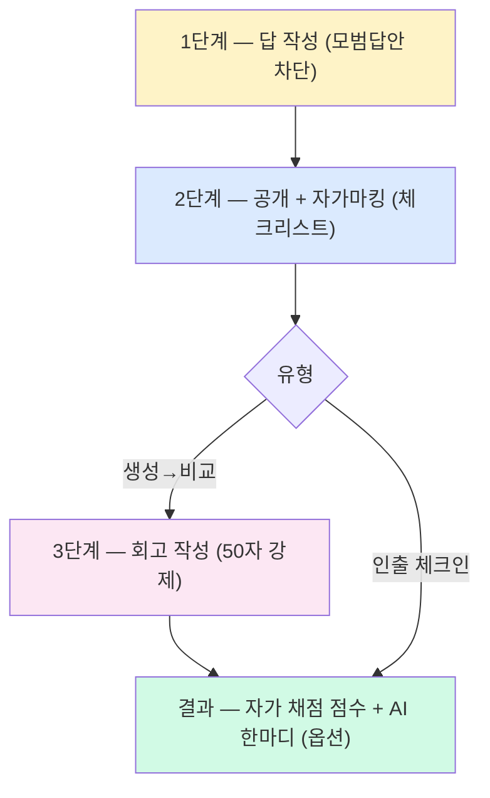

# 내가 안 쓰는 기능을 다시 만들기 — 메타인지 학습 UX 재설계

> **결과**: 채점 LLM 호출 1회 → **0회**, 두 유형 → **1개로 통합**, 모델/마이그레이션 변경 **0건**. 자가 마킹 UI로 *메타인지를 강제*하는 흐름으로 전환.

| 항목 | 내용 |
| --- | --- |
| 목적 | "textarea → AI 채점" 단일 흐름으로 굳어버린 연습유형을 본래 의도(메타인지 강화)대로 복원 |
| 방식 | HTMX 다단계 partial + 자가 마킹 체크리스트 + on-demand "AI 한마디" |
| 범위 | `generation_compare` 4단계 흐름, `retrieval_checkin` 3단계 흐름, AI 채점 제거, 두 유형 통합 |

---

## 만들게 된 계기

> **내가 만든 도구를, 내가 안 쓰게 됐다.** 그 인식에서 시작한 재설계.

원래 [[학습 로그 기반 간격 반복 연습문제 시스템 구현]]에서 3가지 유형(`generation_compare`, `path_trace`, `retrieval_checkin`)을 만들었다. 그런데 실제로 며칠 써보니 **생성→비교와 인출체크인을 거의 안 쓰게** 됐다. 
![[Pasted image 20260520144549.png]]

이유를 곱씹어보니 둘 다 사용자 경험이 거의 같았다:

1. textarea에 답을 쓴다
2. 제출한다
3. AI가 점수(예: "0.7점")와 한 줄 피드백을 돌려준다

학습 의도는 분명히 다른데, **UI가 동일**하니까 사용자 입장에선 "어차피 빈칸 채우기 → 채점받기"였다. 더 결정적인 문제는 **AI 점수가 두루뭉술해서 *뭘 빠뜨렸는지를 모른다*** 는 것. 옵시디언 노트에 적어둔 원래 의도와 정면 충돌하는 상태였다:

> "비슷한 것 같음, 0.7점" 식의 두루뭉술한 채점은 학습자가 *뭘 빠뜨렸는지*를 모른다. **"아 이 부분을 까먹었구나"를 정확히 알아야 다음에 보완할 수 있다.**
> — [[학습 로그 기반 간격 반복 연습문제 시스템 구현]]

원래 참고했던 [DrCatHicks/learning-opportunities](https://github.com/DrCatHicks/learning-opportunities)의 [PRINCIPLES.md](https://github.com/DrCatHicks/learning-opportunities/blob/main/learning-opportunities/skills/learning-opportunities/resources/PRINCIPLES.md) / [SKILL.md](https://github.com/DrCatHicks/learning-opportunities/blob/main/learning-opportunities/skills/learning-opportunities/SKILL.md)를 다시 정독하면서 핵심 원칙을 놓쳤다는 걸 깨달았다.

---

## 놓치고 있던 원칙: "Pause for input"

> End your message immediately after the question. Do not generate any further content after the pause point.

답·힌트·예시를 **사용자 응답 전에 절대 보여주지 않는다**. 그리고 Generation→Comparison 원본 패턴은 사실 4단계였다:

1. **Pause**: "답을 보여주기 전에, 어떻게 접근할지 먼저 적어봐"
2. Wait for response
3. 실제 구현/모범답안 공개
4. **Pause**: "**뭐가 비슷한가? 뭐가 다른가? 왜 우리가 이 방향으로 갔을까?**"

기존 구현은 1~3을 한 화면에서 동시에 하고 4가 통째로 빠져 있었다. **비교 reflection이 핵심인데 그게 없었던 것**이다.

`PRINCIPLES.md`의 다른 원칙도 같이 짚어보면:

| 원칙 | 적용 방향 |
| --- | --- |
| **Dynamic Testing** | "Errors without correction, or with vague/softened feedback, don't produce the benefit" → "0.7점" 같은 두루뭉술한 피드백 금지 |
| **Metacognition** | Monitoring(앎/모름 인지) + Calibration(자기평가 정확도) → 학습자가 직접 체크리스트 마킹 |
| **Generation Effect** | 답을 생성하기 *전에* 모범답안 노출 금지 → 클라이언트 토글 대신 서버 왕복으로 컨닝 차단 |

---

## 새 흐름 설계

### 흐름 다이어그램



### 핵심 결정 4가지

#### 1. `생성->비교`에 `key_points`를 어디서 추출할까?

**선택**: 출제 시점에 LLM이 모범답안과 함께 추출.

자가 마킹 체크리스트를 만들려면 모범답안에서 *짧고 yes/no로 판단 가능한 핵심 포인트*(`key_points`)가 필요했다. 출제 결과는 이런 형식으로 나온다:

```json
{
  "question": "프로세스와 스레드의 차이점을 설명하세요.",
  "model_answer": "프로세스는 운영체제로부터 독립된 메모리 공간(Code, Data, Heap, Stack)을 할당받는 작업 단위로, PCB를 통해 관리된다. 반면 스레드는 ...",
  "key_points": [
    "독립된 메모리 공간(Code/Data/Heap/Stack) - 프로세스",
    "공유 메모리(Code/Data/Heap) - 스레드",
    "PCB를 통한 관리 - 프로세스",
    "경량 프로세스(Lightweight Process) - 스레드",
    "컨텍스트 스위칭 오버헤드 큼 - 프로세스"
  ]
}
```

`key_points` 각 항목이 그대로 2단계 체크박스 한 줄이 된다. 학습자는 본인 답에 그 포인트가 포함됐는지 yes/no로 클릭하면 끝.

구현 방법은 두 가지였다:
① 출제 시점에 LLM이 `model_answer`와 함께 같이 뽑아두기, ② 사용자가 2단계로 진입한 시점에 즉석에서 추출하기.

후자는 출제 데이터가 가벼워지는 대신 *2단계 진입할 때마다 1~3초 응답 지연*이 생긴다 (LLM 호출 추가). 전자는 출제 LLM 호출 1회를 유지하면서 출력 토큰만 약간 늘어나는 정도. 어차피 출제는 한 번만 일어나니까 그 한 번에 다 뽑아두는 게 낫다.

#### 2. AI를 어디까지 개입시킬까?

**선택**: 채점은 사용자가 직접. AI는 *원할 때만* "한마디" 보조 코멘트.

원래는 AI가 채점하고 점수와 한 줄 피드백을 자동으로 줬다. 그런데 이 자동화가 *학습자가 직접 해야 할 비교·판단을 가로채고* 있었다. 사용자는 "어차피 AI가 알아서 평가하니까" 하면서 본인이 직접 비교/마킹하는 인지 부담을 회피하게 된다.

그래서 AI 채점은 완전히 제거하고, 결과 화면에 **"AI 한마디" 선택 버튼**만 남겼다. 누를 때만 LLM이 1~2문장 격려/보완 코멘트를 단다. 안 누르면 0회 호출. 메타인지는 사용자의 책임으로 명확히 위임하면서, AI의 도움은 *사용자가 결정해서* 받을 수 있게!


#### 3. 회고 단계를 어떻게 강제할까?

**선택**: 별도 단계로 분리 + **50자 이상 입력 시에만 제출 가능**.

회고(reflection) 자체가 메타인지의 핵심인데, 1~2단계 안에 끼워넣으면 학습자가 *건너뛰기 쉽다*. 그래서 회고를 별도 3단계로 분리하고, textarea가 50자 미만일 때는 제출 버튼이 disabled.

처음엔 "자유 입력, 0자도 OK"로 두려 했다. 사용자 자율성을 존중한다는 명분이었다. 그러나 *회고 단계의 의도 자체가 메타인지 강제*인데 비워둘 수 있으면 그냥 1~2단계만 거치는 셈이라 강제 효과가 사라진다. 50자는 "뭐가 다르고, 왜 그런가"를 한두 문장으로 정리할 수 있는 최소 분량.

#### 4. 점수를 어떻게 매길까?

**선택**: `score = 체크한 포인트 수 / 전체 포인트 수`, 통과 기준 0.6.

자가 채점이라서 점수 산정은 단순할수록 좋다. 사용자가 체크한 핵심 포인트 비율 = 점수. 통과 기준 0.6은 기존 `advance_interval` / `reset_interval` 로직과 호환되어서 [[학습 로그 기반 간격 반복 연습문제 시스템 구현|간격 반복 시스템]]을 손대지 않고 그대로 작동.

회고 작성 여부에 가중치를 두는 것도 고민했다 — "회고를 길게 쓰면 가산점" 같은 방식. 하지만 *글의 길이*는 학습 깊이와 비례하지 않고 오히려 게이밍(긴 글이 점수 높음)을 유도한다. 게다가 50자 강제로 이미 회고는 *최소 보장*되어 있어서 굳이 점수에 반영할 필요가 없었다.

---

## 1단계: 답 작성 (모범답안 차단)

페이지에 들어와서 첫 화면. 사용자가 답을 쓰기 전까지 모범답안·핵심 포인트는 HTML에 **단 한 글자도 포함되지 않는다**. 브라우저 "페이지 소스 보기"로 검사해도 안 보인다.

![[attachments/자가채점 - 생성비교 1단계 모범답안 차단.png]]

질문이 풍부할수록 더 좋아서, 출제 LLM 프롬프트에 "측면을 명시해서 답을 유도하라"고 안내했다. 위 예시는 "메모리 구조, 자원 공유, 생성/소멸 비용, 컨텍스트 스위칭, 안정성 측면"으로 분해되어 나왔다.

추가로 **localStorage 임시 저장**도 붙였다. 새로고침/사고로 답이 사라지면 학습 의지가 꺾이니까🥲 textarea `input` 이벤트로 저장, 페이지 로드 시 복원. 

```html
<textarea name="answer"
          data-draft-key="exercise:{{ exercise.pk }}:draft"
          ...>
</textarea>
```

```javascript
(function() {
    const ta = document.querySelector('textarea[data-draft-key]');
    if (!ta) return;
    const key = ta.dataset.draftKey;
    const saved = localStorage.getItem(key);
    if (saved) ta.value = saved;
    ta.addEventListener('input', () => localStorage.setItem(key, ta.value));
})();
```

---

## 2단계: 공개 + 자가마킹

여기서부터 두 유형이 갈린다.

### 생성→비교: 모범답안 + 체크리스트

![[attachments/자가채점 - 생성비교 2단계 모범답안 공개와 자가마킹.png]]

- 본인이 쓴 답(읽기 전용 카드)
- 모범 답안 (full text, 보라색 카드)
- 핵심 포인트 체크리스트 (각각 "내 답에 포함됐나?" 체크박스)


### 인출 체크인: 체크리스트만 (모범답안 풀텍스트 X)

![[attachments/자가채점 - 인출체크인 2단계 자가마킹.png]]

생성→비교와 의도적으로 차별화: **모범답안 풀텍스트를 안 보여준다**. 핵심 포인트 체크리스트가 곧 모범답안의 압축본 역할을 한다. 더 순수한 "기억 인출 연습"을 위해서다.

> 이 차별화가 사실상 핵심이었는데, 막상 모범답안이 짧으면 풀텍스트와 키포인트의 정보 격차가 작아서 두 유형이 비슷하게 느껴진다. 이 한계가 [[#이후 — 두 유형 통합]]으로 이어진다.

---

## 3단계: 회고 (생성→비교 전용)

![[attachments/자가채점 - 생성비교 3단계 회고 작성.png]]

2단계에서 체크한 결과를 ✓ (초록) / ✗ (빨강) badge로 한 번에 요약한다. 그 아래 회고 textarea가 있는데 **50자 이상 입력 전에는 "최종 제출" 버튼이 disabled**. 

> 처음엔 "자유 입력, 0자도 OK"로 두려 했는데, **회고 단계의 의도 자체가 메타인지 강제**라 비워두면 그냥 1~2단계만 거치는 셈이 된다. 50자 정도면 "뭐가 다르고, 왜 그런가"를 한두 문장으로 정리할 수 있는 최소 분량이라고 봤다.

---

## 결과 화면

자가 채점 점수 + 빠뜨린 포인트 강조 + 회고 + 모범답안 + "AI 한마디" 버튼.

![[attachments/자가채점 - 생성비교 결과 화면.png]]

### "AI 한마디" — on-demand

기존엔 AI가 알아서 점수를 매기고 피드백을 줬다. 이번 재설계에선 **사용자가 누를 때만** LLM이 1~2문장 보조 코멘트를 단다. 채점/평가가 아니라 격려·보완 한마디. 안 누르면 0회 호출.

코멘트는 DB에 저장하지 않는다 (매번 새 컨텍스트로 호출). 부담 없는 보조 도구로만 쓰이게 의도된 디자인.

### 인출 체크인 결과

![[attachments/자가채점 - 인출체크인 결과 화면.png]]

같은 결과 partial을 공유하되, 모범답안 풀텍스트는 표시되지 않는다(2단계 의도 일관성). "기억하지 못한 포인트"가 빨간 배지로 명확히 보인다.

---

## 백엔드 변경

### 서비스 레이어

`ExerciseService`에서 AI 채점 두 메서드를 제거하고 자가 채점 + on-demand coach로 대체:

```python
def evaluate_attempt(self, exercise, user_answer):
    dispatch = {
        'path_trace': self._evaluate_path_trace,
        'generation_compare': self._evaluate_self_marked,   # ← 자가 채점
        'retrieval_checkin': self._evaluate_self_marked,    # ← 자가 채점
    }
    return dispatch[exercise.exercise_type](exercise, user_answer)

def _evaluate_self_marked(self, exercise, user_answer):
    """자가 채점: LLM 호출 없음. ai_feedback엔 reflection 저장."""
    key_points = exercise.content.get('key_points', [])
    total = max(len(key_points), 1)
    covered = [i for i in user_answer.get('covered_indices', []) if 0 <= i < total]
    score = len(covered) / total
    return {
        'is_correct': score >= 0.6,
        'score': score,
        'ai_feedback': user_answer.get('reflection', ''),
    }
```

**스키마 변경 없음.** `ExerciseAttempt.ai_feedback` 필드의 *의미만 재해석*:
- generation_compare: reflection 본문
- retrieval_checkin: 빈 문자열
- path_trace: 기존 단계별 설명 그대로


### API 뷰 — stage 분기

`ExerciseAttemptAPIView` POST에 `stage` 폼 파라미터로 4단계 흐름을 분기시켰다. 같은 엔드포인트로 들어와서 stage 값에 따라 다른 partial을 반환:

```python
stage = request.POST.get('stage', 'final')

if stage == 'reveal':
    # 1단계 답 받아서 2단계 partial 반환 (저장 X)
    ...
if stage == 'reflect':
    # 2단계 체크 받아서 3단계 partial 반환 (저장 X, generation_compare 전용)
    ...
# final
user_answer = {
    'text': text,
    'covered_indices': covered,
}
if exercise_type == 'generation_compare':
    user_answer['reflection'] = request.POST.get('reflection', '').strip()
return self._finalize(request, exercise, user_answer)
```


### 데이터 구조

`ExerciseAttempt.user_answer` JSONField 새 구조:

```python
generation_compare:  {"text": "...", "covered_indices": [0, 2], "reflection": "..."}
retrieval_checkin:   {"text": "...", "covered_indices": [0, 1, 3]}
path_trace:          {"selected_indices": [...]}  # 기존 그대로
```

---

## LLM 호출 비용 변화

| 항목 | 이전 | 이후 |
| --- | --- | --- |
| 출제 (generation_compare) | 1회 | 1회 (그대로) |
| 채점 (generation_compare) | 1회 | **0회** |
| 채점 (retrieval_checkin) | 1회 | **0회** |
| AI 한마디 | — | on-demand 0~1회 (사용자가 눌렀을 때만) |

채점 단계 LLM 호출이 사라져서 결과 화면이 즉시 뜬다. 비용도 절감되고 사용자 체감 속도도 개선됐다.

---

## 이후 — 두 유형 통합

리팩토링을 끝낸 뒤에도 두 유형의 차이가 모호했다. 정리해보면 둘의 차이는 결국 **모범답안 유무**(그래서 회고 단계가 의미 있느냐)에 달려있다:

| 구분 | 모범답안 | 회고 |
| --- | --- | --- |
| 인출체크인 | 없음 (핵심 포인트만) | 생략 |
| 생성→비교 | 있음 | 50자 강제 |

그런데 핵심 포인트가 3~5개에 불과하다 보니, 그걸 풀어쓴 모범답안도 짧을 수밖에 없고 결국 **핵심 포인트와 거의 같은 내용**이 된다. 모범답안이 있어도 추가 정보 가치가 거의 없는 셈 — **즉 두 유형의 차이가 없게 된다**!

그래서 둘 중 하나만 남기기로 했다. 모범답안이 짧더라도 본인 답을 한 번 더 비교·정리하는 **회고 단계의 메타인지 효과는 그대로**이기 때문에, 회고를 가진 생성→비교를 남기고 **인출체크인을 통째로 제거**했다 — 기존 데이터, 코드 삭제 . 이제 *직접 답하기 (생성->비교)* 와 *선택지 고르기(경로추적)* 두 유형만 남는다.

---

## 회고

가장 인상적이었던 건 **원래 의도는 코드에 이미 있었는데, UI가 그걸 못 전달하고 있었다**는 점이다. 채점 함수는 처음부터 핵심 포인트별로 covered 여부를 판정하고 있었지만, 그 결과를 사용자에겐 "0.7점 + 한 줄 피드백"으로 뭉뚱그려 보여줬다. 자가 마킹 체크리스트 UI는 새로운 기능을 *추가*했다기보다, **이미 있던 의도를 사용자에게 직접 노출**시킨 셈이다.

또 하나, **비슷해 보이는 두 기능을 합칠지 말지는 학습자에게 노출되는 정보의 차이로 판단해야 한다**. 두 유형의 인지과학적 의도는 분명 다르지만, 실제로 보이는 정보의 양이 비슷하면 사용자에겐 같은 도구가 된다. 의도와 UX가 어긋난 채로 두 개를 유지하느니, 짧은 답안에선 차별화가 무의미하다고 판단하고 하나로 통합했다.

---

## 참고

- [DrCatHicks/learning-opportunities — PRINCIPLES.md](https://github.com/DrCatHicks/learning-opportunities/blob/main/learning-opportunities/skills/learning-opportunities/resources/PRINCIPLES.md)
- [DrCatHicks/learning-opportunities — SKILL.md](https://github.com/DrCatHicks/learning-opportunities/blob/main/learning-opportunities/skills/learning-opportunities/SKILL.md)
- [[학습 로그 기반 간격 반복 연습문제 시스템 구현]]
- [[프롬프트 변경 효과 측정 - correct_index 오류율 비교 테스트]]
