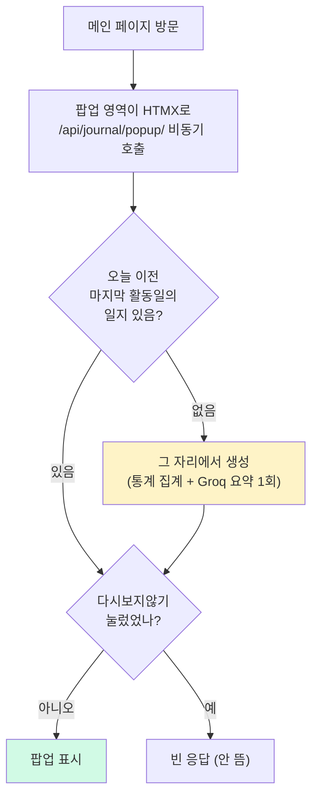

# 일일 학습일지

> **결과**: 자정 지나고 처음 접속하면 "🔥 n일차, 6월 7일 학습일지" 팝업이 뜬다. 그날의 질문/연습문제 통계 + "오늘은 ~~를 공부했네요" 한 줄 요약. 통계 페이지 잔디에 hover해도 같은 일지가 보인다. cron 없이, 방문한 시점에 만들어서 보여주는 방식.

| 항목 | 내용 |
| --- | --- |
| 목적 | 하루 학습을 정리해주는 일일 일지. 팝업 + 잔디 hover |
| 방식 | `DailyJournal` 모델 + 방문 시점 lazy 생성 + HTMX 비동기 팝업 |
| 범위 | 모델/마이그레이션 1건, `JournalService`, 팝업 partial, heatmap 툴팁, backfill 커맨드 |

---

## 만들게 된 계기

개발일지를 쭉 돌아보다가 숫자 하나가 눈에 걸렸다. 질문은 61건인데 연습문제를 푼 건 5번. 검색하고 저장하는 건 매일 하는데 복습은 거의 안 하고 있었다. 실제로 복습 대기 문제가 11개나 쌓여 있었는데, 그걸 알려면 일부러 복습 탭에 들어가야 했다.

[[통계 대시보드 + Streak(불꽃) 시스템 구현|Streak]] 만들 때 Speak의 불꽃을 따라 했는데, 정작 Speak이 잘 되는 진짜 이유를 빼먹었던 거다. 불꽃이 아니라 "알림이 오고, 누르면 바로 시작된다"는 점. 우리 앱은 복습할 게 있다는 사실 자체를 알 방법이 없었다.

그래서 복습으로 끌어들이는 장치를 한 번에 세 개 넣었다. 
1. 복습 대기 개수를 모든 페이지 상단에 배지로 항상 표시하고 2.
2.  Streak 조건을 "맞혀야 인정"에서 "시도하면 인정"으로 바꿨다. 틀린 복습이야말로 제일 많이 배우는 순간인데, 틀리면 불꽃이 안 켜지니까 오히려 풀기 싫어지는 구조였기 때문. 
3. 이 문서의 내용인 일일 학습일지다. 하루가 끝나면 "○월 ○일, 불꽃 n일차, 질문 n개, 연습문제 통과 n/미통과 n"에 LLM 한 줄 요약을 붙여서 팝업으로 보여주고, 통계 잔디에 hover해도 보이게.

---

## cron이 없는데 "자정 지나면"을 어떻게?

"자정 지나면 생성"이라고 하면 자연스럽게 스케줄러부터 떠오른다. 근데 Render 무료 플랜은 cron이 안 된다. [[render 배포웹 슬립 방지]] 때 이미 겪은 제약이다. Background Worker는 유료고, Celery는 ping 하나 보내자고 브로커까지 띄워야 해서 그때도 포기했었다.

그래서 발상을 뒤집었다. 자정에 만들 필요가 없다. 어차피 일지를 보는 건 사용자가 방문했을 때니까, "방문했는데 일지가 없으면 그때 만들면" 된다. 사용자 눈에는 완전히 똑같다.



팝업을 HTMX로 비동기 로드한 것도 같은 이유다. 일지 생성에 Groq 요약 호출이 1초쯤 끼는데, 페이지 렌더링에 같이 묶으면 매일 첫 방문이 1초씩 느려진다. 비동기로 빼면 페이지는 바로 뜨고 팝업이 살짝 늦게 나타난다.

```html
<!-- main.html: 페이지 로드 시 팝업을 비동기로 가져온다 -->
<div hx-get="" hx-trigger="load" hx-swap="innerHTML"></div>
```

생성이 실패해도 그냥 안 뜨고 만다. 일지는 부가 기능이니까 메인 흐름을 막으면 안 된다.

---

## 구현하면서 정한 것들

모델은 날짜별로 한 줄씩이다.

```python
class DailyJournal(models.Model):
    date = models.DateField(unique=True)
    streak_day = models.PositiveIntegerField(default=0)    # 불꽃 n일차
    question_count = models.PositiveIntegerField(default=0)
    attempt_count = models.PositiveIntegerField(default=0)
    pass_count = models.PositiveIntegerField(default=0)
    fail_count = models.PositiveIntegerField(default=0)
    summary = models.TextField(blank=True)                 # LLM 한 줄 요약
    is_dismissed = models.BooleanField(default=False)      # 다시보지않기
```

여기서 `streak_day`가 좀 귀찮았다. [[통계 대시보드 + Streak(불꽃) 시스템 구현|Streak 모델]]은 싱글턴이라 "지금" 며칠 연속인지만 알고, "그 날짜 기준으로 며칠차였는지" 기록은 없다. 그래서 활동일 집합(질문이나 연습문제 시도가 있던 날짜들)을 뽑아서, 해당 날짜부터 거꾸로 연속된 날을 센다.

```python
def _streak_day_at(self, date):
    """해당 날짜 기준 불꽃 n일차. date에서 거꾸로 연속 활동일을 센다"""
    active = self._active_dates()
    if date not in active:
        return 0
    day, count = date, 0
    while day in active:
        count += 1
        day -= timezone.timedelta(days=1)
    return count
```

요약 생성은 그날 검색한 질문 목록(최대 10개)만 Groq 경량 모델에 넘긴다. 답변 본문까지 넣을 필요가 없다. "무슨 주제를 공부했는지"는 질문 제목만 봐도 알 수 있고, 토큰도 아낀다. 실제로 이런 게 나온다:

> *"오늘은 Django 애플리케이션에서 보상 트랜잭션을 구현하는 방법에 대해 공부했네요."*

활동이 없던 날은 일지를 아예 안 만든다. "질문 0개, 시도 0개" 팝업은 정보가 아니라 소음이니까.

"다시 보지 않기"는 localStorage 대신 DB(`is_dismissed`)에 저장했다. 혼자 쓰는 앱이라 충돌 걱정이 없고, 다른 기기로 접속해도 "이미 봤다"는 상태가 유지된다. [닫기]는 이번만 닫는 거라 다음 방문에 또 뜬다.

잔디 hover는 통계 페이지 heatmap 데이터에 일별 통계와 일지 요약을 합쳐서, 셀에 마우스 올리면 툴팁으로 보여준다.

```
6월 7일 · 🔥1일차
질문 1개 · 연습문제 3개 (통과 3/미통과 0)
오늘은 Django 보상 트랜잭션 구현에 대해 공부했네요.
```

과거 날짜들은 팝업 흐름으로는 일지가 안 생기니까, 한 번에 만들어주는 커맨드도 추가했다 (`python manage.py backfill_journals`). 활동일당 Groq 1회라 무료 한도 안에서 1회 실행이면 끝.

마지막으로 집계 기준 통일. heatmap이 원래 "연습문제 정답"만 활동으로 세고 있었는데, Streak 조건을 "시도"로 바꿨으니 heatmap도 같은 기준으로 맞췄다. 활동의 정의가 기능마다 다르면 "잔디는 비었는데 불꽃은 켜진" 날이 생긴다.

---

## 회고

"자정 지나면 생성"이라는 말을 듣고 처음 떠올린 건 스케줄러였는데, 무료 플랜 제약 덕분에 오히려 더 단순한 답을 찾았다. 이벤트가 일어나는 시점과 데이터를 만드는 시점은 분리할 수 있다. 사용자가 보는 순간에만 존재하면 되는 데이터라면 굳이 미리 만들어둘 이유가 없다. keep-alive 데몬 스레드 때도 그랬지만, 제약이 설계를 단순하게 만들 때가 있다.

---

## 참고

- [[통계 대시보드 + Streak(불꽃) 시스템 구현]]: Streak 모델, heatmap의 최초 구현
- [[render 배포웹 슬립 방지]]: Render 무료 플랜의 cron 제약을 처음 확인한 작업
- [[꼬리질문]]: 같은 날 진행한 작업
