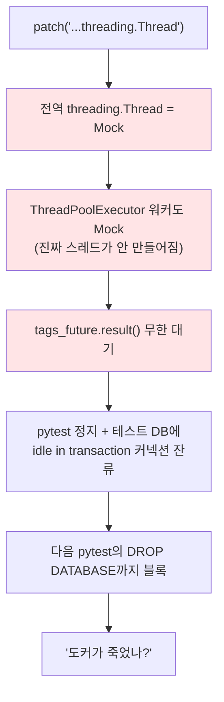

# 코드 청소 - 중복·죽은 경로·조용히 저장되던 버그

> **결과**: pgvector RAG → LangGraph → 환각 방어까지 기능을 몰아치고 나서 리뷰를 돌려 빚을 청산했다. 뷰에 숨어 테스트 불가능하던 로직을 그래프로 옮기고, 아무도 안 부르는 동기 경로 162줄을 지우고, LLM 장애 시 에러 문구가 학습 로그로 저장되던 버그를 잡았다. 테스트는 73개 → 89개. 덤으로 `mock.patch`가 전역 `threading.Thread`를 갈아치워서 pytest가 스스로 데드락에 걸리는 함정도 밟았다.

| 항목 | 내용 |
| --- | --- |
| 목적 | 기능 3연타([[pgvector 하이브리드 RAG - FTS+벡터 RRF 결합\|RAG]] → [[LangGraph 라우팅 에이전트 - 질문별 조건 분기\|라우팅]] → [[환각 방어 - 예방·검출·표시 3단\|환각 방어]]) 뒤에 쌓인 중복·죽은 코드·테스트 공백 정리 |
| 방식 | 리팩토링/테스트 관점 코드 리뷰 → 커밋 성격별로 쪼개서 진행 (refactor 2 + fix 1 + test 1) |
| 범위 | search_agent, learnlog_service, api_views, serializers, urls, tests |

---

## 만들게 된 계기

한 달 사이에 큰 기능을 세 번 밀어붙였다. 그때마다 "일단 돌아가게"가 우선이라 코드에 빚이 쌓였는데, 어디에 얼마나 쌓였는지는 정작 나도 몰랐다. 그래서 기능 추가를 멈추고 클로드에게 리팩토링·테스트 관점으로 리뷰를 요청했다.

다만 리뷰 결과를 그대로 다 받진 않았다. 기준을 두 개만 세웠다.

① **같이 변해야 하는 것들이 흩어져 있는가.** 그냥 생김새가 비슷한 코드는 안 건드린다. 한쪽만 바뀌면 조용히 버그가 되는 중복만 잡는다.
② **로직이 테스트 가능한 자리에 있는가.** 좋은 로직도 SSE 스트리밍 한복판에 있으면 테스트 사각지대다.

이 기준으로 걸러진 게 커밋 4개 분량이었다.

---

## 무엇을 정리했나

| 커밋 | 내용 | 기준 |
| --- | --- | --- |
| refactor | answer_source 산출을 뷰 → generate 노드로 + 500/1500 상수 통합 + 프롬프트 조립 추출 | ①② |
| refactor | 미사용 동기 질문 경로 제거 (-162줄) | 죽은 코드 |
| fix | 스트리밍 실패 시 에러 문구가 학습 로그로 저장되던 문제 | 숨은 버그 |
| test | 라우터 폴백·verification 초기값·검증 스레드 인자 테스트 (73→89개) | ② 마무리 |

첫 커밋의 대표 사례가 절삭 예산 500/1500이다. 답변을 만들 때 과거 로그를 몇 자로 잘라 넣을지가 500(웹 포함) 또는 1500(웹 생략)인데, [[환각 방어 - 예방·검출·표시 3단|비동기 검증]]은 "생성에 쓴 컨텍스트와 답변이 모순되냐"를 묻는 거라 검증도 반드시 같은 값으로 잘라야 한다. 그런데 이 값이 두 파일에 매직 넘버로 따로 박혀 있었고, 제약은 주석 한 줄("생성에 쓴 절삭 길이 그대로")뿐이었다. 벤치마크 돌리고 예산을 바꾸는 날 한쪽을 놓치면, 검증이 생성 때 없던 내용으로 판정하기 시작하면서 배지가 거짓말이 된다. 상수 하나로 모았다.

```python
# learnlog_service.py — 주석으로만 존재하던 제약을 코드로
RETRIEVED_LIMIT_WEB = 500      # 웹 검색 포함 경로
RETRIEVED_LIMIT_NO_WEB = 1500  # 웹 생략 경로
```

answer_source(이 답변이 뭘 참고했나: both/logs/web/none) 4분기 판단도 옮겼다. 원래 SSE 뷰 안에 있어서 테스트하려면 스트리밍 전체를 돌려야 했는데, 판단 재료가 전부 그래프 state에 있으니 generate 노드에서 산출해 state로 내보내게 했다. 옮기자마자 "라우터가 use_logs=True라 해도 검색 결과가 비었으면 logs 출처가 아니다" 같은 엣지 케이스 테스트가 3줄로 써졌다. 자리가 맞으면 테스트는 그냥 나온다.

두 번째 커밋은 리뷰의 부산물이다. "동기 경로엔 검증·배지가 안 붙는데요?"라는 지적에 grep을 떠보니, 프론트는 SSE 엔드포인트만 부르고 있었다. HTMX 동기 뷰와 JSON API는 스트리밍 도입 이후 아무도 안 부르는 화석이었던 것. 통합할 필요도 없이 삭제로 끝났다. 라우트 2개, 뷰 2개, `process_query`, 동기 `generate_answer`, 전용 시리얼라이저까지 162줄.

---

## 에러 문구가 학습 로그로 저장되고 있었다

이번 리뷰에서 제일 아픈 발견. 스트리밍 답변 생성의 예외 처리가 이랬다.

```python
except Exception as e:
    print(f"AI 답변 스트리밍 오류: {e}")
    yield "답변 생성 중 오류가 발생했습니다."   # ← 문제의 줄
```

친절해 보이지만, 이 문구는 **토큰처럼 yield**된다. 받는 쪽(SSE 뷰)은 이게 에러인지 알 길이 없으니 정상 답변으로 취급한다. 그래서 LLM이 장애 나면 "답변 생성 중 오류가 발생했습니다"라는 문장이 태그 추출되고, 마크다운으로 변환되고, 임베딩까지 붙어서 학습 로그로 저장됐다. 중간에 끊기면 반쪽 답변 + 에러 문구가 한 덩어리로 남고.

[[환각 방어 - 예방·검출·표시 3단|환각 방어]] 때 정리했듯 이 앱의 진짜 피해는 틀린 기록이 저장돼서 복습으로 암기되는 건데, 에러 문구 로그가 정확히 그 케이스다. 환각은 3단 방어까지 쳐놓고 정작 에러 문구는 무사통과였던 셈.

수정은 한 줄이다. yield 대신 raise. 예외가 그래프를 뚫고 올라가면 SSE 뷰의 기존 except가 받아서 **저장 없이** error 이벤트만 내보낸다. 회귀 테스트는 피해 시나리오를 그대로 고정했다: 에이전트가 죽었을 때 `event: error`가 오고 `LearningLog.objects.count() == 0`.

---

## 테스트 보강, 그리고 동어반복 함정

네 번째 묶음은 "docstring으로만 존재하던 약속"들을 테스트로 못 박는 작업이다.

| 테스트 | 고정한 약속 |
| --- | --- |
| TestDecideRoute | 라우터 LLM이 죽으면 둘 다 True (= 라우팅 도입 전 파이프라인으로 후퇴) |
| parametrize 5케이스 | answer_source 값별 verification 초기값 (both/logs/web → pending) |
| TestVerifyThreadArgs | 검증 스레드는 생성과 같은 컨텍스트·절삭 길이를 받는다 |

쓰다가 작은 유혹이 하나 있었다. 500/1500을 상수로 통합했으니 테스트도 `assert limit == RETRIEVED_LIMIT_NO_WEB`으로 쓰고 싶어진다. 근데 그러면 누가 상수를 2000으로 잘못 바꿔도 테스트는 통과한다. 코드가 코드 자신과 같은지 묻는 동어반복이 되는 것. 그래서 테스트는 리터럴로 박았다.

```python
assert limit == 1500   # 상수 참조가 아니라 숫자로 행동을 고정
```

프로덕션 코드에선 매직 넘버가 나쁘고, 테스트 단언에선 오히려 그게 일이다.

---

## 테스트가 3분째 안 끝난다

TestVerifyThreadArgs를 돌리는데 평소 6초짜리 스위트가 3분 넘게 침묵했다. 도커가 죽었나? 컨테이너는 14시간째 멀쩡하고 exec도 즉답. DB를 까보니 테스트 DB에 "idle in transaction" 커넥션이 하나 붙어 있는데, 매번 정확히 같은 자리(팩토리가 만든 78번째 로그 UPDATE 직후)에서 멈춰 있었다. 매번 같은 자리라는 건 환경 문제가 아니라 코드 문제라는 뜻이다. 범인은 방금 쓴 내 테스트였다.

```python
patch('search.api_views.threading.Thread')   # 이게 함정
```

풀어 보면 이렇다.

① `api_views.py`는 `import threading`으로 모듈을 통째로 들고 있다. 그래서 `search.api_views.threading`은 "api_views 안의 뭔가"가 아니라 **전역 threading 모듈 그 자체**다.
② 거기서 `.Thread`까지 들어가면 파이썬 프로세스 전체의 `threading.Thread` 클래스가 Mock으로 바뀐다.
③ 그런데 뷰가 태그/마크다운 병렬 처리에 쓰는 `ThreadPoolExecutor`도 내부에서 `threading.Thread`로 워커를 만든다. 워커가 Mock이 되니 제출한 작업이 영원히 안 돌고, `future.result()`가 무한 대기.



수정은 패치가 꽂히는 위치를 한 단계 위로 올리는 것. 클래스가 아니라 api_views가 들고 있는 `threading`이라는 이름표만 바꾼다.

```python
# 전: 전역 threading.Thread 클래스를 교체 → 프로세스 전체가 영향
patch('search.api_views.threading.Thread')

# 후: api_views 모듈의 threading 속성만 Mock → 이 파일 안의 코드만 영향
patch('search.api_views.threading')
```

이러면 뷰의 `threading.Thread(...)`만 가로채지고 ThreadPoolExecutor는 진짜 threading을 계속 쓴다. 수정 후 89개가 6초에 끝났다. 좀비 커넥션이 막고 있던 DROP DATABASE, stdin 프롬프트에 걸려 있던 재실행까지, 그날 겪은 이상 현상 전부가 이 패치 한 줄의 연쇄였다.

---

## 회고

기능을 밀 때는 "일단 돌아가게"가 맞다고 생각하는데, 그게 3연타쯤 쌓이면 어디에 빚이 있는지 본인도 모르게 된다는 걸 이번에 확인했다. 리뷰를 돌려보니 중복이나 죽은 코드보다 무서운 건 에러 문구 저장 같은 "조용히 잘못 동작하는" 놈들이었다. 예외를 삼키고 친절한 문구로 바꾸는 코드는 쓰는 순간엔 방어적으로 보이는데, 받는 쪽이 그걸 구분 못 하면 오히려 오염을 정상 데이터로 둔갑시키는 통로가 된다.

패치 데드락은 시간을 꽤 먹었지만 배운 게 남았다. `patch('a.b.c')`는 문자열이 아니라 객체 경로라서, 마지막 마디가 어디에 붙은 속성이냐에 따라 파급 범위가 파일 하나에서 프로세스 전체로 널뛴다. 그리고 "매번 같은 자리에서 멈춘다"는 건 환경 탓을 멈추고 내 코드를 봐야 한다는 신호라는 것도. 도커 재시작부터 하려던 손을 멈추길 잘했다.

---

## 참고

- `search/services/search_agent.py`: generate 노드의 answer_source 산출
- `search/services/learnlog_service.py`: `RETRIEVED_LIMIT_*` 상수, `_build_answer_prompt`, 스트리밍 raise
- `search/api_views.py`: 얇아진 SSE 뷰 + 검증 스레드 인자
- `search/tests/test_search_agent.py`, `test_verification.py`: 보강된 테스트 (73→89)
- [[LangGraph 라우팅 에이전트 - 질문별 조건 분기|LangGraph 라우팅 에이전트]]: answer_source가 이사 간 그래프
- [[환각 방어 - 예방·검출·표시 3단|환각 방어]]: 500/1500 동기화가 지키는 검증, 에러 문구 버그가 뚫었던 방어선
- [[SSE 진행 스트리밍 - 프로그레스바·진행로그|SSE 진행 스트리밍]]: 삭제된 동기 경로를 대체한 유일 경로
