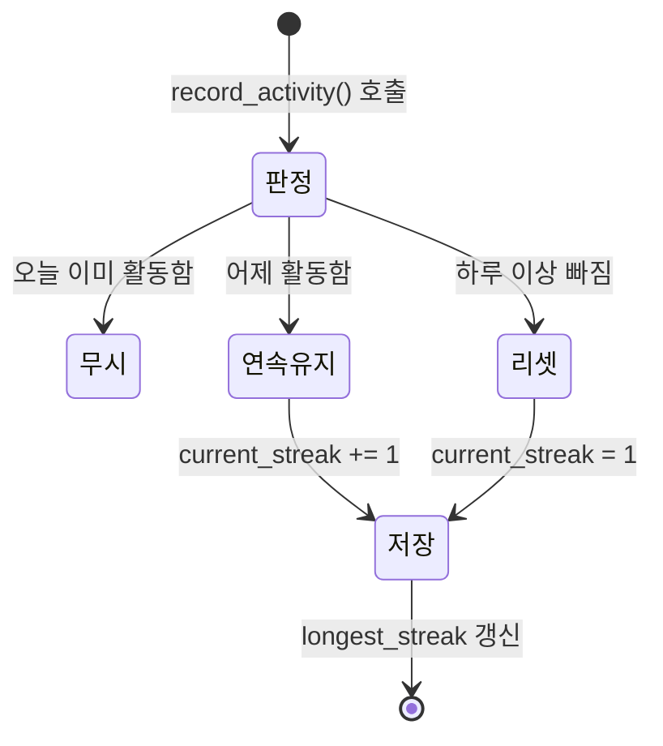

# 통계 대시보드 + Streak(불꽃) 시스템 구현


| 항목 | 내용 |
| --- | --- |
| 맥락 | 학습 동기부여를 위한 Streak 시스템 + 통계 대시보드 구현 |
| 적용 | LearningLog 생성 / ExerciseAttempt 정답 시 Streak 자동 갱신 |
| 선택 | Django 시그널 (`post_save`) |

---

## 만들게 된 계기

![[통계_대시보드_화면.png]]

LearnLog를 만들어 놓고 나서, 실제로 매일 꾸준히 사용하게 만드는 장치가 부족하다고 느꼈다. 기능은 있는데 습관이 안 되니까 결국 안 쓰게 되는 문제였다.

평소에 영어 회화 앱 **Speak**을 쓰고 있었는데, 거기에 "불꽃(🔥)" 기능이 있다. 매일 접속해서 학습하면 연속 일수가 올라가고, 하루라도 빠지면 리셋된다. 단순한 장치인데 은근히 "오늘도 해야지" 하는 동기부여가 된다.

이걸 LearnLog에도 적용하면 좋겠다고 생각해서, Streak 시스템과 함께 학습 활동을 한눈에 볼 수 있는 통계 대시보드(GitHub 잔디 스타일 heatmap)를 만들었다.

---

## Streak 모델 설계

Streak은 앱 전체에서 하나만 존재하면 되므로 **싱글턴 패턴**으로 구현했다. `pk=1` 레코드 하나만 사용하고, `load()` 클래스 메서드로 항상 같은 인스턴스를 반환한다.

```python
class Streak(models.Model):
    current_streak = models.PositiveIntegerField(default=0)   # 현재 연속 일수
    longest_streak = models.PositiveIntegerField(default=0)   # 최장 기록
    last_active_date = models.DateField(null=True, blank=True) # 마지막 활동일

    @classmethod
    def load(cls):
        obj, _ = cls.objects.get_or_create(pk=1)
        return obj
```

### 활동 기록 로직

불꽃이 유지되는 기준은 **새 질문을 하거나(LearningLog 생성), 복습 문제를 하나라도 맞힌 경우(ExerciseAttempt 정답)**다.



```python
def record_activity(self, date=None):
    today = date or timezone.now().date()
    if self.last_active_date == today:
        return                        # 같은 날 중복 → 무시
    if self.last_active_date == today - timedelta(days=1):
        self.current_streak += 1      # 어제 활동 있음 → 연속 유지
    else:
        self.current_streak = 1       # 하루 이상 빠짐 → 리셋
    self.longest_streak = max(self.longest_streak, self.current_streak)
    self.last_active_date = today
    self.save(update_fields=['current_streak', 'longest_streak', 'last_active_date'])
```

나중에 다중 사용자를 지원하게 되면 `user` FK를 추가하고 유저별로 레코드를 갖는 방식(멀티턴)으로 확장할 수 있다.

---

## 구현 방식 선택 — 왜 시그널인가

LearningLog 생성과 ExerciseAttempt 정답 시 Streak을 자동 갱신하는 방법은 여러 가지가 있다.

### 1. 시그널 (`post_save`)

```python
# search/signals.py
@receiver(post_save, sender=LearningLog)
def update_streak_on_log(sender, instance, created, **kwargs):
    if created:
        streak = Streak.load()
        streak.record_activity(instance.created_at.date())
```

- 기존 모델 코드를 전혀 수정하지 않음 (개방-폐쇄 원칙)
- 여러 모델에 동일한 부가 동작을 걸 때 한 파일에서 관리 가능
- 단점: 코드를 읽을 때 "이 모델이 저장되면 뭐가 실행되지?"를 추적하기 어려움

### 2. save() 오버라이드

```python
class LearningLog(models.Model):
    def save(self, *args, **kwargs):
        is_new = self.pk is None
        super().save(*args, **kwargs)
        if is_new:
            Streak.load().record_activity(self.created_at.date())
```

- 흐름이 명시적 — 모델 코드만 보면 무슨 일이 일어나는지 바로 알 수 있음
- 단점: LearningLog, ExerciseAttempt 두 모델 모두에 streak 코드가 들어가야 함

### 3. 매니저 create() 오버라이드

```python
class LearningLogManager(models.Manager):
    def create(self, **kwargs):
        instance = super().create(**kwargs)
        Streak.load().record_activity(instance.created_at.date())
        return instance
```

- `objects.create()`를 통해서만 동작. `Model(…).save()`로 생성하면 누락됨
- `objects.create()` 내부적으로 `save()`를 호출하므로, save() 오버라이드나 시그널은 어떤 생성 방식이든 잡아낼 수 있음

### 4. 서비스 레이어에서 호출

```python
def create_learning_log(query, response, ...):
    log = LearningLog.objects.create(...)
    Streak.load().record_activity(log.created_at.date())
    return log
```

- 비즈니스 로직이 한 곳에 모임 → 가장 명시적, 테스트하기 쉬움
- 단점: admin, shell에서 직접 생성하면 누락. 호출 코드를 빼먹어도 에러가 나지 않음

### 비교 요약

| 방식 | 장점 | 단점 |
| --- | --- | --- |
| **시그널 (`post_save`)** | 기존 코드 수정 없음, 다중 모델에 한 파일로 관리 | 흐름 추적이 어려움 |
| save() 오버라이드 | 명시적, 디버깅 직관적 | 두 모델 모두에 streak 코드가 침투 |
| 매니저 create() 오버라이드 | 명시적 | `Model().save()`로 생성하면 누락 |
| 서비스 레이어 호출 | 가장 명시적, 테스트 쉬움 | admin/shell에서 직접 생성 시 누락 |

---

## 이번 구현에서 시그널을 선택한 이유

- Streak은 학습 로그나 풀이 시도와는 별개의 부가 기능 → 기존 모델에 streak 코드를 넣으면 관련 없는 기능끼리 섞임
- **두 모델에 동시에** 걸어야 하는 상황 → signals.py 한 파일에서 관리
- admin이나 shell에서 직접 생성해도 시그널이 동작하므로 누락 없음

### Django 커뮤니티의 일반적인 입장

시그널은 **가급적 피하라**는 의견이 주류다. [Django 공식 문서](https://docs.djangoproject.com/en/5.0/topics/signals/)에서도 "가능하면 시그널을 피하라. 느슨한 결합처럼 보이지만 코드를 이해·수정·디버깅하기 어렵게 만든다"고 말한다.

하지만 이번 케이스처럼 **부가 기능 + 다중 모델**이면 시그널이 합리적이고, 핵심 로직이면 명시적 호출이 낫다. 정석이 정해져 있다기보다 상황에 맞는 판단. Streak의 싱글턴 패턴에 대한 정리는 → [[싱글턴 패턴 - Streak 모델 적용]]

| 시그널이 적합한 경우 | 시그널을 피해야 하는 경우 |
| --- | --- |
| 수정할 수 없는 외부 모델에 훅 | 핵심 비즈니스 로직 (주문, 결제) |
| 여러 모델에서 같은 부가 동작 트리거 | 단일 모델의 단순 로직 |
| 부수 효과 (로깅, 알림, 캐시 무효화) | |
