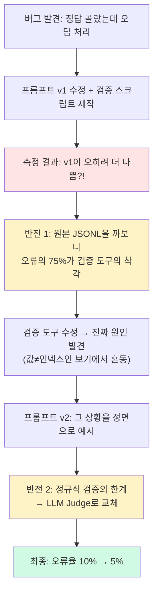

# 프롬프트 변경 효과 측정 - correct_index 오류율 비교 테스트

> 연습문제의 정답 번호가 틀리게 생성되는 버그를 발견하고, 프롬프트를 고쳐 오류율을 절반(약 10% → 5%)으로 줄인 과정. 그 과정에서 *검증 도구 자체가 틀린* 반전을 두 번 겪고, 결국 검증 방법을 정규식에서 LLM 채점으로 갈아엎었다.

| 항목 | 내용 |
| --- | --- |
| 목적 | LLM이 출제할 때 `correct_index`(정답이 몇 번째 보기인지)를 틀리게 넣는 문제를 프롬프트로 줄이고, 효과를 수치로 검증 |
| 방식 | 같은 입력으로 구/신 프롬프트를 각각 여러 번 호출 → 자동 채점 → 오류율 비교 |
| 범위 | `_gen_path_trace` 프롬프트, `search/experiments/` |

반전이 두 번 있는 이야기라, 전체 흐름을 먼저 그려두면 따라가기 쉽다.



---

## 1. 발견한 버그 — 정답을 골랐는데 오답 처리됐다

'선택지 고르기' 문제를 풀다가, 틀렸는데 정답으로 처리되는 걸 발견했다.
내 선택지: 1 / 정답: 2

![[Pasted image 20260410171258.png]]

```json
{
  "question": "obj 객체를 생성하고 참조 횟수를 증가시킨 후, obj의 참조 횟수는?",
  "choices": ["0", "1", "2", "3"],
  "correct_index": 1,
  "explanation": "... 참조 횟수는 2가 됩니다."
}
```

`explanation`은 "정답은 2"라고 말하는데, `correct_index`는 1이다. 보기가 `["0","1","2","3"]`이니 정답이 "2"라면 `correct_index`는 **2**여야 한다.

**LLM이 정답 값(2)과 그 값이 들어있는 자리 번호(index)를 헷갈린 것**이다. 채점 로직은 `correct_index`를 그대로 믿기 때문에, 사용자가 정답을 골라도 오답 처리된다.

---

## 2. 프롬프트를 고쳤더니 오히려 나빠졌다 — 알고 보니 검증 도구가 틀렸다

### 프롬프트 수정 (v1)

가설은 단순했다 — 프롬프트에 *"correct_index는 0부터 세는 자리 번호다"*라고 못 박으면 줄어들 것. 규칙 블록과 예시를 추가했다. 문제는 **이게 진짜 효과가 있는지는 수치로 확인해야 한다**는 것.

### 검증 설계

같은 학습 로그(사용자가 검색한 질문+요약)를 입력으로 고정하고, 구/신 프롬프트를 각각 20번씩 출제시켜 오류율을 비교했다. 주제는 숫자가 많이 나오는 *파이썬 참조 카운팅*으로 골랐다(보기가 `["0","1","2","3"]` 같은 숫자로 나와야 인덱스 혼동 버그가 잘 드러나서).

채점은 `explanation`에서 정답 숫자를 정규식으로 뽑아 `choices[correct_index]`와 비교하는 **규칙 기반 자동 검증**으로 했다.

```python
def extract_answer_from_explanation(explanation: str) -> str | None:
    # explanation에서 "횟수는 2입니다", "정답은 3" 같은 패턴을 정규식으로 찾아 정답 숫자를 추출
    patterns = [
        r"(?:횟수는|값은|결과는|카운트는|개수는)\s*[\"']?(\d+)",
        r"(\d+)\s*(?:가|이)\s*(?:됩니다|됨|정답|맞습니다)",
        ...
    ]
    # 첫 번째로 매칭되는 숫자를 반환
```

추출한 숫자와 `choices[correct_index]`가 일치하면 통과, 불일치하면 오류로 기록, 추출 자체가 안 되면 스킵.

### 결과가 정반대 — 근데 검증 도구가 문제였다

첫 결과가 예상과 정반대였다.

```
[OLD] 오류율 13.6% (3/22)
[NEW] 오류율 17.9% (5/28)   ← 고쳤는데 오히려 증가...
```

리포트를 그대로 믿고 프롬프트를 또 고치려다, 저장해둔 원본 응답(JSONL)을 직접 열어봤다. 그랬더니 **검증 도구가 보고한 오류의 75%가 가짜**였다.

원인은 위 정규식이 `explanation`에서 **첫 번째로 나오는 숫자**를 정답으로 뽑는 것. LLM의 설명은 보통 서사 구조라 *"처음엔 1이고 → 임시 참조가 붙어 → 최종 3이 됩니다"* 식인데, 첫 숫자(중간 단계)를 정답으로 착각한 것이다. 실제 정답은 "3"인데 "1"로 오인해 오답으로 찍은 식.

```json
{
  "correct_index": 2,
  "choices": ["1", "2", "3", "4"],
  "explanation": "객체가 생성되면 참조 횟수는 1입니다. ... 임시 참조가 추가되어 3이 됩니다."
}
// 정규식이 첫 번째 "1"을 정답으로 뽑아 choices[2]="3" ≠ "1" → 오류로 잘못 기록
// 실제로는 정답 3 = choices[2] → 정상
```

수동으로 전수 확인한 진짜 수치:

| | 검증 도구가 보고한 오류율 | **실제 오류율** |
|---|---|---|
| OLD | 13.6% | **0% (0/22)** |
| NEW | 17.9% | **7% (2/28)** |

---

## 3. 진짜 원인과 프롬프트 v2

### 원인 — 예시가 쉬운 케이스만 보여줬다

진짜 버그 2건은 패턴이 같았다. 핵심은 **보기(choices)의 첫 번째 값이 무엇이냐**에 따라 "정답 값"과 "자리 번호(index)"가 일치하기도 하고 어긋나기도 한다는 것이다.

**쉬운 케이스 — 값과 자리 번호가 우연히 일치 (v1 예시)**

| 자리 번호 (index)  | 0   | 1   | 2       | 3   |
| -------------- | --- | --- | ------- | --- |
| 보기 값 (choices) | "0" | "1" | **"2"** | "3" |

정답이 "2"이면 → choices[**2**] = "2" → `correct_index = 2` ✅

LLM이 "정답 값이 2니까 correct_index도 2"라고 생각해도 **우연히 맞아버린다**.

**어려운 케이스 — 값과 자리 번호가 어긋남 (진짜 버그가 드러나는 상황)**

| 자리 번호 (index) | 0 | 1 | 2 | 3 |
|---|---|---|---|---|
| 보기 값 (choices) | "1" | **"2"** | "3" | "4" |

정답이 "2"이면 → choices[**1**] = "2" → `correct_index = 1` ✅
그런데 LLM은 "정답 값이 2니까" → `correct_index = 2` ❌ (choices[2]="3"으로 틀린 답)

프롬프트 v1의 예시가 하필 위의 **쉬운 케이스**(`["0","1","2","3"]`)였다. LLM이 값과 자리 번호를 구분 못 해도 예시에서는 맞아버리니, **어려운 케이스를 프롬프트가 가르치지 못한 것**이 진짜 원인이었다.

(검증 도구도 같이 고쳤다. 두 가지 수정:

```python
def extract_answer_from_explanation(explanation: str) -> str | None:
    # 1순위: "따라서/최종적으로/즉" 같은 결론 표현 뒤의 숫자
    conclusion_patterns = [
        r"(?:따라서|결국|최종적으로|최종|결론적으로|그러므로|즉)[^\n]*?(\d+)",
        r"정답은\s*[\"']?(\d+)",
        r"답은\s*[\"']?(\d+)",
    ]
    for pat in conclusion_patterns:
        matches = re.findall(pat, explanation)
        if matches:
            return matches[-1]  # 여러 개면 마지막 것

    # 2순위: 기존 서술 패턴 — 첫 번째가 아닌 마지막 매칭을 채택
    legacy_patterns = [
        r"(?:횟수는|값은|결과는|카운트는|개수는)\s*[\"']?(\d+)",
        r"(\d+)\s*(?:가|이)\s*(?:됩니다|됨|정답|맞습니다)",
        ...
    ]
    last_hit = None
    for pat in legacy_patterns:
        for m in re.finditer(pat, explanation):
            last_hit = m.group(1)  # 첫 매칭을 덮어쓰며 마지막까지 감
    return last_hit
```

저장된 데이터에 새 로직만 다시 적용했으므로 API 재호출 비용은 0.)

### 프롬프트 v2 — 값≠인덱스 상황을 직접 보여주기

세 가지를 바꿨다.
1. 예시를 `["1","2","3","4"]`처럼 **값과 자리 번호가 다른 케이스**로 교체
2. 맞는 패턴(✅)과 틀린 패턴(❌)을 둘 다 명시
3. *"correct_index를 정한 뒤, choices[correct_index]를 꺼내 정답과 같은지 다시 확인하라"*는 self-check 지시 추가

**결과** (개선된 검증 도구 기준):

| 버전 | 오류율 |
|---|---|
| OLD | 4.3% |
| v1 | 9.7% |
| **v2** | **3.3%** (OLD보다도 개선) |

다만 v2에서도 오류 1건은 여전히 같은 "값≠인덱스" 패턴이었다. **프롬프트로 확률을 낮출 순 있어도 0으로 만들 순 없었다.**

---

## 4. 정규식의 한계 → LLM 채점으로 검증 방법 교체

휴리스틱(정규식 검증)에는 근본 한계가 있었다. 5개 쿼리로 확장한 회귀 테스트(다양한 주제에서도 잘 되는지 확인)를 돌리니, **전체 161개 step 중 검증된 건 16개뿐**. 나머지 90%는 explanation에 구체적 숫자가 없어 정규식이 잡지 못하고 스킵됐다. 표현이 다양해질수록 정규식이 못 따라간 것.

그래서 **정규식 대신 LLM에게 채점을 맡겼다(LLM Judge)**. 각 문제의 질문·보기·정답번호·설명을 통째로 넘기고 "이 정답 번호가 맞는지" 판단하게 했다. LLM은 자연어를 이해하니 스킵 없이 전체를 검증할 수 있다. 채점 모델은 **Claude Haiku**를 썼다 — 출제는 Groq의 Llama가 하는데, 같은 모델로 자기 답을 채점하면 같은 실수를 반복할 수 있어서 다른 모델로 교차 검증한 것.

**결과** (스킵 없이 전체 step 판정):

| 버전 | 오류율 |
|---|---|
| OLD | 10.0% (8/80) |
| **v2** | **5.0% (4/80)** |
| 5개 쿼리로 확장 | **0.6% (1/161)** |

휴리스틱과 절대 수치는 다르지만 **방향은 일치** — v2가 절반으로 개선됐고, 다양한 주제에서는 오류가 거의 없었다. (v2의 오류 4건 중 2건은 진짜 버그, 2건은 설명 자체가 모호해 판단 불가한 케이스였다.)

---

## 5. 결론

1. **프롬프트 개선은 유효하다.** OLD 대비 v2에서 오류가 절반으로 줄었다.
2. **숫자형 보기가 주범이다.** 모든 오류가 `["1","2","3","4"]` 같은 숫자 보기에서 발생했고, 서술형 보기에서는 0건. 값과 자리 번호를 혼동하는 게 근본 원인.
3. **파이썬 참조 카운팅은 특수 케이스.** 숫자 보기가 유독 많이 나와 오류가 집중됐고, 다양한 주제로 넓히면 0.6%까지 떨어졌다.

### 추가 개선 방향

- **숫자 보기를 서술형으로 강제**: `"2"` 대신 `"참조 횟수는 2이다"`로 생성하면 값-인덱스 혼동 자체가 구조적으로 불가능. (미착수)
- ~~생성 후 자동 검증 + 재생성~~ → **구현 완료**: `correct_answer` 정답 필드를 함께 출력하게 강제하고 `choices[정답번호] == correct_answer`를 코드로 검증, 어긋나면 재생성. 사용자에게 도달하는 오류를 **0/91 step(N=20 실측)**까지 낮췄다 → [[correct_index 런타임 가드 — 자가검증으로 환각 0%에 수렴]]

---

## 6. 배운 것

**결과가 이상하면 요약 리포트가 아니라 원본 데이터를 봐야한다.** "고친 게 더 나쁘다"는 리포트를 그대로 믿었으면 프롬프트를 되돌렸을 것이다. 원본을 까보니 오류의 75%가 검증 도구의 착각이었다. 호출할 때마다 원본 응답을 저장해둔 덕에 재검증이 가능했다.

**정규식으로 LLM 출력을 검증하는 건 한계가 크다.** 스킵률이 60~90%라 전체 그림을 볼 수 없었다. LLM 채점으로 바꾸고서야 전체를 검증할 수 있었다. 결국 *LLM 출력을 검증하는 데도 LLM이 필요하다*는 게 아이러니하면서 현실적인 결론이었다.

---

## 참고

- [[프롬프트 검증 재설계 - pytest를 버리고 실험 스크립트로]] — 이 실험의 검증 방법론(pytest 기반) 자체를 재설계
- [[correct_index 런타임 가드 — 자가검증으로 환각 0%에 수렴]] — "추가 개선 방향"의 자동 검증+재생성을 실제 구현
- [[학습 로그 기반 간격 반복 연습문제 시스템 구현]] — `_gen_path_trace`가 속한 연습문제 시스템
