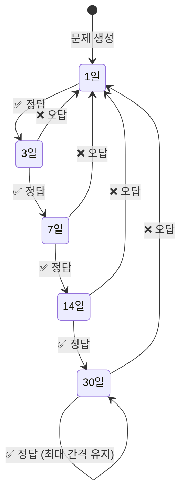
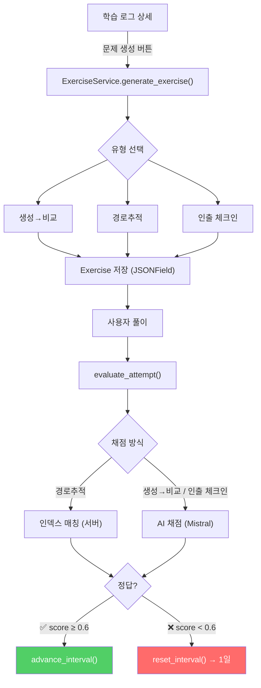

# 학습 로그 기반 간격 반복 연습문제 시스템 구현

[https://github.com/aengu/learn-log/commit/fbabfc95e45ae1b9bd7b8f08c303aedd40b523d4](https://github.com/aengu/learn-log/commit/fbabfc95e45ae1b9bd7b8f08c303aedd40b523d4)

| 항목 | 내용 |
| --- | --- |
| 목적 | 학습 로그를 일회성 아카이브로 끝내지 않고, 자동 생성된 연습문제로 다시 인출·복습하게 만들기 |
| 방식 | Django JSONField + AI 채점 (Mistral) + HTMX |
| 범위 | Exercise/ExerciseAttempt 모델, 3가지 유형 생성·채점, 간격 반복, 연습문제 UI |

---

## 만들게 된 계기

원래 LearnLog는 검색 → 답변 → 마크다운 저장까지의 흐름이었는데, 막상 써보니 **저장만 하고 다시 안 보게 되는** 문제가 있었다. 검색해서 답을 얻은 그 순간엔 이해한 것 같지만, 며칠 지나면 잊어버리고 같은 걸 또 검색하고 있었다.

그러던 중 [DrCatHicks/learning-opportunities](https://github.com/DrCatHicks/learning-opportunities)를 발견했다. AI 보조 코딩 환경에서 개발자의 학습이 퇴화하는 문제를 인지과학적으로 풀어낸 Claude Code 플러그인인데, 여기서 강조하는 개념들이 내가 겪던 문제와 정확히 맞아떨어졌다.

| 참고 레포가 말하는 문제 | LearnLog에서 이렇게 풀었다 |
| --- | --- |
| Generation Effect (그냥 받아 적으면 기억에 안 남음) | **생성→비교** 유형: 모범 답안을 보기 전에 자기 답을 먼저 쓰게 함 |
| Testing Deficit (답을 다시 보기만 하면 인출 연습이 안 됨) | **인출 체크인** 유형: 답을 다시 보지 말고 기억에서 꺼내서 적게 함 |
| Spacing Effect (한 번에 몰아서 보면 효과가 떨어짐) | **간격 반복** 시스템으로 시간을 두고 다시 풀게 함 |
| Fluency Illusion (깔끔한 답을 보면 이해했다고 착각함) | 연습문제로 한 번 더 인출하게 만들어서 진짜로 아는지 확인 |

참고 레포는 CLI 대화 인터페이스 기반이라 그대로 가져올 수 없었다. **개념은 차용하되 인터랙션은 웹에 맞게 재설계**했다 — 6가지 연습 유형 중 웹 폼에 맞는 3개만 골랐고, 설계 원칙 3개 중 "Pause for input (정답 먼저 보여주지 말 것)"만 적용했다.

> 참고 레포 상세: [PRINCIPLES.md](https://github.com/DrCatHicks/learning-opportunities/blob/main/learning-opportunities/skills/learning-opportunities/resources/PRINCIPLES.md) / [SKILL.md](https://github.com/DrCatHicks/learning-opportunities/blob/main/learning-opportunities/skills/learning-opportunities/SKILL.md)

---

## 3가지 연습문제 유형

참고 레포의 6가지 유형 중, 웹 화면 하나에서 답을 쓰고 결과를 보는 흐름이 자연스러운 3개만 골랐다.

| 유형 | 원문 | 풀이 방식 | 채점 | 안 고른 이유 |
| --- | --- | --- | --- | --- |
| **생성→비교** | Generation → Comparison | 텍스트로 답 작성 → 모범 답안과 비교 | AI (Mistral) | - |
| **경로추적** | Trace the Path | 스텝마다 객관식 선택 → JS 즉시 피드백 | 인덱스 매칭 (서버) | - |
| **인출 체크인** | Retrieval Check-in | 텍스트로 답 작성 → 핵심 포인트 체크 | AI (Mistral) | - |
| ~~Prediction→Observation~~ | | | | 코드 실행 환경 필요 |
| ~~Debug This~~ | | | | LLM 채점 신뢰도 불확실 |
| ~~Teach It Back~~ | | | | 대화 왕복 필요, 폼 구조와 안 맞음 |

경로추적(`path_trace`)은 원래 CLI에서 한 스텝씩 답을 받으며 진행하는 방식인데, 웹에 맞게 **객관식 + JS로 즉시 피드백 + 마지막에 한 번에 제출**하는 구조로 바꿨다. "정답 보기 전에 일단 답을 골라야 한다"는 핵심 규칙(Pause for input)은 그대로 지켰다.

---

## 모델 설계

유형마다 필요한 데이터가 다르다 — 경로추적은 객관식 선택지, 생성→비교는 모범 답안, 인출 체크인은 핵심 포인트 목록. 고정 컬럼으로 다 만들면 대부분 NULL이 된다. 그래서 `content` 하나에 JSONField로 유형마다 다른 모양을 담기로 했다.

### Exercise

```python
class Exercise(models.Model):
    EXERCISE_TYPE_CHOICES = [
        ('generation_compare', '생성→비교'),
        ('path_trace', '경로추적'),
        ('retrieval_checkin', '인출 체크인'),
    ]

    learning_log = models.ForeignKey(LearningLog, on_delete=models.CASCADE, related_name='exercises')
    exercise_type = models.CharField(max_length=30, choices=EXERCISE_TYPE_CHOICES)
    content = models.JSONField() # 유형별 문제 데이터
    review_interval = models.PositiveIntegerField(default=1) # 현재 복습 주기 (일)
    next_review_at = models.DateTimeField(null=True, blank=True) # 다음 복습 예정일
```

- LearningLog에 FK를 건 이유: 연습문제는 특정 학습 로그에서 출발해서 만들어진 거라, 그 로그가 사라지면 문제도 같이 사라지는 게 자연스러움.

### ExerciseAttempt

```python
class ExerciseAttempt(models.Model):
    exercise = models.ForeignKey(Exercise, on_delete=models.CASCADE, related_name='attempts')
    user_answer = models.JSONField()
    is_correct = models.BooleanField(null=True, blank=True)
    ai_feedback = models.TextField(blank=True)
    score = models.FloatField(null=True, blank=True)  # 0.0 ~ 1.0
```

- Exercise랑 따로 둔 이유: 한 문제를 여러 번 풀 수 있어서 풀이 기록도 여러 개가 쌓인다. Exercise 안에 욱여넣으면 "이 문제 몇 번 풀었지", "지난번엔 몇 점이었지" 같은 걸 보기 힘들어짐.

### JSONField content 구조

| 유형 | content 구조 |
| --- | --- |
| 생성→비교 | `{"question": "질문", "model_answer": "모범 답안"}` |
| 경로추적 | `{"scenario": "시나리오", "steps": [{"question": "질문", "choices": [...], "correct_index": 0, "explanation": "설명"}]}` |
| 인출 체크인 | `{"question": "질문", "key_points": ["포인트1", "포인트2", "포인트3"]}` |

---

## 간격 반복 (Spaced Repetition)

맞히면 다음에 풀 시점을 점점 늦추고 (1일 → 3일 → 7일 → 14일 → 30일), 틀리면 다시 1일로 되돌리는 방식이다. 한 번 맞혔다고 영영 안 보여주는 게 아니라, 잊어버릴 때쯤 다시 꺼내서 풀게 하는 게 핵심.



```python
REVIEW_INTERVALS = [1, 3, 7, 14, 30]  # 일 단위

def advance_interval(self):
    """마지막 성공 기준으로 다음 복습일 계산"""
    idx = REVIEW_INTERVALS.index(self.review_interval)
    next_interval = REVIEW_INTERVALS[min(idx + 1, len(REVIEW_INTERVALS) - 1)]
    self.review_interval = next_interval
    self.next_review_at = timezone.now() + timezone.timedelta(days=next_interval)
    self.save(update_fields=['review_interval', 'next_review_at'])

def reset_interval(self):
    """오답 시 1일로 리셋"""
    self.review_interval = 1
    self.next_review_at = timezone.now() + timezone.timedelta(days=1)
    self.save(update_fields=['review_interval', 'next_review_at'])
```

- 통과 기준은 **0.6점**이다. 5문제 중 3개 이상이면 정답 처리. 100점 아니면 다 틀린 걸로 치면 한 문제만 삐끗해도 간격이 1일로 리셋돼서 풀기가 싫어진다.
- 복습 목록에 올라오는 조건: 한 번도 안 푼 새 문제(`next_review_at`이 비어 있음) 거나, 다시 풀 시점이 이미 지난 문제.

---

## 서비스 레이어 설계

검색·답변 생성 쪽(`LearnlogService`)은 그대로 두고, 연습문제 관련은 `ExerciseService`라는 별도 클래스로 빼서 책임을 분리했다.



### 채점 로직

채점 방식은 유형마다 다르니까, dispatch 딕셔너리로 분기한다.

```python
def evaluate_attempt(self, exercise, user_answer):
    dispatch = {
        'path_trace': self._evaluate_path_trace,           # 인덱스 매칭 (AI 불필요)
        'generation_compare': self._evaluate_generation_compare,  # AI 비교
        'retrieval_checkin': self._evaluate_retrieval_checkin,    # AI 핵심 포인트 체크
    }
    return dispatch[exercise.exercise_type](exercise, user_answer)
```

3가지 유형의 채점 방식은 다르지만, **공통 규칙**이 있다:
- 모든 채점 결과는 `{is_correct, score, ai_feedback}` 딕셔너리로 반환
- 통과 기준은 일괄 0.6점
- AI 채점은 `temperature=0.2` (같은 답에 같은 점수가 나와야 하니까)
- 프롬프트에 "JSON으로만 응답 (```없이)" 강제 + 코드블록 감싸서 오면 벗겨내는 방어 처리

| 유형 | 채점 방식 | AI 사용 | 핵심 로직 |
| --- | --- | --- | --- |
| 경로추적 | `correct_index` 비교 | X | 스텝별 정답 인덱스 매칭, 피드백은 출제 시 만든 `explanation` 사용 |
| 생성→비교 | 모범 답안과 비교 | O | 학습자 답변 + 모범 답안을 LLM에 던져서 score + feedback 받음 |
| 인출 체크인 | 핵심 포인트 포함 여부 | O | `key_points` 각각에 대해 true/false 체크, 포함 비율이 곧 score |

경로추적만 AI를 안 쓰는 이유: 객관식이라 정답 인덱스만 비교하면 되니까 빠르고 API 비용도 안 든다.

인출 체크인이 통째로 비교하지 않고 포인트 단위로 쪼개는 이유: "비슷한 것 같음, 0.7점" 식의 두루뭉술한 채점은 학습자가 *뭘 빠뜨렸는지*를 모른다. "아 이 부분을 까먹었구나"를 정확히 알아야 다음에 보완할 수 있다.

### 출제 프롬프트

출제도 같은 패턴이다. `textwrap.dedent`로 들여쓰기 깔끔하게, 응답은 JSON으로 강제. 학습 로그의 AI 답변은 `[:500]`으로 잘라서 넣는다 — 문제 만드는 데는 500자면 핵심을 잡기에 충분하고, 토큰 비용도 아낄 수 있다.

---

## URL 구조

```
GET  /exercises/                          # 복습 대기 목록
GET  /exercises/<pk>/                     # 문제 풀기
POST /api/exercises/generate/<log_pk>/    # 문제 생성 (HTMX)
POST /api/exercises/<pk>/attempt/         # 풀이 제출 (HTMX)
```

문제 생성 버튼은 두 군데에 뒀다:
1. **질문 결과 화면 아래** — 답변을 방금 본 직후가 가장 머릿속에 생생할 때
2. **학습 로그 상세 모달 아래** — 나중에 기록 보러 와서 다시 풀고 싶을 때

두 곳에 들어가는 버튼 HTML이 똑같길래 `partials/exercise_generate.html`로 따로 빼고 양쪽에서 ``로 가져다 썼다.

---

![[attachments/학습 로그 기반 간격 반복 연습문제 시스템 구현 - image.png]]

![[attachments/학습 로그 기반 간격 반복 연습문제 시스템 구현 - image 1.png]]

---

## 이후 개선

경로추적 문제의 correct_index 오류를 발견하고 프롬프트를 개선했다 → [[프롬프트 변경 효과 측정 - correct_index 오류율 비교 테스트]]
