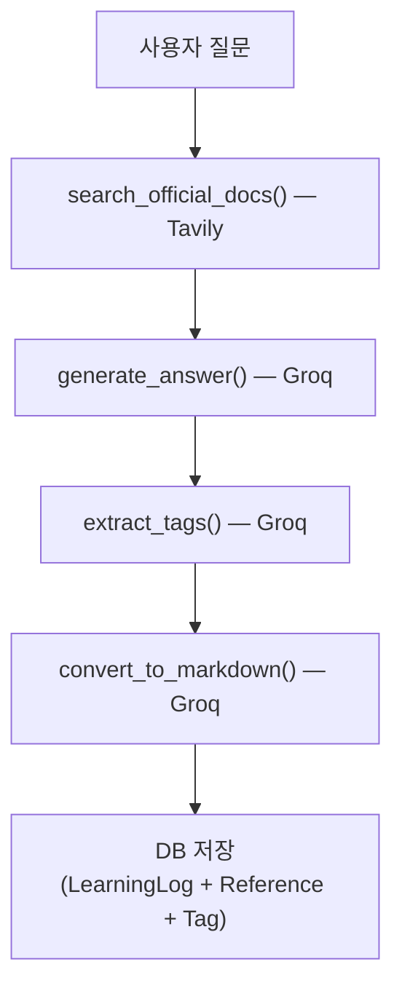

# 학습 로그 서비스 계층 설계 및 구현

[https://github.com/aengu/learn-log/commit/2caa5720eb720f3fdb9aac5591b063acd722487e](https://github.com/aengu/learn-log/commit/2caa5720eb720f3fdb9aac5591b063acd722487e)

질문 입력부터 DB 저장까지의 전체 처리 파이프라인을 서비스 클래스로 구현

| 항목 | 내용 |
| --- | --- |
| 목적 | 외부 API 호출 → 데이터 가공 → DB 저장 파이프라인 구현 |
| 방식 | 서비스 패턴 (LearnlogService 클래스) |

---

## 요구사항

- 사용자의 질문에 대해 공식 문서 기반으로 검색한다.
- 검색 결과를 컨텍스트로 넘겨 AI 답변을 생성한다.
- 질문과 답변에서 기술 태그를 자동 추출한다.
- 최종 결과를 노션용 마크다운 형식으로 변환한다.
- 위 과정의 결과를 LearningLog, Reference, Tag 모델에 저장한다.
- 같은 URL의 Reference, 같은 이름의 Tag는 중복 생성하지 않는다.

---

## 서비스 처리 흐름



뷰에서 비즈니스 로직을 분리하기 위해 LearnlogService 클래스를 도입. 뷰에선service.process_query(query)만 호출하면 된다.

---

## 구현

### 클래스 초기화

```python
class LearnlogService:
    def __init__(self):
        self.groq_client = Groq(api_key=settings.GROQ_API_KEY)
        self.tavily_client = TavilyClient(api_key=settings.TAVILY_API_KEY)

```

외부 API 클라이언트를 `__init__`에서 한 번 생성한다. 메서드 호출마다 재생성하지 않기 위함.

### 1단계: 공식 문서 검색 (Tavily API)

```python
def search_official_docs(self, query):
    try:
        results = self.tavily_client.search(
            query=query,
            search_depth="advanced",
            max_results=5,
            include_domains=[
                "docs.docker.com",
                "docs.python.org",
                "docs.djangoproject.com",
                "github.com",
            ]
        )
        return results
    except Exception as e:
        return {'results': []}

```

- `search_depth="advanced"`: 심층 검색으로 문서 내용까지 수집
- `include_domains`: 검색 결과를 **지정된 도메인으로 제한**하는 Tavily API 파라미터. 블로그나 비공식 자료 대신 공식 문서만 가져오기 위해 사용

### 2단계: AI 답변 생성 (Groq API)

```python
def generate_answer(self, query, search_results):
    context = "\\n\\n".join([
        f"출처: {r.get('url', 'N/A')}\\n내용: {r.get('content', '')[:400]}"
        for r in search_results.get('results', [])[:3]  # 상위 3개만
    ])

    prompt = f"""
        사용자 질문: {query}
        참고 자료:
        {context if context else "참고 자료 없음"}
        위 참고 자료를 바탕으로 질문에 대한 명확하고 상세한 답변을 작성해주세요.
    """

    response = self.groq_client.chat.completions.create(
        model="llama-3.3-70b-versatile",
        messages=[{"role": "user", "content": prompt}],
        temperature=0.7,
        max_tokens=2000
    )
    return response.choices[0].message.content.strip()

```

- 검색 결과 상위 3개를 컨텍스트로 넘겨서 **근거 기반 답변**을 생성
- `temperature=0.7`: 정확성과 자연스러움 사이의 균형

### 3단계: 태그 자동 추출 (Groq API)

```python
def extract_tags(self, query, ai_response):
    prompt = f"""
        다음 개발 질문과 답변에서 핵심 기술 태그를 추출해주세요.
        질문: {query}
        답변: {ai_response[:500]}
        규칙:
        - 정확히 3~5개의 태그만 추출
        - 모두 소문자, 영어만 사용
        - 쉼표로 구분
        출력 형식 예시: docker, network, bridge-mode, container
        태그:"""

    response = self.groq_client.chat.completions.create(
        model="llama-3.3-70b-versatile",
        messages=[{"role": "user", "content": prompt}],
        temperature=0.2,  # 낮은 temperature로 일관성 확보
        max_tokens=50
    )

    tags_text = response.choices[0].message.content.strip()
    tags = [
        tag.strip().lower().replace(' ', '-')
        for tag in tags_text.split(',')
        if tag.strip() and len(tag.strip()) > 1
    ]
    return tags[:5]

```

- `temperature=0.2`: 답변 생성(0.7)보다 낮게 설정. 태그는 **일관된 형식**이 중요하므로 창의성보다 정확성 우선
- `max_tokens=50`: 태그 목록은 짧으므로 토큰 제한을 낮게 설정
- API 실패 시 `_fallback_tag_extraction()`으로 질문 텍스트에서 직접 키워드 매칭

```python
def _fallback_tag_extraction(self, query):
    common_terms = [
        'docker', 'python', 'javascript', 'react', 'django',
        'api', 'database', 'network', 'kubernetes', 'git'
    ]
    query_lower = query.lower()
    tags = [term for term in common_terms if term in query_lower]
    return tags[:3] if tags else ['general']

```

### 4단계: 마크다운 변환 (Groq API)

```python
def convert_to_markdown(self, query, answer, search_results):
    refs = "\\n".join([
        f"- [{r.get('title', 'N/A')}]({r.get('url', '')})"
        for r in search_results.get('results', [])
    ])

    prompt = f"""
        다음 내용을 노션 스타일 마크다운으로 정리해주세요:
        질문: {query}
        답변: {answer}
        참고 자료: {refs if refs else "없음"}
    """

    response = self.groq_client.chat.completions.create(
        model="llama-3.3-70b-versatile",
        messages=[{"role": "user", "content": prompt}],
        temperature=0.5,
        max_tokens=3000
    )
    return response.choices[0].message.content.strip()

```

- `temperature=0.5`: 답변 생성(0.7)보다 낮게. 내용 변형 없이 **형식만 변환**해야 하므로
- 실패 시 기본 마크다운 포맷으로 fallback: `f"## {query}\\n\\n{answer}\\n\\n## 참고 자료\\n{refs}"`

### 5단계: DB 저장

```python
# LearningLog 생성
log = LearningLog.objects.create(
    query=user_query,
    ai_response=ai_answer,
    markdown_content=markdown,
)

# Reference 생성 및 연결
for result in search_results.get('results', []):
    ref, created = Reference.objects.get_or_create(
        url=result.get('url', ''),
        defaults={
            'title': result.get('title', 'Untitled'),
            'excerpt': result.get('content', '')[:500],
            'source_type': self._determine_source_type(result.get('url', '')),
        }
    )
    log.references.add(ref)

# Tag 생성 및 연결
for tag_name in tag_names:
    tag, created = Tag.objects.get_or_create(
        name=tag_name,
        defaults={'slug': slugify(tag_name)}
    )
    log.tags.add(tag)

```

- **`get_or_create`**: 같은 URL의 Reference, 같은 이름의 Tag가 이미 있으면 새로 만들지 않고 재사용
- `log.references.add(ref)`: ManyToMany 중간 테이블에 관계만 추가

**출처 유형 자동 판별:**

```python
def _determine_source_type(self, url):
    url_lower = url.lower()
    if 'stackoverflow.com' in url_lower:
        return 'stackoverflow'
    elif 'github.com' in url_lower:
        return 'github'
    elif any(domain in url_lower for domain in ['docs.', 'documentation', 'doc.']):
        return 'official'
    elif any(domain in url_lower for domain in ['blog', 'medium.com', 'dev.to']):
        return 'blog'
    else:
        return 'other'

```

URL 문자열에서 키워드를 매칭하여 Reference 모델의 `source_type` 필드 값을 결정한다.

---

## 이후 개선

검색 도메인 하드코딩과 출처 판별 문제는 이후 개선했다 → [[기술 스택별 검색 도메인 자동 매핑 및 출처 판단 개선]]

이후 Groq 단독 구성에서 Groq + Mistral 하이브리드로 전환했다 → [[LLM 공급자 하이브리드 전환 - Groq + Mistral 속도·품질 벤치마크]]