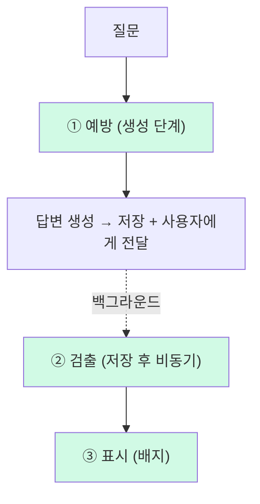
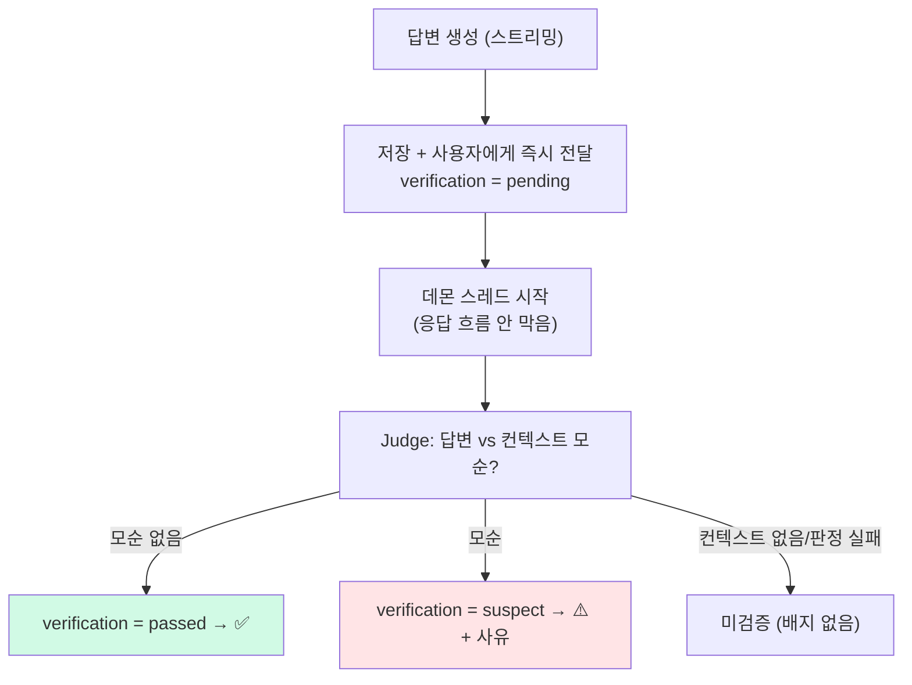

# 환각 방어 - 예방·검출·표시 3단

> **결과**: 무료 티어 모델의 환각은 못 막으니, 막는 대신 예방·검출·표시 3단으로 다뤘다. 핵심은 검출(생성과 다른 모델로 모순 검사)을 답변 속도를 안 막게 비동기로 뺀 것. 그 Judge를 Claude로 교차검증하다, 4월에 고친 검색 버그의 효과가 두 달 뒤 숫자로 드러나는 부산물까지 나왔다.

| 항목 | 내용 |
| --- | --- |
| 목적 | [[LangGraph 라우팅 에이전트\|웹 생략 경로]]가 과거 LLM 답변만으로 답하는 구조라, 오염된 학습 로그의 재사용을 막기 |
| 방식 | 예방(grounding 프롬프트 + 라우터) · 검출(비동기 모순 검증, 생성과 다른 모델) · 표시(배지) |
| 범위 | DEFAULT_INSTRUCTIONS, 라우터 기준, 비동기 검증 스레드, verification 필드, 배지 템플릿, Judge 교차검증 |

---

## 만들게 된 계기

[[LangGraph 라우팅 에이전트 - 질문별 조건 분기|LangGraph 라우팅 에이전트]]를 만들면서 웹 생략 경로가 생겼다. 라우터가 "내 학습 로그만으로 충분하다"고 판단하면 웹 검색을 생략하는 건데, 그러면 답변의 유일한 근거가 과거에 내가 저장해둔 LLM 답변이 된다. 만약 거기 환각이 섞여 있었다면, 그게 컨텍스트로 다시 들어가서 새 답변에 환각을 재생산할 수 있다. 잘못 정리된 노트로 복습하는 셈이다.

게다가 이 앱에선 환각이 유난히 치명적이다. 보통 챗봇은 틀린 답을 한 번 보고 끝이지만, LearnLog는 답변을 저장하고 그걸로 [[간격 반복 연습문제 - 자동 출제·채점|연습문제를 만들고 간격 반복으로 복습]]시킨다. 틀린 내용이 들어오면 그걸 외울 때까지 반복하는 구조다. 

그렇다고 무료 티어 모델(mistral-large)이 환각을 안 만들게 할 방법은 없다. 모델 자체의 한계니까. 할 수 있는 건 세 가지뿐이다. 나올 확률을 줄이고(예방), 나왔을 때 잡아내고(검출), 사용자가 의심할 수 있게 표시하는 것(표시).

---

## 3단 방어선



**① 예방** — 두 갈래다.

하나는 답변 생성 프롬프트(`DEFAULT_INSTRUCTIONS`)에 grounding 지시를 넣었다. 환각의 상당수가 "그럴듯한 디테일을 지어내는"(없는 버전·API 이름) 형태라 이걸 직접 겨냥했다.

```python
DEFAULT_INSTRUCTIONS = (
    "형식: 개념 → 동작 원리 → 코드 예시 → 주의사항. ..."
    # grounding: 환각이 잘 생기는 '그럴듯한 디테일 지어내기' 차단
    "구체적인 버전·수치·설정 이름·API 이름은 참고 자료나 과거 학습 로그에 근거가 있을 때만 단정하고, "
    "근거가 없으면 불확실하다고 명시할 것."
)
```

다른 하나는 [[LangGraph 라우팅 에이전트 - 질문별 조건 분기|라우터]] 강화다. 사실 민감한 질문은 학습 로그가 충분해 보여도 웹 검색을 강제(`need_web=true`)하게 했다. 이런 질문이야말로 공식 문서 대조가 꼭 필요한데, 학습 로그는 LLM 생성물이라 그것만 믿으면 안 되니까. (= 계기에서 말한 "근거가 옛 LLM 답변뿐"인 상황 자체를 줄인다)

```python
# decide_route 프롬프트의 need_web 판단 기준
- need_web: 기록만으로 부족해서 웹 검색 보강이 필요한가.
  기록이 질문의 답을 이미 충분히 담고 있을 때만 false.
  단, 구체적인 버전·설정/옵션 이름·API 시그니처·정확한 수치·최신 동향을 묻는
  질문은 기록이 충분해 보여도 true (기록은 LLM 생성물이라 공식 문서 대조 필요)
```

**② 검출** — 저장된 답변이 생성에 쓰인 컨텍스트와 모순되는지 LLM Judge가 검사한다. 핵심은 Judge를 **생성 모델과 다른 계열**(Groq의 llama)로 둔 것이다. 답변 생성은 Mistral인데, 같은 모델에게 자기 답을 검증시키면 생성할 때 그럴듯하다고 믿은 걸 검증할 때도 똑같이 믿어서 못 잡는다. 자기 출력에 후한 self-evaluation bias도 있고. 다른 계열은 실수 패턴이 달라서 한쪽이 놓친 걸 잡는다.

기준이 "사실인가"가 아니라 "**컨텍스트와 맞는가**"인 건 의도된 것이다. 답변이 사실인지 검사하려면 Judge가 진실을 알아야 하는데, Judge도 같은 무료 티어 LLM이라 자기 지식으로 또 환각한다(기준점이 프롬프트 밖, 모델 머릿속에만 있음). 반면 답변과 컨텍스트는 둘 다 프롬프트 안에 글로 있으니, Judge는 외부 지식 없이 두 글을 대조만 하면 된다 — 정답을 몰라도 검증 가능한 닫힌 문제다. RAG에서 말하는 **충실성(faithfulness)** 검사다. 단점은 "틀린 컨텍스트를 충실히 따른" 환각은 못 잡는다는 것인데, 뒤의 MCP 사례가 정확히 그 한계다.

**③ 표시** — 결과 카드와 상세 모달에 배지를 붙였다. 출처(🌐 웹 문서 / 📚 내 학습 로그 / 둘 다), 잘림(⚠️), 검증 결과(✅ 검증됨 / ⚠️ 불일치 의심). 그리고 ⚠️ 의심이 붙은 로그로 연습문제를 만들려고 하면 "틀린 내용으로 복습하지 않게 확인하라"는 경고를 띄운다. 환각이 복습으로 암기되는 그 경로를 정확히 끊는 마무리다.

---

## 검증을 동기로 끼우지 않은 이유

처음엔 검증하는 노드를 동기로 설계했다. 검증에서 반려되면 답변을 재생성해 30초가 추가되는데, 너무 길다. 그래서 검증을 저장 후 비동기로 뺐다. 근거는 "만들게 된 계기"에 적은 그대로다. 이 앱에서 환각의 진짜 피해는 읽는 순간이 아니라 저장돼서 복습으로 암기되는 것이다. 그러면 검증이 지켜야 할 건 응답 속도가 아니라 저장된 학습 로그다. 답변은 일단 사용자에게 바로 흘려보내고, 백그라운드 스레드에서 검사해서 결과를 배지로만 남긴다.



비동기라 재생성은 없다. 이미 전달된 답을 다시 만들 수 없으니, 검출의 결과물은 "수정"이 아니라 "표시"다. 이게 출처 배지와 자연스럽게 한 기능으로 합쳐졌다. 스레드는 [[SSE 진행 스트리밍 - 프로그레스바·진행로그|기존 SSE]]에서 쓰던 패턴 그대로 데몬 스레드 하나 던지는 걸로 해결했다. Celery 같은 건 이 규모에 과하다.

여기에 공짜 보너스가 하나 있다. 답변이 max_tokens에 걸려 잘렸는지는 LLM 없이도 안다. Mistral 응답의 finish_reason이 'length'면 잘린 거다. 호출 0회, 지연 0초로 판정해서 ⚠️ 잘림 배지를 붙이고, 다시 만들지는 사용자가 정하게 했다.

---

## 그 Judge는 믿을 만한가 — Claude 교차검증

검출의 핵심이 Groq Judge인데, 정작 그 Judge가 제대로 판정하는지는 안 재봤다. 심판을 심판해보기로 했다. 기존 로그를 Groq Judge로 판정하고(컨텍스트는 저장된 reference 발췌, 운영과 동일), 같은 프롬프트로 Claude(Opus)에게 재판정시켜 일치율을 봤다. 프롬프트·컨텍스트·답변이 전부 동일하니 판정이 갈리면 그건 순수 모델 차이다.

66건(중복 질문 제거 후) 결과:

| 지표 | 결과 |
| --- | --- |
| 두 Judge 일치 | 48/66 (73%) |
| 둘 다 의심 (환각 확정 후보) | 1건 |
| Claude만 의심 (Groq이 놓침) | 2건 |
| Groq만 의심 (오판 후보) | 16건 |

Groq이 의심한 17건 중 Claude가 동의한 건 1건뿐이다. 거짓 양성 16건의 사유를 하나씩 보니 전부 같은 패턴이었다. "컨텍스트가 답변과 다른 주제다", "컨텍스트에 그 정보가 없다". 즉 Groq은 **무관함(irrelevant)을 모순(contradiction)으로 착각**하고 있었다.

```text
# 실제 거짓 양성 케이스 (pk 35, Groq만 의심)
질문:     dispatch method
컨텍스트:  [github.com/agenticsorg/quantum-agentics]
        물류 최적화 레포  ← tavily가 엉뚱한 주제의 레포를 검색함
답변:     디스패치 메서드는 함수 호출 시 어떤 메서드를 실행할지 결정하는 과정입니다. Julia에서는 인자 타입에 따라...

Groq   → consistent=false  "답변의 주장이 컨텍스트 내용과 명백히 어긋나며,
                            컨텍스트는 Supply Chain... 답변은 관련성이 떨어짐"
                            ← '관련성이 떨어짐'(무관)이라 해놓고 결론은 '어긋남'(모순)
Claude → consistent=true   ""  (대조할 거리가 없을 뿐, 어긋난 주장은 없음)
```

여기엔 두 가지가 겹쳐 있다.

1. **검색 품질** — 검색이 질문(`dispatch method`)과 무관한 물류 최적화 레포를 컨텍스트로 물어왔다. (다음 섹션으로 이어진다)
2. **Groq의 오판** — "관련성이 떨어짐"이라고 스스로 말하면서 결론은 "명백히 어긋남"으로 냈다. 즉 **무관(irrelevant)을 모순(contradiction)으로** 찍은 것.

|                    | 정의                    | Judge가 의심으로 찍어야 하나 |
| ------------------ | --------------------- | ------------------ |
| 모순 (contradiction) | 컨텍스트는 A라는데 답변은 B라고 주장 | ✅                  |
| 무관 (irrelevant)    | 대조할 거리가 아예 없음 (딴 주제)  | ❌                  |

사실 검증 프롬프트(`check_consistency`)에는 이 오판을 막으려는 줄이 이미 있었다.

```python
# check_consistency 프롬프트의 판단 기준
- 답변의 주장(수치, 동작 설명, API 사용법)이 컨텍스트 내용과 명백히 어긋나면 consistent=false
- 컨텍스트에 없는 내용을 답변이 추가로 다루는 것은 모순이 아님   ← 이미 쳐둔 방어선
```

이렇게 적어뒀는데도 뚫렸다. 이후 "무관함은 모순이 아니다"를 한 줄 추가하고 영어 병기까지 해봤지만, 해결하지 못했다. 이 혼동은 프롬프트 한두 줄로는 못 잡고, 결국 검색 품질이 근본이라는 것을 확인했다.

---

## 부산물: 4월에 고친 버그가 숫자로 증명됐다

불일치 케이스의 pk를 로그 생성일로 묶어보다가 예상 못 한 게 나왔다.

| 시기 | 의심 건수 / 전체 | Groq 의심율 | |
| --- | --- | --- | --- |
| 1월 | 3 / 8 | 38% | |
| 2월 | 6 / 22 | 27% | |
| 3월 | 5 / 8 | **62%** | 최악 |
| **4월** | 0 / 6 | **0%** | ← [[RAG 검색 파이프라인 개선 — 한국어 질문이 엉뚱한 결과를 부르던 문제\|검색 파이프라인 개선]] |
| 5월 | 2 / 12 | 17% | |
| 6월 | 1 / 10 | 10% | |
| **합** | **17 / 66** | | |

먼저 숫자만 보면, 1~3월 의심율이 평균 37%(3월은 62%로 최악)였는데 4월을 기점으로 0%까지 뚝 떨어지고 이후로도 10% 안팎을 유지한다.

그리고 그 4월에 [[RAG 검색 파이프라인 개선 — 한국어 질문이 엉뚱한 결과를 부르던 문제|검색 파이프라인을 개선]]했었다. 한국어 질문을 Groq로 영어 검색어로 변환해 영어 공식 문서 매칭률을 높이고, 도메인 매칭에 실패하면 `github.com`을 강제로 끼워 넣던 걸 없애 개인 레포·번역서 같은 노이즈를 걷어낸 작업이다.

이 둘이 연결되는 건 Groq의 "무관함 오판"이 곧 그 로그의 컨텍스트가 실제로 무관했다는 뜻이기 때문이다. 즉 의심율은 사실상 그 시절 검색 품질의 지표였고, 4월 개선의 효과가 두 달 뒤 환각 검증 실험에서 소급으로 측정된 셈이다. 

---

## 진짜 환각 3건

Groq의 의심 17건이 전부 오판은 아니었다. 그 안에 진짜 환각도 섞여 있었다 — 사람이 직접 확인할 후보 3건.

| # | 주제 | 환각 내용 | 누가 잡음 |
| --- | --- | --- | --- |
| **#84** | 멀티 DB 트랜잭션 (가장 심각) | `transaction.atomic()`에 `readonly` 파라미터가 있다고 썼지만 Django에 **존재하지 않음**. + "중첩 atomic으로 크로스 DB 원자성 보장"도 틀림 (Django는 2PC 미지원) | Claude ✅ / Groq ❌ |
| **#45** | textwrap 인덴트 | "탭을 8개 공백으로 치환한다"고 주장. 실제 dedent는 탭과 공백을 같게 보지 않음 | 둘 다 합의 (유일) |
| **#44** | 여러 줄 인덴트 | 스타일 가이드가 금지하는 백슬래시 줄 잇기를 유효한 방법으로 소개 | — |

#84가 가장 심각한 건 두 가지가 겹쳐서다. 존재하지 않는 API를 그럴듯하게 지어낸 교과서적 환각인 데다(① 예방의 grounding이 노린 바로 그 유형), 하필 내가 실제로 공부한 보상 트랜잭션 꼬리질문 체인의 시작점이라 그 위에 쌓은 후속 학습까지 오염됐을 수 있다. 계기에서 말한 "환각이 컨텍스트로 재생산된다"가 실제로 일어난 정황이다.

그리고 #45와 #84의 판정이 갈린 게 의미심장하다. #45는 컨텍스트 내용과 직접 어긋나서 둘 다 잡았지만, #84는 존재하지 않는 API라 컨텍스트에 근거가 없어서 Groq이 놓쳤다. 이 "근거 없음 vs 직접 모순" 차이가 다음 섹션으로 이어진다.

"환각이 저장되면 복습으로 틀린 걸 외운다"던 처음의 걱정이 추상적인 우려가 아니라 실물로 확인된 셈이다.

---

## 검출이 못 잡는 환각, 검색으로 막다

검증을 다 만들고 나서 "MCP server가 뭐야"를 물어봤다가, 검출이 못 잡는 환각 케이스를 봤다.

```text
질문: "MCP server가 뭐야"
       (= Model Context Protocol, LLM이 외부 도구·데이터에 붙는 표준 프로토콜)

            답변의 날조                      실제 MCP
구성 요소   '스킬(skill)'                    '도구(tool)·프롬프트·리소스'
로딩        "검증된 스킬 디렉토리에서 동적 로딩"   그런 개념 없음
배포        "서명된 패키지로 배포"             그런 개념 없음
용도        "멀티 봇 인스턴스 관리"            LLM ↔ 외부 도구/데이터 연결

출처(reference): 공식 문서가 아님
  → VS Code 페이지 / Minecraft MCP 예시 / mcpservers.org (서드파티 디렉토리)
```

이 환각은 두 단계를 거쳐 생겼고, 둘 다 검출망에 안 걸렸다.

**① 검색 — 엉뚱한 MCP를 물어옴**

[[검색 도메인 자동 매핑 - 출처 판단 개선|`domains.py`]]에 `mcp` 키워드 매칭이 없어서, Tavily가 도메인 제한 없이 열린 웹을 검색했다. 그 결과 공식 스펙(modelcontextprotocol.io)이 아니라 검색 상위의 잡다한 페이지(VS Code 페이지·Minecraft에 MCP 붙인 토이 예시·mcpservers.org 서드파티 디렉토리)를 컨텍스트로 물어왔다. 

**② 검증 — Groq이 통과시킴**

Judge는 "답변 vs 진실"이 아니라 "답변 vs 컨텍스트"만 본다.

```text
Judge가 보는 것:  답변 ↔ 컨텍스트  일치하나?
이 케이스:       관련없는 컨텍스트(서드파티)  →  답변이 그걸 충실히 따름
                ∴ 답변과 컨텍스트가 서로 일치 → consistent=true → 통과
```

답변이 그 나쁜 컨텍스트를 충실히 따랐으니 둘이 서로 일치 → 모순 없음 → 통과다. #84(존재하지 않는 API)는 컨텍스트에 근거가 없어서 잡혔지만, 이건 "충실하게 틀린" 경우라 검출망을 통과한다. **grounding이 부실하면 grounding-consistency 검증도 무력해진다.**

그래서 검출을 더 정교하게 만드는 대신 1차 소스를 고쳤다. [[검색 도메인 자동 매핑 - 출처 판단 개선|도메인 매핑]]에 한 줄 추가:

```python
'mcp': ['modelcontextprotocol.io'],
```

같은 질문을 다시 돌렸다.

| | 도메인 추가 전 | 도메인 추가 후 |
| --- | --- | --- |
| 핵심 개념 | "스킬 동적 로딩" (날조) | "도구·프롬프트·리소스" (정확) |
| 보안 | "서명된 스킬 패키지 검증" (날조) | 사라짐 |
| 범위 | "특히 VS Code" / Minecraft 봇 | "Claude Desktop 등", 로컬/원격 구분 |
| 출처 | mcpservers.org (서드파티) | modelcontextprotocol.io (공식) |

개념 레벨 날조가 통째로 사라졌다. "reference에 공식 문서가 없던 게 1차 원인"이라는 가설이 그대로 맞았다.

다만 완벽하진 않았다. 새 답변도 코드는 여전히 틀렸다. MCP를 JSON-RPC(`initialize` → `tools/call`)가 아니라 `/.well-known/mcp` 같은 자작 REST 엔드포인트로 그렸다. 이건 검색으로 안 고쳐진다. 공식 문서가 컨텍스트에 있어도 모델이 그 안의 프로토콜 디테일까지 정확히 옮기진 못하고 "REST겠거니" 하고 그럴듯하게 메운다. 개념은 검색이 고치고, 코드 디테일은 모델 능력의 한계로 남는다.

---

## 회고

못 막는 환각은 예방·검출·표시로 다루되, "어디서 치명적인지(복습으로 암기되는 것)"를 먼저 정하니 검증을 비동기로 빼는 설계가 따라 나왔다.

제일 큰 교훈은 검출보다 검색이 근본이라는 것. 프롬프트 미세조정으론 Judge의 무관↔모순 혼동을 못 잡았는데, 정작 MCP 도메인 한 줄이 3겹 방어보다 환각을 더 줄였다. 검출은 "일치하게 틀린" 환각은 못 잡지만, 좋은 컨텍스트는 그걸 아예 안 생기게 한다. 덤으로 환각 잡으려 만든 측정 도구가 4월 검색 버그의 효과를 두 달 뒤 숫자로 증명해준 것도 좋았다.

---

## 참고

- `search/services/learnlog_service.py`: `decide_route`(라우터 강화), `check_consistency` / `verify_log`(모순 검증), `DEFAULT_INSTRUCTIONS`(grounding)
- `search/api_views.py`: `_verify_in_background`(저장 후 데몬 스레드)
- `search/templates/search/partials/answer_badges.html`: 출처·잘림·검증 배지
- `benchmarks/0611/export_judge_cases.py` + `benchmark_judge_crosscheck.py`: Judge 교차검증 (claude -p)
- `search/management/commands/verify_logs.py`: 기존 로그 일괄 검증
- [[LangGraph 라우팅 에이전트 - 질문별 조건 분기|LangGraph 라우팅 에이전트]]: 웹 생략 경로를 만든 작업 (이 환각 우려의 출처)
- [[RAG 검색 파이프라인 개선 — 한국어 질문이 엉뚱한 결과를 부르던 문제]]: 시기별 의심율이 증명한 그 개선
- [[간격 반복 연습문제 - 자동 출제·채점|학습 로그 기반 간격 반복 연습문제 시스템 구현]]: 환각이 암기로 이어지는 경로
- [[LLM 공급자 하이브리드 전환 - Groq + Mistral 속도·품질 벤치마크]]: Judge를 생성과 다른 계열로 둔 배경
